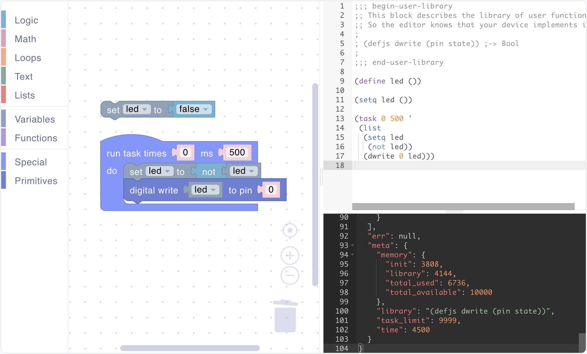
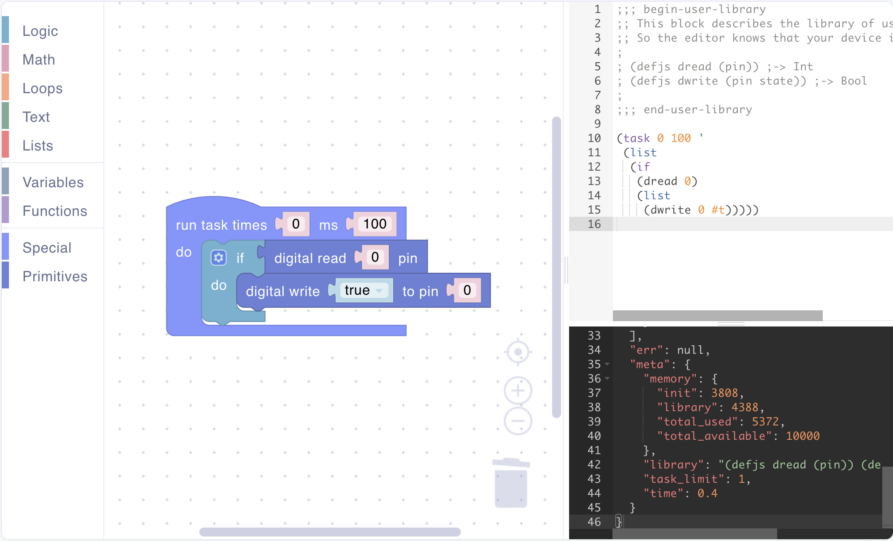
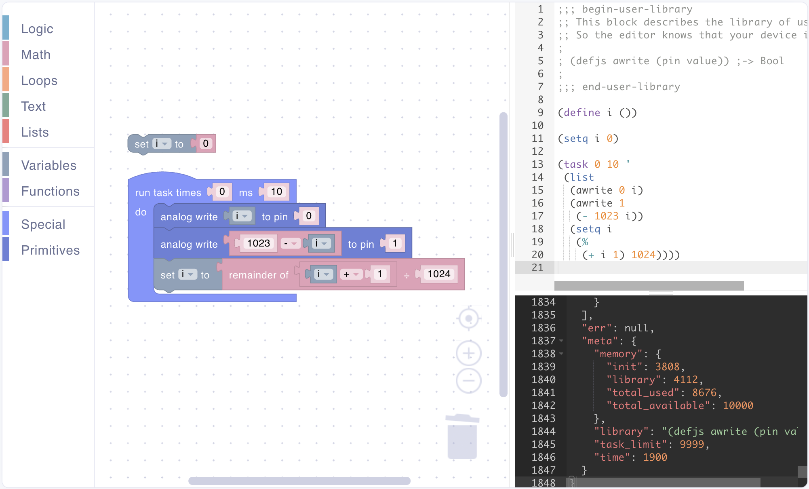
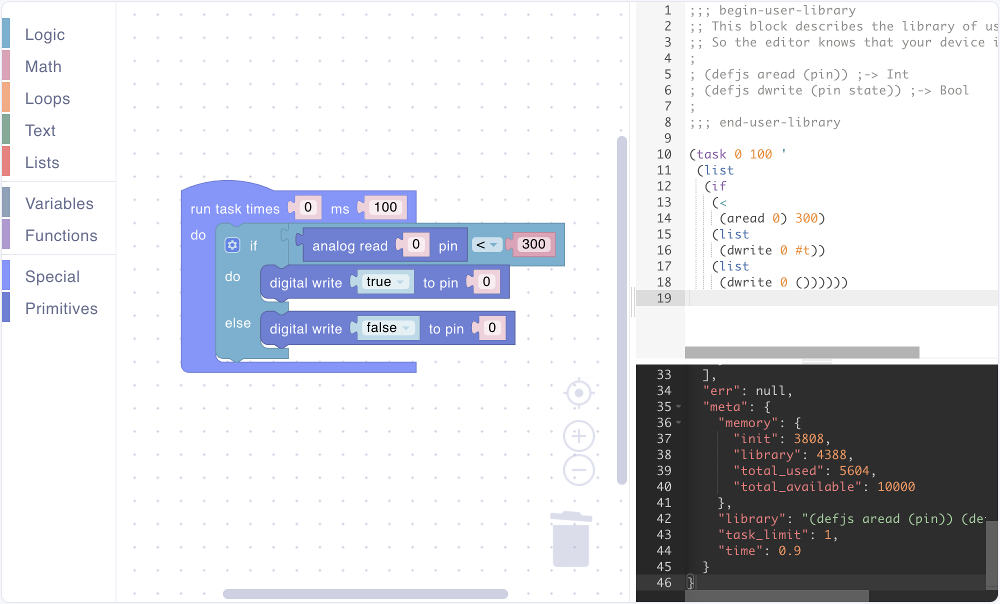
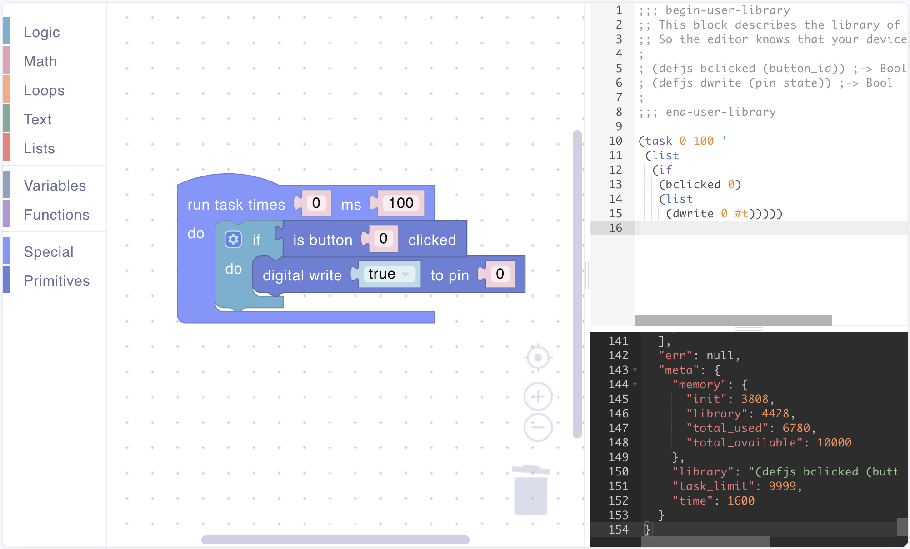
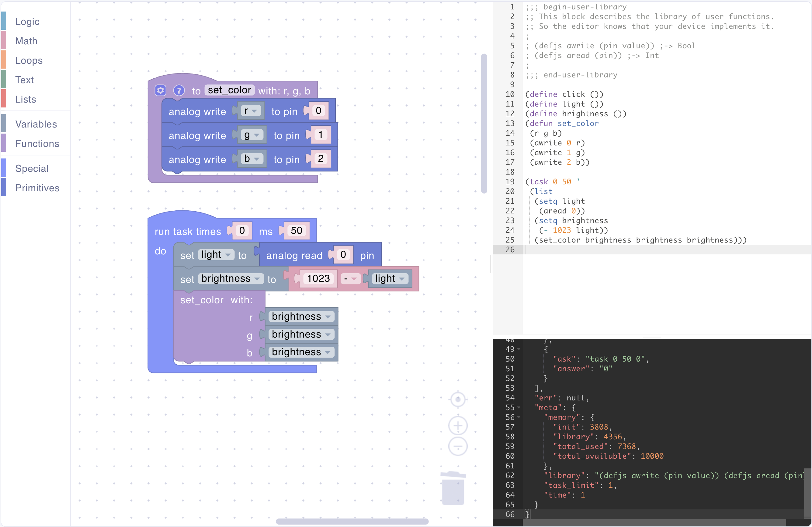
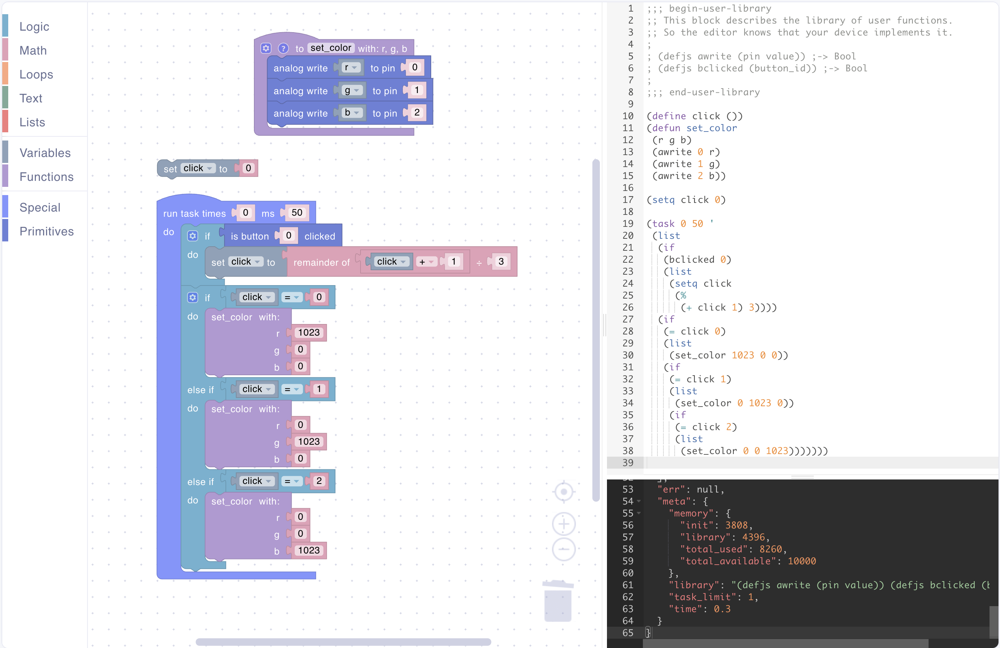
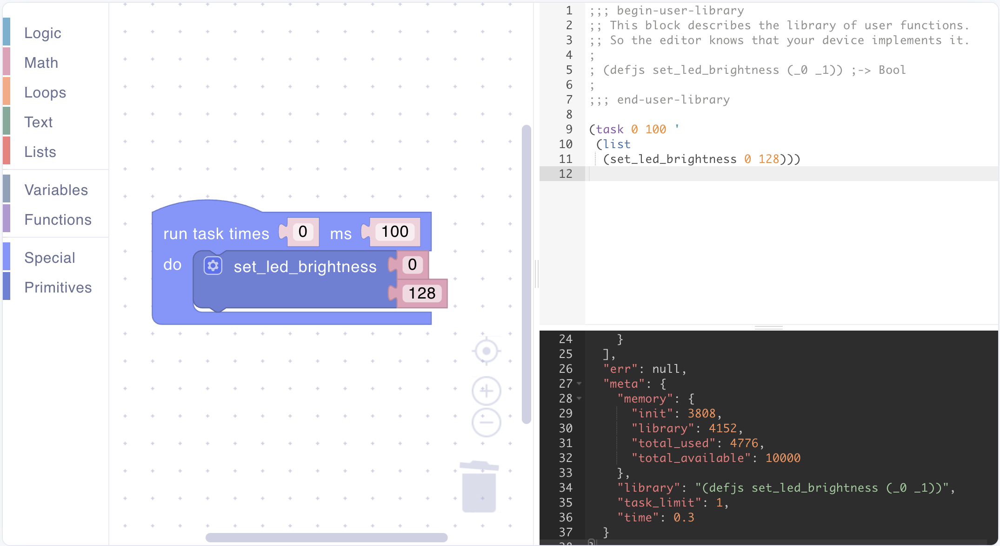

# Primitives

## Overview

Primitives are the bridge between C++ application code and scripts in Uniot Core. They are C++ functions callable from script that enable hardware access, complex calculations, and integration with application logic.

Uniot Core provides two types of primitives:

1. **Built-in Primitives**: Pre-implemented functions for common hardware operations (GPIO, buttons, etc.)
2. **Custom Primitives**: User-defined functions for application-specific logic

### Use Cases

Common scenarios where primitives are valuable:

- **Hardware Control**: Expose sensors, actuators, and peripherals to scripts
- **Complex Logic**: Implement algorithms in C++ but allow script-based configuration
- **State Management**: Let scripts read and modify device state
- **Custom Protocols**: Implement device-specific communication protocols

## How Primitives Work

### Execution Flow

1. **Script Received**: Device receives script via MQTT
2. **Interpretation**: Interpreter parses and executes the script
3. **Primitive Call**: Script calls a primitive function
4. **C++ Execution**: Primitive executes C++ code
5. **Result Return**: Result is converted back to Lisp data type
6. **Script Continues**: Script processes the result

### Type System

Primitives use a simple type system for argument validation:

| Lisp Type       | C++ Type | Description                    |
| --------------- | -------- | ------------------------------ |
| `Lisp::Int`     | `int`    | Integer values                 |
| `Lisp::Bool`    | `bool`   | Boolean values (true/false)    |
| `Lisp::BoolInt` | `bool`   | Combined Boolean/Integer value |
| `Lisp::Symbol`  | `String` | Symbols and identifiers        |

### User Library Block


If you create scripts using the visual editor, this block is automatically generated for you. You can skip this section unless you're writing scripts manually.


Every script must begin with a special metadata block that describes the primitives available to the script. The UniotLisp interpreter uses this block to understand which primitives are available, enabling the interpreter to properly validate and execute primitive calls.

**Structure**

The user library block is enclosed by special markers:

```lisp
;;; begin-user-library

;; This block describes the library of user functions.
;; So the editor knows that your device implements it.

; (defjs primitive-name (arg1 arg2 ...)) ;-> ReturnType

;;; end-user-library
```

**Purpose**

- **Interpreter Requirement**: The interpreter uses this information to know which primitives are in your script
- **Type Validation**: Helps the interpreter validate primitive calls with correct argument types
- **Documentation**: Serves as inline documentation for developers reading the script

**When You Need to Care About This**

- **Visual Editor Users**: You don't need to do anything - the block is automatically generated and included in your scripts
- **Manual Script Writers**: **Required** - you must manually add this block at the beginning of every script you write, declaring all primitives used in that script

**Syntax: `defjs` Declarations**

Each primitive is declared using the `defjs` syntax:

```lisp
; (defjs primitive-name (param1 param2 ...)) ;-> ReturnType
```

**Example**

If you have a custom primitive `set_led_brightness` that takes two integers (pin and brightness) and returns a boolean:

```lisp
;;; begin-user-library

;; This block describes the library of user functions.
;; So the editor knows that your device implements it.

; (defjs set_led_brightness (pin brightness)) ;-> Bool
; (defjs dwrite (pin state)) ;-> Bool
; (defjs aread (pin)) ;-> Int

;;; end-user-library

;; Rest of your script starts here
(task 0 100 '
  (list
    (if (> (aread 0) 512)
      (set_led_brightness 15 255))))
```

**Notes**

- The block is delimited by `;;; begin-user-library` and `;;; end-user-library` markers
- Each declaration is on a single line, prefixed with `;` (comment)
- The `;->` arrow indicates the return type
- Multiple primitives can be declared in the same block
- The block appears at the very beginning of the script
- **Required for interpreter**: The UniotLisp interpreter needs this block to recognize and validate primitive function calls

## Built-in Primitives

Uniot Core includes a set of built-in primitives for common hardware operations. These primitives work in conjunction with the **Register system**, which provides a layer of abstraction between scripts and physical hardware pins.

### The Register System

The Register system maps logical pin indices (used in scripts) to physical GPIO pins. This abstraction provides several benefits:

- **Safety**: Scripts can't accidentally access unregistered pins
- **Flexibility**: Physical pin assignments can change without modifying scripts
- **Portability**: Same scripts work on different hardware configurations
- **Organization**: Group related pins under named registers

#### How It Works

1. **Registration**: C++ code registers physical GPIO pins using `Uniot.registerLisp*()` methods
2. **Mapping**: Each registered pin gets a logical index (0, 1, 2, ...)
3. **Access**: Scripts use logical indices to access pins through built-in primitives
4. **Validation**: Primitives validate indices against registered pins before hardware access

### Registering GPIO Pins

Before using built-in primitives, you must register GPIO pins:

```cpp
void setup() {
  // Register digital output pins (GPIO 12, 13, 14)
  Uniot.registerLispDigitalOutput(12, 13, 14);
  // Script indices: pin 12 = index 0, pin 13 = index 1, pin 14 = index 2

  // Register digital input pins (GPIO 0, 4)
  Uniot.registerLispDigitalInput(0, 4);
  // Script indices: pin 0 = index 0, pin 4 = index 1

  // Register analog output pins for PWM (GPIO 12, 13, 14)
  Uniot.registerLispAnalogOutput(12, 13, 14);
  // Script indices: pin 12 = index 0, pin 13 = index 1, pin 14 = index 2

  // Register analog input pins (GPIO A0)
  Uniot.registerLispAnalogInput(A0);
  // Script indices: A0 = index 0

  Uniot.begin();
}
```

**Important**: Each pin type (digital output, digital input, analog output, analog input) has its own index namespace.

### Quick Reference

| Primitive  | Purpose                      | Registration Method           | Signature              |
| ---------- | ---------------------------- | ----------------------------- | ---------------------- |
| `dwrite`   | Write digital pin (HIGH/LOW) | `registerLispDigitalOutput()` | `(dwrite index state)` |
| `dread`    | Read digital pin (HIGH/LOW)  | `registerLispDigitalInput()`  | `(dread index)`        |
| `awrite`   | Write analog pin (PWM)       | `registerLispAnalogOutput()`  | `(awrite index value)` |
| `aread`    | Read analog pin (ADC)        | `registerLispAnalogInput()`   | `(aread index)`        |
| `bclicked` | Check button click           | `registerLispButton()`        | `(bclicked index)`     |

### Available Built-in Primitives

#### 1. `dwrite` - Digital Write

Writes a digital value (HIGH/LOW) to a registered output pin.

**Parameters**:

- `index` (Int): Logical pin index (0-based)
- `state` (Bool): Pin state (true = HIGH, false = LOW)

**C++ Registration**:

```cpp
Uniot.registerLispDigitalOutput(12, 13, 14);
```

**Example - Blink LED**:

<div><figure><figcaption></figcaption></figure></div>

#### 2. `dread` - Digital Read

Reads a digital value (HIGH/LOW) from a registered input pin.

**Parameters**:

- `index` (Int): Logical pin index (0-based)

**Returns**: Boolean state (true = HIGH, false = LOW)

**C++ Registration**:

```cpp
Uniot.registerLispDigitalInput(0, 4);
```

**Example - Read PIR sensor and turn LED**:

<div><figure><figcaption></figcaption></figure></div>

#### 3. `awrite` - Analog Write (PWM)

Writes an analog value (PWM) to a registered output pin.

**Parameters**:

- `index` (Int): Logical pin index (0-based)
- `value` (Int): PWM value (0-1023)

**C++ Registration**:

```cpp
Uniot.registerLispAnalogOutput(12, 13, 14);
```

**Example - RGB LED Control**:

<div><figure><figcaption></figcaption></figure></div>

#### 4. `aread` - Analog Read

Reads an analog value from a registered input pin.

**Parameters**:

- `index` (Int): Logical pin index (0-based)

**Returns**: Integer value (0-1023)

**C++ Registration**:

```cpp
Uniot.registerLispAnalogInput(A0);
```

**Example - Auto Light**:

<div><figure><figcaption></figcaption></figure></div>

#### 5. `bclicked` - Button Clicked

Checks if a registered button was clicked (and resets the click state).

**Parameters**:

- `index` (Int): Logical pin index (0-based)

**Returns**: Boolean (true if button was clicked)

**C++ Registration**:

```cpp
auto button = new uniot::Button(0, LOW, 30);
Uniot.registerLispButton(button, FOURCC(_btn));
```

**Example - Button Event Handler**:

<div><figure><figcaption></figcaption></figure></div>

### Complete Built-in Primitives Example

**C++ Code**:

```cpp
#include <Uniot.h>

#define PIN_LED_R 15
#define PIN_LED_G 12
#define PIN_LED_B 13
#define PIN_BUTTON 4
#define PIN_LDR A0

#define BTN_PIN_LEVEL LOW
#define LED_PIN_LEVEL HIGH

void setup() {
  // Configure WiFi
  Uniot.configWiFiCredentials("MyWiFi", "password");
  Uniot.configUser("uniot_account_id");
  Uniot.configWiFiStatusLed(PIN_LED_R, LED_PIN_LEVEL);
  Uniot.configWiFiResetButton(PIN_BUTTON, BTN_PIN_LEVEL);

  // Register GPIO for UniotLisp access
  Uniot.registerLispDigitalOutput(PIN_LED_R, PIN_LED_G, PIN_LED_B);
  Uniot.registerLispDigitalInput(PIN_BUTTON);
  Uniot.registerLispAnalogOutput(PIN_LED_R, PIN_LED_G, PIN_LED_B);
  Uniot.registerLispAnalogInput(PIN_LDR);

  // Register button object
  auto button = new uniot::Button(PIN_BUTTON, BTN_PIN_LEVEL, 5);
  Uniot.registerLispButton(button);

  Uniot.begin();
}

void loop() {
  Uniot.loop();
}
```

**Script**:

<div><figure><figcaption><p>Auto-brightness</p></figcaption></figure></div>

<div><figure><figcaption><p>Color cycle on button click</p></figcaption></figure></div>

### Register System Internals

The Register system consists of two main components:

#### GpioRegister

Manages GPIO pin mappings:

- Stores physical pin numbers in named registers
- Maps logical indices to physical GPIO numbers
- Validates pin access attempts

#### ObjectRegister

Manages object references (like Button instances):

- Stores pointers to registered objects
- Associates objects with identifiers (FOURCC codes)
- Provides type-safe object retrieval

#### PrimitiveExpeditor Access

Built-in primitives access the Register system through `PrimitiveExpeditor`:

```cpp
Object dwrite(Root root, VarObject env, VarObject list) {
  auto expeditor = PrimitiveExpeditor::describe(name::dwrite, Lisp::Bool, 2, Lisp::Int, Lisp::BoolInt)
                       .init(root, env, list);
  expeditor.assertDescribedArgs();

  auto pin = expeditor.getArgInt(0);      // Get logical index
  auto state = expeditor.getArgBool(1);   // Get state

  uint8_t gpio = 0;
  // Get physical GPIO from register
  if (pin >= 0 && expeditor.getAssignedRegister().getGpio(pin, gpio)) {
    digitalWrite(gpio, state);            // Write to physical pin
  } else {
    expeditor.terminate("pin is out of range");
  }

  return expeditor.makeBool(state);
}
```

## Creating Custom Primitives

### Basic Structure

A primitive is a C++ function with a specific signature:

```cpp
Object primitive_name(Root root, VarObject env, VarObject list)
```

**Parameters**:

- `root`: Garbage collector root (memory management)
- `env`: Current environment (scope/context)
- `list`: Argument list from Lisp

### Using PrimitiveExpeditor

`PrimitiveExpeditor` is a helper class that simplifies primitive creation by handling:

- Argument type validation
- Argument extraction
- Type conversion
- Error handling
- Return value creation

### Step-by-Step Example

Let's create a primitive that controls an LED based on brightness:

**1. Declare the Primitive**

```cpp
#include <Uniot.h>

using namespace uniot;

Object set_led_brightness(Root root, VarObject env, VarObject list);
```

**2. Implement the Primitive**

```cpp
Object set_led_brightness(Root root, VarObject env, VarObject list) {
  // Describe the primitive: name, return type, arg count, arg types
  auto expeditor = PrimitiveExpeditor::describe(
    "set_led_brightness",  // Primitive name (used in error messages)
    Lisp::Bool,            // Return type
    2,                     // Number of arguments
    Lisp::Int,             // First argument type (pin)
    Lisp::Int              // Second argument type (brightness)
  ).init(root, env, list);

  // Validate that arguments match the description
  expeditor.assertDescribedArgs();

  // Extract arguments (automatically type-checked)
  int pin = expeditor.getArgInt(0);
  int brightness = expeditor.getArgInt(1);

  // Clamp brightness to valid PWM range
  brightness = std::max(0, std::min(255, brightness));

  // Perform the hardware operation
  analogWrite(pin, brightness);

  // Return success status
  return expeditor.makeBool(true);
}
```

**3. Register the Primitive**

```cpp
void setup() {
  // ... other setup code ...

  // Register the primitive
  Uniot.addLispPrimitive(set_led_brightness);

  Uniot.begin();
}
```

**4. Use in Scripts**

<div><figure><figcaption></figcaption></figure></div>

## Best Practices

### Descriptive Names

Use clear, descriptive names that indicate what the primitive does:

```cpp
// Good
Object turn_relay_on(...)
Object read_temperature_sensor(...)
Object set_motor_speed(...)

// Avoid
Object relay(...)  // Ambiguous
Object temp(...)   // Too abbreviated
Object go(...)     // Unclear
```

### Validate Inputs

Always validate arguments to prevent undefined behavior:

```cpp
Object set_pwm(Root root, VarObject env, VarObject list) {
  auto expeditor = PrimitiveExpeditor::describe("set_pwm", Lisp::Bool, 2, Lisp::Int, Lisp::Int)
                     .init(root, env, list);
  expeditor.assertDescribedArgs();

  int pin = expeditor.getArgInt(0);
  int value = expeditor.getArgInt(1);

  // Validate pin number
  if (pin < 0 || pin > 16) {
    UNIOT_LOG_ERROR("Invalid pin: %d", pin);
    return expeditor.makeBool(false);
  }

  // Clamp value to valid range
  value = std::max(0, std::min(255, value));

  analogWrite(pin, value);
  return expeditor.makeBool(true);
}
```

### Use Logging

Log operations for debugging and monitoring:

```cpp
Object important_operation(Root root, VarObject env, VarObject list) {
  auto expeditor = PrimitiveExpeditor::describe("important_operation", Lisp::Bool, 1, Lisp::Int)
                     .init(root, env, list);
  expeditor.assertDescribedArgs();

  int value = expeditor.getArgInt(0);

  UNIOT_LOG_INFO("Performing operation with value: %d", value);

  bool success = performOperation(value);

  if (success) {
    UNIOT_LOG_DEBUG("Operation completed successfully");
  } else {
    UNIOT_LOG_ERROR("Operation failed");
  }

  return expeditor.makeBool(success);
}
```

### Keep Primitives Simple

Each primitive should do one thing well:

```cpp
// Good - focused primitives
Object read_sensor(...);
Object calculate_average(...);
Object send_notification(...);

// Avoid - doing too much
Object read_sensor_calculate_and_notify(...);  // Too complex
```

### Return Meaningful Values

Choose return types that provide useful information:

```cpp
// Return bool for success/failure
Object write_config(...) -> Bool

// Return int for numeric data
Object read_sensor(...) -> Int

// Return symbol for status
Object get_device_state(...) -> Symbol
```

## Conclusion

Primitives are the foundation of dynamic behavior in Uniot Core, enabling both simple GPIO operations and complex device control through scripts.

**Built-in Primitives** provide:

- Immediate access to common hardware operations
- Safe, validated GPIO access through the Register system
- Consistent interface across different devices
- No additional C++ code required

**Custom Primitives** enable:

- Extensibility: Add new capabilities without modifying core framework
- Flexibility: Update device behavior through scripts
- Maintainability: Separate hardware logic from business logic
- Optimization: Performance-critical operations in C++

By combining built-in and custom primitives with scripting, you can create powerful, flexible IoT devices that are:

- **Remotely Reconfigurable**: Update logic via MQTT without reflashing
- **Hardware Abstracted**: Scripts work across different physical setups
- **Safe**: Register system prevents unauthorized pin access
- **Maintainable**: Clear separation between firmware and scripts

## Further Reading

- [**PrimitiveExpeditor**](https://core.docs.uniot.io/latest/group__uniot-lisp-primitive-expeditor.html): Complete reference for argument handling and validation
- [**Register System**](https://core.docs.uniot.io/latest/group__registers.html): Detailed documentation on GPIO and object registration
- [**UniotLisp Interpreter**](../advanced/uniot-lisp/embedding-instructions.md): Understanding the embedded UniotLisp environment and syntax
