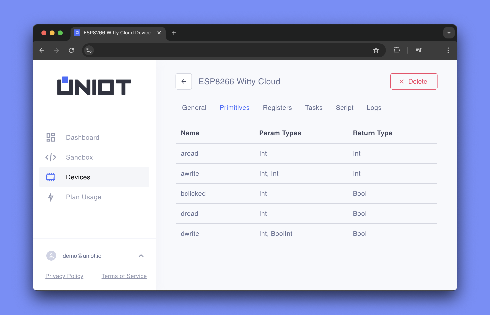
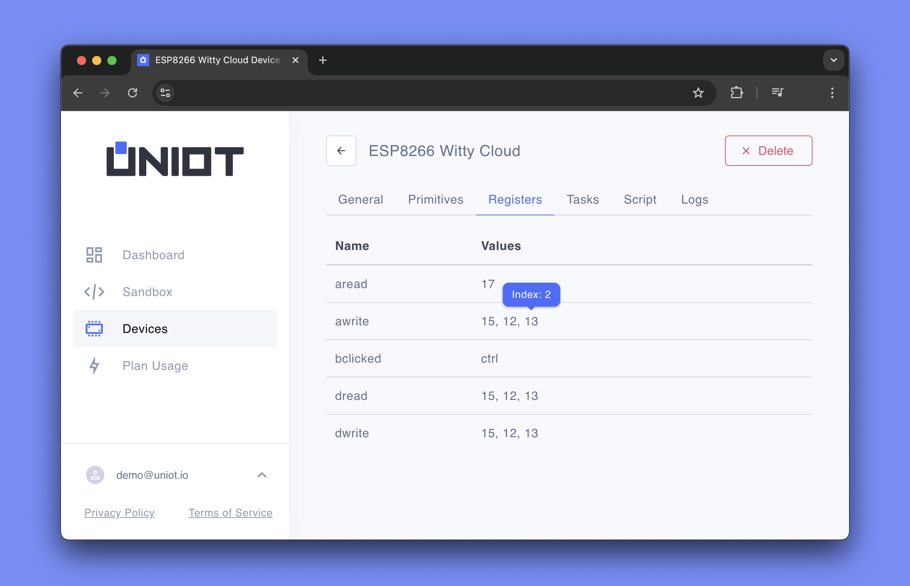

# Primitives

**Primitives** are building blocks that bridge the gap between [scripts](./scripting.md) and hardware interactions. They serve as functions that are called by scripts to perform operations such as reading data from sensors, controlling actuators, and generally working with peripherals. With primitives, you can use the power of scripting to control and monitor hardware components without having to dive into complex hardware-specific code every time you want to change the behavior of a device.

## Purpose

The primary purposes of Primitives in the Uniot include:

- **Abstraction:** Simplifies complex hardware interactions by providing high-level functions that encapsulate low-level operations.
- **Modularity:** Promotes a modular architecture in which hardware functions are packaged into discrete, reusable components.
- **Flexibility:** Provides dynamic and programmable hardware control via scripts, enabling rapid development and iteration.
- **Maintenance:** Simplifies maintenance and upgrades by isolating hardware-specific code in primitives, reducing the impact of changes on the overall system.
- **Scalability:** Supports the addition of new hardware features by registering new primitives, improving system scalability.

## Implementation

Primitives are implemented and managed within the [`PrimitiveExpeditor`](../advanced/uniot-core/lispwrapper/primitiveexpeditor.md) component of the [`LispWrapper`](../advanced/uniot-core/lispwrapper/README.md) module. The [`PrimitiveExpeditor`](../advanced/uniot-core/lispwrapper/primitiveexpeditor.md) class handles primitive registration, validation, and register management. For more information about registers, see the [`Register` documentation](../advanced/uniot-core/register/README.md).

### Types of Primitives

There are two types of primitives:

1. **User-written Primitives**: Custom primitives for controlling complex peripherals that require more sophisticated interactions
2. **Default Primitives**: Pre-defined primitives for basic digital and analog I/O operations and button interactions

### User-written Primitives

To create a custom primitive, you need to define a primitive function and add it to the Lisp environment. Here's an example that creates a `pin_high` primitive to check if a pin is in HIGH state:



```c++
Object myPrimitiveFunction(Root root, VarObject env, VarObject list) {
  // Describe the primitive with its name, return type, argument count, and argument types
  auto expeditor = PrimitiveExpeditor::describe("pin_high", Lisp::Bool, 1, Lisp::Int)
                      .init(root, env, list);

  // Ensure the provided arguments match the description
  expeditor.assertDescribedArgs();

  // Retrieve the first argument (pin number)
  auto pin = expeditor.getArgInt(0);

  // Return true if the pin is HIGH, false otherwise
  return expeditor.makeBool(digitalRead(pin) == HIGH);
}

void setup() {
  // ... other setup code ...

  // Add the primitive to the UniotLisp environment
  MainAppKit.getLisp().pushPrimitive(myPrimitiveFunction);

  // ... other setup code ...
}
```



Once registered, this primitive is accessible from both [UniotLisp](../advanced/uniot-lisp/README.md) scripts and the [Visual Editor](../platform/sandbox/visual-editor/README.md).

### Default Primitives

Default primitives handle basic I/O operations through pin registers. For a complete list of default primitives, see the [Default Primitives documentation](../advanced/uniot-core/lispwrapper/defaultprimitives.md).

Here's an example of setting up registers for common components:



```c++
#define PIN_LDR A0      // Light sensor
#define PIN_BUTTON D2   // Push button
#define PIN_RED 15      // Red LED
#define PIN_GREEN D6    // Green LED
#define PIN_BLUE D7     // Blue LED

void setup() {
  // ... other setup code ...
  PrimitiveExpeditor::getRegisterManager().setDigitalOutput(PIN_RED, PIN_GREEN, PIN_BLUE);
  PrimitiveExpeditor::getRegisterManager().setDigitalInput(PIN_RED, PIN_GREEN, PIN_BLUE);
  PrimitiveExpeditor::getRegisterManager().setAnalogOutput(PIN_RED, PIN_GREEN, PIN_BLUE);
  PrimitiveExpeditor::getRegisterManager().setAnalogInput(PIN_LDR);
  // ... other setup code ...
}
```



### Registers

Registers are an abstraction layer that simplifies pin management and hardware access. They act as organized collections of pins grouped by their functionality, making it easier to work with multiple pins and ensuring proper pin configuration.

The register manager provides four register types for default primitives:

- `dwrite`: Register for writing digital values
  - Controls digital output pins like LEDs or relays
  - Accepts boolean values (**#t** for **HIGH**, **()** for **LOW**)
  - Pins must be configured using `setDigitalOutput()`

- `dread`: Register for reading digital values
  - Reads from digital input pins like buttons or switches
  - Returns boolean values (**#t** for **HIGH**, **()** for **LOW**)
  - Pins must be configured using `setDigitalInput()`

- `awrite`: Register for writing analog values
  - Controls PWM-capable pins for analog output
  - Accepts values from **0-1023** for variable control
  - Commonly used for LED brightness or motor speed
  - Pins must be configured using `setAnalogOutput()`

- `aread`: Register for reading analog values
  - Reads from analog input pins like sensors
  - Returns values from **0-1023** representing voltage levels
  - Used for temperature, light, or other analog sensors
  - Pins must be configured using `setAnalogInput()`

Using registers provides several benefits:

- Organized pin management and access control
- Type safety through proper pin configuration
- Simplified hardware abstraction in scripts
- Efficient pin state tracking and updates

## Using Primitives

You can view available primitives and registers for your device on the Uniot Platform. On the Registers page, hovering over a pin value shows its index, **which you'll use when writing scripts**.

<div><figure><figcaption>Primitives Tab</figcaption></figure></div>
<div><figure><figcaption>Registers Tab</figcaption></figure></div>

For more information about using primitives in scripts, see the [Primitives](../platform/sandbox/visual-editor/primitives.md) section of the Visual Editor.

## Related Topics

- [Scripting](./scripting.md): Learn how to use primitives in scripts
- [Registers](../advanced/uniot-core/register/README.md): Information on the register system
- [Default Primitives](../advanced/uniot-core/lispwrapper/defaultprimitives.md): List of built-in primitives
- [LispWrapper](../advanced/uniot-core/lispwrapper/README.md): Overview of the Lisp wrapper module
- [PrimitiveExpeditor](../advanced/uniot-core/lispwrapper/primitiveexpeditor.md): Detailed documentation on the primitive expeditor
