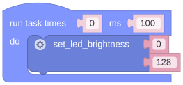

# Primitives

## Overview

Primitives are the bridge between C++ application code and scripts in Uniot Core. They are C++ functions callable from script that enable hardware access, complex calculations, and integration with application logic.

Uniot Core provides two types of primitives:

1. **Built-in Primitives**: Pre-implemented functions for common hardware operations (GPIO, buttons)
2. **Custom Primitives**: User-defined functions for application-specific logic

A third group is always present and needs no registration: `task`, `is_event`, `pop_event` and `push_event` are the core primitives every script is built around. They are described on the [Scripting](scripting.md) page.

### Use Cases

Common scenarios where primitives are valuable:

- **Hardware Control**: Expose sensors, actuators, and peripherals to scripts
- **Complex Logic**: Implement algorithms in C++ but allow script-based configuration
- **State Management**: Let scripts read and modify device state
- **Custom Protocols**: Implement device-specific communication protocols

## How Primitives Work

### Execution Flow

1. **Script Received**: Device receives a script via MQTT, or restores the persisted one from flash at boot
2. **Interpreter Built**: A fresh UniotLisp interpreter is created and every registered primitive is installed into it
3. **Primitive Call**: Script calls a primitive function
4. **C++ Execution**: Primitive validates its arguments and executes C++ code
5. **Result Return**: Result is converted back to a Lisp value
6. **Script Continues**: Script processes the result

### Type System

Primitives declare the type of each argument. The declaration is checked when the primitive is called, and a mismatch stops the script with an error such as `[dwrite] Invalid type of 1 parameter, expected <Bool/Int>, got <Symbol>`.

| Lisp Type       | Accepts                              | Read with                                    | Notes                                                                                                   |
| --------------- | ------------------------------------ | -------------------------------------------- | ------------------------------------------------------------------------------------------------------- |
| `Lisp::Int`     | Integer                              | `getArgInt(i)` → `int`                       | UniotLisp has no floats; scale fractional values to integers                                            |
| `Lisp::Bool`    | `#t` / `()` (true / nil)             | `getArgBool(i)` → `bool`                     | There is no `#f`; `()` is the only false value                                                          |
| `Lisp::BoolInt` | A boolean or an integer              | `getArgBool(i)` or `getArgInt(i)`            | `getArgBool` treats non-zero as true; `getArgInt` turns `#t` into `1` and `()` into `0`                 |
| `Lisp::Symbol`  | A symbol, usually quoted (`'name`)   | `getArgSymbol(i)` → `const char *`           | Used for event names and other identifiers                                                              |
| `Lisp::Cell`    | A list, usually a quoted expression  | `getArg(i)` → raw `Object`                   | Received unevaluated; `task` uses this for its body and evaluates it later                              |
| `Lisp::Any`     | Anything                             | Any of the above                             | Skips validation for that argument; the accessor you call still checks its own type                     |

The return type is declared the same way and produced with `makeInt()`, `makeBool()` or `makeSymbol()`. Every primitive must return something; an action-only primitive returns a boolean.

### How the Platform Learns About Primitives

A primitive's name, return type and argument types are declared once, in its `describe()` call. When the device connects to MQTT, Uniot Core sends that description for every custom primitive in the device status packet, next to the list of registers and the FOURCC labels of the objects behind them. The platform uses this to draw the blocks in the Visual Editor, to generate the user library block, and to show the pin mapping on the device's **Registers** tab. Nothing about a primitive has to be configured on the platform side.

### User Library Block


**Using the Visual Editor?** This block is generated for you from the device's primitive list. You can skip this section unless you write scripts by hand.


Scripts begin with a metadata block that lists the primitives the script uses. It is written entirely as comments, so the interpreter on the device ignores it. Its readers are the tools around the script: the Visual Editor writes it, and the Code Editor and the [Emulator](../platform/sandbox/emulator.md) rely on it to know which functions exist. A hand-written script that calls a primitive missing from the block fails to compile in the Emulator with "Undefined symbol".

**Structure**

The user library block is enclosed by special markers, exactly as the Visual Editor emits it:

```lisp
;;; begin-user-library
;; This block describes the library of user functions.
;; So the editor knows that your device implements it.
;
; (defjs primitive-name (arg1 arg2 ...)) ;-> ReturnType
;
;;; end-user-library
```

**Purpose**

- **Editor and Emulator**: They only know the primitives declared here, built-ins included
- **Documentation**: The block doubles as inline documentation of what the script expects from the device

**When You Need to Care About This**

- **Visual Editor Users**: Nothing to do; the block is generated and kept up to date for you
- **Manual Script Writers**: **Required**; add the block at the top of every script and declare every primitive the script calls, including built-ins such as `dwrite` or `aread`

**Syntax: `defjs` Declarations**

Each primitive is declared on its own line:

```lisp
; (defjs primitive-name (param1 param2 ...)) ;-> ReturnType
```

The parameter names are only labels. The Visual Editor uses `pin`, `state`, `value` and `button_id` for the built-ins and `_0`, `_1`, … for custom primitives.

**Example**

If you have a custom primitive `set_led_brightness` that takes two integers (LED index and brightness) and returns a boolean:

```lisp
;;; begin-user-library
;; This block describes the library of user functions.
;; So the editor knows that your device implements it.
;
; (defjs set_led_brightness (_0 _1)) ;-> Bool
; (defjs dwrite (pin state)) ;-> Bool
; (defjs aread (pin)) ;-> Int
;
;;; end-user-library

;; Rest of your script starts here
(task 0 100 '
  (list
    (if (> (aread 0) 512)
      (set_led_brightness 0 255))))
```

**Notes**

- The block is delimited by `;;; begin-user-library` and `;;; end-user-library` markers
- Each declaration is on a single line, prefixed with `;` (comment)
- The `;->` arrow indicates the return type
- Multiple primitives can be declared in the same block
- The block appears at the very beginning of the script
- The device itself never reads it; a script without the block runs on the device exactly the same

## Built-in Primitives

Uniot Core includes a set of built-in primitives for common hardware operations. These primitives work in conjunction with the **Register system**, which provides a layer of abstraction between scripts and physical hardware pins.

### The Register System

The Register system maps logical pin indices (used in scripts) to physical GPIO pins. This abstraction provides several benefits:

- **Safety**: Scripts can't accidentally access unregistered pins
- **Flexibility**: Physical pin assignments can change without modifying scripts
- **Portability**: Same scripts work on different hardware configurations
- **Organization**: Group related pins under named registers

#### How It Works

1. **Registration**: C++ code registers physical GPIO pins using `Uniot.registerLisp*()` methods
2. **Mapping**: Each registered pin gets a logical index (0, 1, 2, ...) in registration order
3. **Access**: Scripts use logical indices to access pins through built-in primitives
4. **Validation**: Primitives validate indices against registered pins before hardware access

Three rules follow from this design:

- **A built-in primitive exists only when its register has at least one entry.** A sketch that never calls `registerLispAnalogInput()` has no `aread`; a script calling it fails with an undefined symbol.
- **Each pin type has its own index namespace.** Digital output index `0` and analog output index `0` may be the same physical pin or different ones; they are looked up in different registers.
- **Registering again replaces the previous set.** List every pin of one type in a single `registerLisp*()` call.

### Registering GPIO Pins

Before using built-in primitives, you must register GPIO pins:

```c++
void setup() {
  // Register digital output pins (GPIO 12, 13, 14).
  // Script indices for the digital write (dwrite) primitive:
  // pin 12 = index 0, pin 13 = index 1, pin 14 = index 2
  Uniot.registerLispDigitalOutput(12, 13, 14);

  // Register digital input pins (GPIO 0, 4).
  // Script indices for the digital read (dread) primitive:
  // pin 0 = index 0, pin 4 = index 1
  Uniot.registerLispDigitalInput(0, 4);

  // Register analog output pins for PWM (GPIO 12, 13, 14).
  // Script indices for the analog write (awrite) primitive:
  // pin 12 = index 0, pin 13 = index 1, pin 14 = index 2
  Uniot.registerLispAnalogOutput(12, 13, 14);

  // Register analog input pins (GPIO A0).
  // Script indices for the analog read (aread) primitive:
  // A0 = index 0
  Uniot.registerLispAnalogInput(A0);

  Uniot.begin();
}
```


**Register inputs before `Uniot.begin()`.** Registering a pin for `dread` or `aread` sets it to plain `INPUT`, which clears any pull resistor. `begin()` gives every button on such a pin its pull back, but only for buttons it knows about at that point.


### Quick Reference

| Primitive  | Purpose                      | Registration Method           | Signature              | Returns                       |
| ---------- | ---------------------------- | ----------------------------- | ---------------------- | ----------------------------- |
| `dwrite`   | Write digital pin (HIGH/LOW) | `registerLispDigitalOutput()` | `(dwrite index state)` | Bool: the state written       |
| `dread`    | Read digital pin (HIGH/LOW)  | `registerLispDigitalInput()`  | `(dread index)`        | Bool: `#t` HIGH, `()` LOW     |
| `awrite`   | Write analog pin (PWM)       | `registerLispAnalogOutput()`  | `(awrite index value)` | Int: the value written        |
| `aread`    | Read analog pin (ADC)        | `registerLispAnalogInput()`   | `(aread index)`        | Int: 0-1023                   |
| `bclicked` | Check button click           | `addLispButton()`             | `(bclicked index)`     | Bool: `#t` once per click     |

An index that is not registered stops the script with `[dwrite] pin is out of range` (or `[bclicked] wrong button id`); the message appears on the device's **Logs** tab.

### Available Built-in Primitives

#### 1. `dwrite` - Digital Write

Writes a digital value (HIGH/LOW) to a registered output pin.

**Parameters**:

- `index` (Int): Logical pin index (0-based)
- `state` (Bool/Int): Pin state — accepts a boolean (`#t` / `()`) or an integer (non-zero = HIGH, `0` = LOW)

**Returns**: The state written, as a boolean

**C++ Registration**:

```c++
Uniot.registerLispDigitalOutput(12, 13, 14);
```

#### 2. `dread` - Digital Read

Reads a digital value (HIGH/LOW) from a registered input pin.

**Parameters**:

- `index` (Int): Logical pin index (0-based)

**Returns**: Boolean state (`#t` = HIGH, `()` = LOW)

**C++ Registration**:

```c++
Uniot.registerLispDigitalInput(0, 4);
```

#### 3. `awrite` - Analog Write (PWM)

Writes an analog value (PWM) to a registered output pin.

**Parameters**:

- `index` (Int): Logical pin index (0-based)
- `value` (Int): PWM value (0-1023)

**Returns**: The value written

The range is 0-1023 on every chip. When at least one analog output pin is registered, Uniot Core sets the PWM resolution to 10 bits during `begin()`, so a script writes the same range on an ESP8266 and on an ESP32.

**C++ Registration**:

```c++
Uniot.registerLispAnalogOutput(12, 13, 14);
```

#### 4. `aread` - Analog Read

Reads an analog value from a registered input pin.

**Parameters**:

- `index` (Int): Logical pin index (0-based)

**Returns**: Integer value in the range 0-1023

The range is the same on every chip. The ESP8266 ADC is 10-bit already; on the ESP32 family Uniot Core sets the read resolution to 10 bits during `begin()` when at least one analog input pin is registered. The voltage behind a reading still depends on the board.

**C++ Registration**:

```c++
Uniot.registerLispAnalogInput(A0);
```

#### 5. `bclicked` - Button Clicked

Checks whether a registered button was clicked since the last check.

**Parameters**:

- `index` (Int): Button index in the `bclicked` register (0-based)

**Returns**: `#t` once per click, then `()` until the next click

A click is a press followed by a release shorter than the long-press threshold. Reading it clears it, so a second `(bclicked 0)` in the same task pass returns `()`. A click that no script reads clears itself after about 10 seconds, which means a script that starts just after a press would react to it. Call `Uniot.resetLispButtons()` from a start hook to drop such presses:

```c++
Uniot.setLispStartHook([](uniot::LispStartReason) {
  Uniot.resetLispButtons();
});
```

**C++ Registration**:

`addLispButton()` does everything a button needs in one call: it creates the `Button`, polls it every 100 ms, links it to `bclicked`, and returns the button's index. A long press is 3 seconds. The pin gets the internal pull its active level needs (pull-up for `LOW`, pull-down for `HIGH`); pins without that pull need an external resistor.

```c++
// In setup(), after Uniot.begin(). The FOURCC id labels the button on the Registers tab.
int door = Uniot.addLispButton(4, LOW, FOURCC(door));  // returns the index scripts pass to bclicked
```

Indices follow registration order in the `bclicked` register. The WiFi reset button from `configWiFiResetButton()` is linked during `Uniot.begin()`, so buttons added before `begin()` come before it and buttons added after `begin()` follow it. Adding your buttons after `begin()`, still in `setup()`, keeps the reset button at index `0` and numbers yours from `1`. Pass `false` as the third argument of `configWiFiResetButton()` to keep the reset button out of the register altogether.

For a button with different timing, create and poll it yourself, then register it. The scheduler task must be named:

```c++
auto button = new uniot::Button(5, LOW, 50);  // pin, active level, long press in poll ticks
auto buttonTask = uniot::TaskScheduler::make(*button);
Uniot.getScheduler().push("user_btn", buttonTask);
buttonTask->attach(100);                       // 50 ticks x 100 ms = 5 s long press
Uniot.registerLispButton(button, FOURCC(_btn));
```

### Register System Internals

The Register system consists of two main components:

#### GpioRegister

Manages GPIO pin mappings:

- Stores physical pin numbers in named registers (`dwrite`, `dread`, `awrite`, `aread`)
- Maps logical indices to physical GPIO numbers
- Sets the pin mode when a pin is registered

#### ObjectRegister

Manages object references (like Button instances):

- Stores pointers to registered objects, appending to the named register (`bclicked`)
- Associates objects with FOURCC identifiers that the platform shows on the Registers tab
- Provides type-safe object retrieval and detects objects that were destroyed

#### PrimitiveExpeditor Access

Built-in primitives access the Register system through `PrimitiveExpeditor`. The proxy returned by `getAssignedRegister()` is bound to the register whose name equals the primitive's name, so `dwrite` reads the `dwrite` register:

```c++
Object dwrite(Root root, VarObject env, VarObject list) {
  auto expeditor = PrimitiveExpeditor::describe(name::dwrite, Lisp::Bool, 2, Lisp::Int, Lisp::BoolInt)
                       .init(root, env, list);
  expeditor.assertDescribedArgs();

  auto pin = expeditor.getArgInt(0);      // Get logical index
  auto state = expeditor.getArgBool(1);   // Get state

  uint8_t gpio = 0;
  // Get physical GPIO from register
  if (pin >= 0 && expeditor.getAssignedRegister().getGpio(pin, gpio)) {
    digitalWrite(gpio, state);            // Write to physical pin
  } else {
    expeditor.terminate("pin is out of range");
  }

  return expeditor.makeBool(state);
}
```

## Creating Custom Primitives

### Basic Structure

A primitive is a C++ function with a specific signature:

```c++
Object primitive_name(Root root, VarObject env, VarObject list)
```

**Parameters**:

- `root`: Garbage collector root (memory management)
- `env`: Current environment (scope/context)
- `list`: Argument list from Lisp

Three rules apply to every primitive:

- **`describe(...).init(...)` is the first statement.** When you register a primitive, Uniot Core calls it once with null arguments to read its description and jumps out of `describe()` before the body runs. Code placed before `describe()` would run with those null arguments.
- **The name in `describe()` is the Lisp name.** The C++ function name does not matter. The described name is what scripts call, what the platform lists, and the name of the register the primitive can read.
- **Register before `Uniot.begin()`.** `addLispPrimitive()` queues the primitive; it is installed when a script's interpreter is built, and the persisted script starts at the end of `begin()`.

### Using PrimitiveExpeditor

`PrimitiveExpeditor` is a helper class that simplifies primitive creation by handling argument validation, argument extraction, type conversion, error reporting and return value creation.

| Method                                   | Purpose                                                                                                             |
| ---------------------------------------- | ------------------------------------------------------------------------------------------------------------------- |
| `describe(name, returnType, count, ...)` | Declares the primitive: Lisp name, return type, number of arguments, then one `Lisp::` type per argument (up to 16) |
| `.init(root, env, list)`                 | Binds the description to the current call; the result is the expeditor                                              |
| `assertDescribedArgs()`                  | Checks the argument count and types against the description and evaluates the arguments; call it first              |
| `getArgInt(i)`                           | Reads argument `i` as `int`                                                                                         |
| `getArgBool(i)`                          | Reads argument `i` as `bool`                                                                                        |
| `getArgSymbol(i)`                        | Reads argument `i` as `const char *`                                                                                |
| `getArg(i)`                              | Returns argument `i` as a raw Lisp object, for `Lisp::Cell` arguments                                                |
| `getArgsLength()`                        | Number of arguments actually passed                                                                                 |
| `makeInt(v)`, `makeBool(v)`, `makeSymbol(s)` | Builds the return value                                                                                         |
| `terminate(msg)`                         | Stops the script with `[name] msg`; see [Reporting Errors](#reporting-errors)                                       |
| `getAssignedRegister()`                  | Proxy to the register named after the primitive; see [Linking Objects to a Primitive](#linking-objects-to-a-primitive) |

### Step-by-Step Example

Let's create a primitive that sets the brightness of one of several LEDs. Like the built-ins, it takes a logical index rather than a GPIO number, so the script does not depend on the wiring.

**1. Declare the Primitive**

```c++
#include <Uniot.h>

using namespace uniot;

Object set_led_brightness(Root root, VarObject env, VarObject list);
```

**2. Implement the Primitive**

```c++
#define PIN_LED_R 15
#define PIN_LED_G 12
#define PIN_LED_B 13

// Logical LED index -> physical pin
static const uint8_t kLedPins[] = {PIN_LED_R, PIN_LED_G, PIN_LED_B};
static const int kLedCount = sizeof(kLedPins) / sizeof(kLedPins[0]);

Object set_led_brightness(Root root, VarObject env, VarObject list) {
  // Describe the primitive: name, return type, arg count, arg types
  auto expeditor = PrimitiveExpeditor::describe(
    "set_led_brightness",  // Lisp name (also reported to the platform)
    Lisp::Bool,            // Return type
    2,                     // Number of arguments
    Lisp::Int,             // First argument type (LED index)
    Lisp::Int              // Second argument type (brightness)
  ).init(root, env, list);

  // Validate that arguments match the description
  expeditor.assertDescribedArgs();

  // Extract arguments
  int index = expeditor.getArgInt(0);
  int brightness = expeditor.getArgInt(1);

  // Reject an index we have no pin for; this stops the script with a message
  if (index < 0 || index >= kLedCount) {
    expeditor.terminate("led index is out of range");
  }

  // Clamp brightness to the PWM range and perform the hardware operation
  brightness = constrain(brightness, 0, 255);
  analogWrite(kLedPins[index], brightness);

  // Return success status
  return expeditor.makeBool(true);
}
```


**Why 0-255 here and 0-1023 for `awrite`?** Arduino's default `analogWrite()` range is 0-255. Uniot Core switches the device to a 10-bit range only when analog output pins are registered with `registerLispAnalogOutput()`, and in that case `awrite` already does what this primitive does. A custom primitive that drives PWM on its own pins sees whatever range the sketch has configured.


**3. Register the Primitive**

```c++
void setup() {
  // ... other setup code ...

  for (auto pin : kLedPins) {
    pinMode(pin, OUTPUT);
  }

  // Register the primitive, before begin()
  Uniot.addLispPrimitive(set_led_brightness);

  Uniot.begin();
}
```

**4. Use in Scripts**

Once the device reconnects, the Visual Editor shows a `set_led_brightness` block and generates its `defjs` line:




<div><figure><figcaption></figcaption></figure></div>





```lisp
;;; begin-user-library
;; This block describes the library of user functions.
;; So the editor knows that your device implements it.
;
; (defjs set_led_brightness (_0 _1)) ;-> Bool
;
;;; end-user-library

(task 0 100 '
 (progn
  (set_led_brightness 0 128)))
```





### Reporting Errors

`expeditor.terminate("message")` is the way a primitive refuses to continue. It raises an interpreter error, so nothing after it runs: the script stops, the stop hook (if any) receives `LispStopReason::Failed`, and `[primitive_name] message` is published to the device's **Logs** tab. The built-ins use it for an unregistered index; use it for anything the script cannot recover from, such as an argument out of range or hardware that is not ready.

For conditions the script should handle itself, return a value instead. A sensor read that can fail is better off returning a sentinel, for example `-1000` for "no reading", so the script can skip that pass and try again on the next one.

### Linking Objects to a Primitive

A custom primitive can use the same Register system as `bclicked`. Link a C++ object under the primitive's name and the primitive fetches it by index, so scripts address instances by `0`, `1`, `2` rather than by anything hardware-specific:

```c++
class Relay : public uniot::ObjectRegisterRecord {
  // ... your object; it must derive from ObjectRegisterRecord ...
};

Relay relayA(12), relayB(13);

Object relay_set(Root root, VarObject env, VarObject list) {
  auto expeditor = PrimitiveExpeditor::describe("relay_set", Lisp::Bool, 2, Lisp::Int, Lisp::Bool)
                       .init(root, env, list);
  expeditor.assertDescribedArgs();

  auto relay = expeditor.getAssignedRegister().getObject<Relay>(expeditor.getArgInt(0));
  if (!relay) {
    expeditor.terminate("wrong relay index");
  }

  relay->set(expeditor.getArgBool(1));
  return expeditor.makeBool(true);
}

void setup() {
  // The register name must equal the name passed to describe()
  Uniot.registerLispObject("relay_set", &relayA, FOURCC(rlyA));  // (relay_set 0 ...)
  Uniot.registerLispObject("relay_set", &relayB, FOURCC(rlyB));  // (relay_set 1 ...)
  Uniot.addLispPrimitive(relay_set);
  Uniot.begin();
}
```

Each `registerLispObject()` call appends to the register, so indices follow registration order. The FOURCC id is what the platform shows for that slot on the Registers tab. If an object is destroyed, `getObject()` returns `nullptr` for its slot instead of a dangling pointer.

## Best Practices

### Descriptive Names

Use clear, descriptive names that indicate what the primitive does:

```c++
// Good
Object turn_relay_on(...)
Object read_temperature_sensor(...)
Object set_motor_speed(...)

// Avoid
Object relay(...)  // Ambiguous
Object temp(...)   // Too abbreviated
Object go(...)     // Unclear
```

### Validate Inputs

Check every argument before touching hardware, and let `terminate()` report what went wrong. A silent `makeBool(false)` hides the mistake from whoever is editing the script:

```c++
Object set_pwm(Root root, VarObject env, VarObject list) {
  auto expeditor = PrimitiveExpeditor::describe("set_pwm", Lisp::Bool, 2, Lisp::Int, Lisp::Int)
                     .init(root, env, list);
  expeditor.assertDescribedArgs();

  int index = expeditor.getArgInt(0);
  int value = expeditor.getArgInt(1);

  if (index < 0 || index >= kPwmCount) {
    expeditor.terminate("index is out of range");  // stops the script; shown on the Logs tab
  }

  value = constrain(value, 0, 255);  // out-of-range values are clamped, not fatal
  analogWrite(kPwmPins[index], value);
  return expeditor.makeBool(true);
}
```

### Keep Primitives Short and Non-blocking

A primitive runs inside the scheduler pass that evaluates the script, so everything else on the device waits for it. Do not `delay()` or poll in a loop. Read a value, write a value, or kick off work that a scheduler task finishes later:

```c++
// Good - focused primitives
Object read_sensor(...);
Object calculate_average(...);
Object send_notification(...);

// Avoid - doing too much
Object read_sensor_calculate_and_notify(...);  // Too complex, and probably blocking
```

### Integers Only

UniotLisp has no floating-point type. Scale fractional values before returning them, and say so in the primitive's name or documentation:

```c++
// Return tenths of a degree: 23.4 °C -> 234
return expeditor.makeInt((int)(temperature * 10));
```

### Use Logging

Log operations for debugging and monitoring:

```c++
Object important_operation(Root root, VarObject env, VarObject list) {
  auto expeditor = PrimitiveExpeditor::describe("important_operation", Lisp::Bool, 1, Lisp::Int)
                     .init(root, env, list);
  expeditor.assertDescribedArgs();

  int value = expeditor.getArgInt(0);

  UNIOT_LOG_INFO("Performing operation with value: %d", value);

  bool success = performOperation(value);

  if (success) {
    UNIOT_LOG_DEBUG("Operation completed successfully");
  } else {
    UNIOT_LOG_ERROR("Operation failed");
  }

  return expeditor.makeBool(success);
}
```

### Return Meaningful Values

Choose return types that provide useful information:

```c++
// Return bool for success/failure
Object write_config(...) -> Bool

// Return int for numeric data
Object read_sensor(...) -> Int

// Return symbol for status
Object get_device_state(...) -> Symbol
```

## Conclusion

Primitives are the foundation of dynamic behavior in Uniot Core, enabling both simple GPIO operations and complex device control through scripts.

**Built-in Primitives** provide:

- Immediate access to common hardware operations
- Safe, validated GPIO access through the Register system
- Consistent interface and value ranges across different devices
- No additional C++ code required

**Custom Primitives** enable:

- Extensibility: Add new capabilities without modifying the core framework
- Flexibility: Update device behavior through scripts
- Maintainability: Separate hardware logic from business logic
- Optimization: Performance-critical operations in C++

By combining built-in and custom primitives with scripting, you can create powerful, flexible IoT devices that are:

- **Remotely Reconfigurable**: Update logic via MQTT without reflashing
- **Hardware Abstracted**: Scripts work across different physical setups
- **Safe**: The Register system prevents access to unregistered pins
- **Maintainable**: Clear separation between firmware and scripts

## Further Reading

- [**Scripting**](scripting.md): The task model, events, script delivery and debugging
- [**Emulator**](../platform/sandbox/emulator.md): Run scripts against mocked primitives before deploying
- [**Visual Editor: Primitives**](../platform/sandbox/visual-editor/primitives.md): The blocks that correspond to the primitives on this page
- [**Uniot Core Reference**](https://github.com/uniot-io/uniot-core/blob/master/docs/reference.md#4-uniotlisp-scripting): The firmware's own reference for scripting, buttons and lifecycle hooks
- [**PrimitiveExpeditor**](https://core.docs.uniot.io/latest/group__uniot-lisp-primitive-expeditor.html): Complete reference for argument handling and validation
- [**Register System**](https://core.docs.uniot.io/latest/group__registers.html): Detailed documentation on GPIO and object registration
- [**UniotLisp Interpreter**](../advanced/uniot-lisp/embedding-instructions.md): Understanding the embedded UniotLisp environment and syntax
