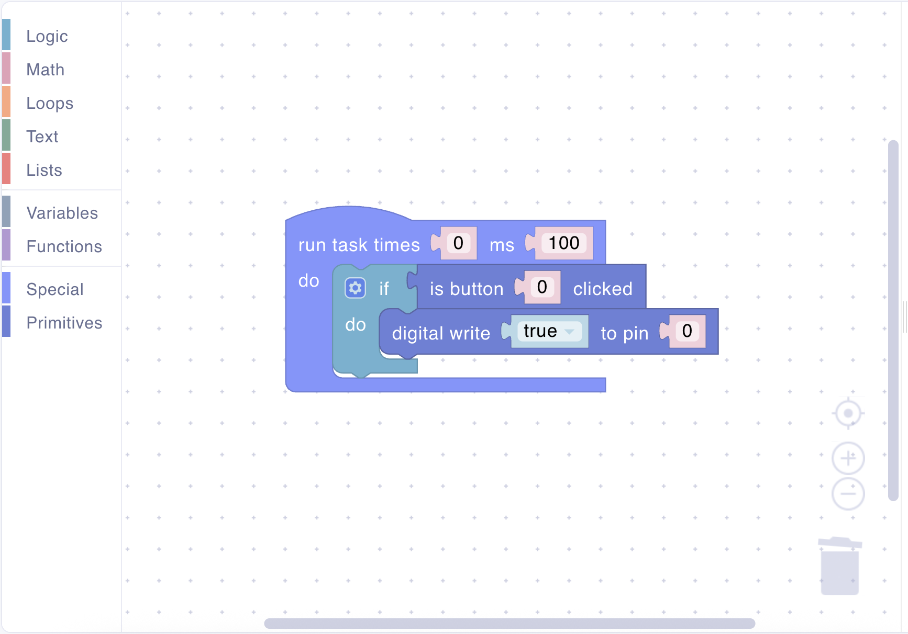
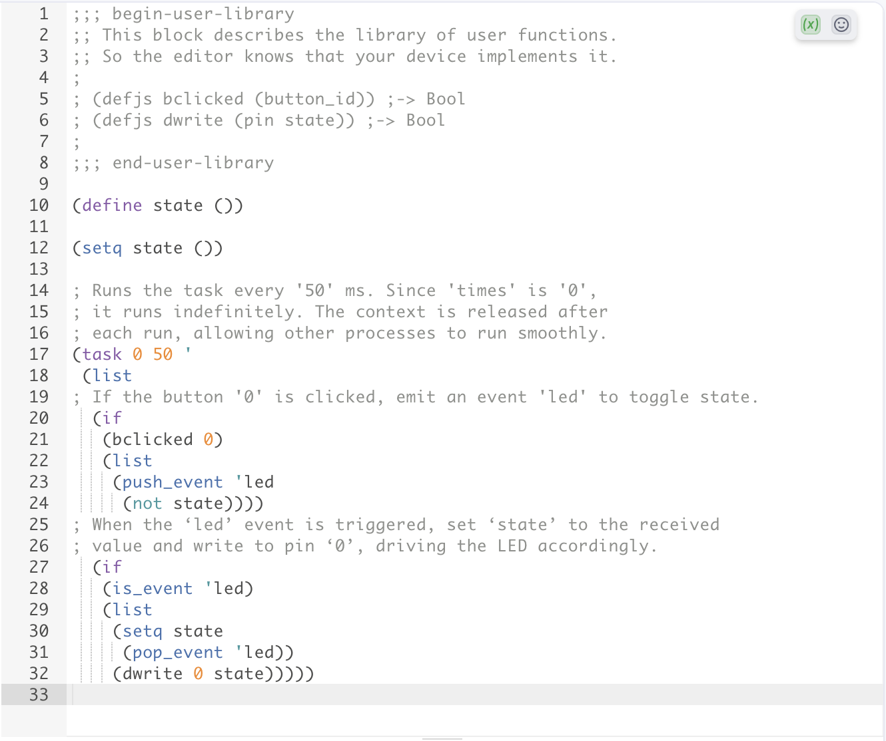
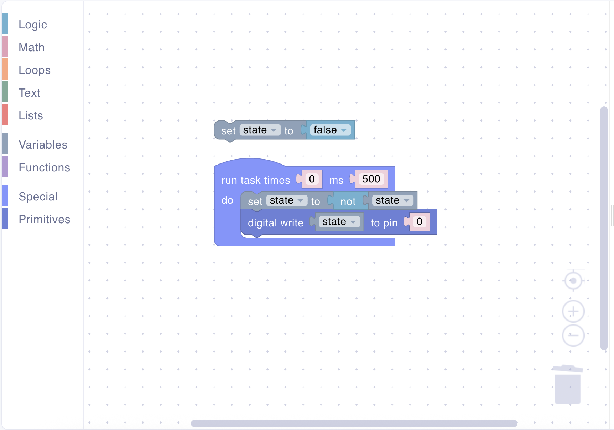
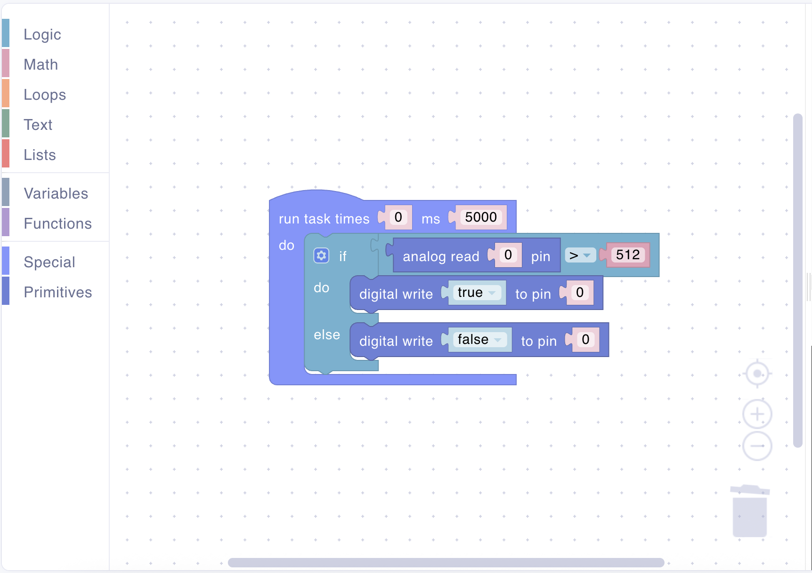
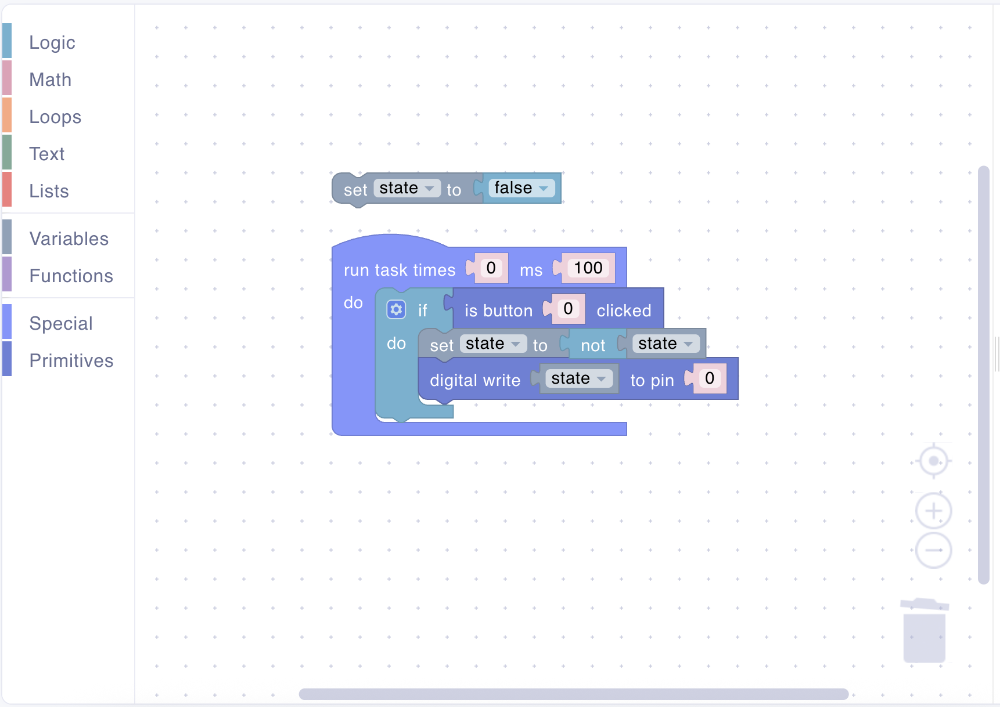

# Scripting

## Overview

Scripting is a core feature of Uniot that enables dynamic device behavior through remote code execution. Instead of hardcoding all logic in firmware, you can send scripts to devices via MQTT, allowing you to:

- **Update logic without reflashing**: Change device behavior instantly
- **Deploy different behaviors**: Same firmware, different scripts per device
- **A/B test features**: Try different algorithms on different devices
- **Rapid prototyping**: Test ideas without compilation cycles
- **User customization**: Let end-users define their own automation rules

Scripts are written in **UniotLisp**, a lightweight Lisp dialect optimized for embedded systems, and executed by the on-device interpreter.

## Workflow

### Script Creation

Uniot provides two ways to create scripts, catering to different user skill levels:

#### Visual Editor (Blockly)

A drag-and-drop interface for users who prefer graphical programming:

- **Block-based Programming**: Drag blocks representing actions, conditions, and logic
- **No Syntax Knowledge Required**: Visual blocks prevent syntax errors
- **Automatic Code Generation**: Blocks are converted to UniotLisp code
- **Instant Preview**: See the generated Lisp code in real-time
- **Perfect for**: Beginners, quick prototyping, common automation tasks

**Example Visual Blocks**:

<div><figure><figcaption></figcaption></figure></div>

**Generated UniotLisp Code**:

```lisp
(task 0 100 '
 (list
  (if
   (bclicked 0)
   (list
    (dwrite 0 #t)))))
```

#### Manual Code Editor

A text-based editor for advanced users who want full control:

- **Full Language Access**: Use all UniotLisp features and primitives
- **Syntax Highlighting**: Visual feedback for code structure
- **Error Detection**: Real-time syntax validation
- **Perfect for**: Advanced users, complex logic, performance-critical code

<div><figure><figcaption></figcaption></figure></div>

### Script Delivery

Scripts are delivered to devices through MQTT:

```
Uniot Platform → MQTT Broker → Device → UniotLisp Interpreter → Execution
```

**Delivery Flow**:

1. **User creates/edits script** in the [Sandbox](../platform/sandbox/README.md)
2. **Script is packaged** as CBOR-encoded MQTT message
3. **Published to device topic**: `<domain>/users/<userId>/devices/<deviceId>/script`
4. **Device receives script** via MQTT subscription
5. **Script is validated** and optionally stored
6. **Interpreter executes** the script

**Script Payload Structure** (CBOR):

```json
{
  "code": "(defun hello () (print 'hello-world)) (hello)",
  "persist": true,
  "timestamp": 1679968928
}
```

**Fields**:

- `code`: UniotLisp source code
- `persist`: Whether to save script and run on reboot
- `timestamp`: Timestamp when the script was sent

### Script Execution

The UniotLisp interpreter executes scripts in a sandboxed environment:

**Execution Lifecycle**:

```
Script Received → Parse → Validate → Execute → Monitor → Report
```

1. **Parsing**: Code is parsed into Abstract Syntax Tree (AST)
2. **Validation**: Syntax and semantic checks
3. **Execution**: Code runs in isolated environment
4. **Monitoring**: Memory and execution time tracking
5. **Reporting**: Errors and logs sent back via MQTT

**Interpreter Sandbox Limitations**:

- ✅ **Allowed**: Registered primitives, defined variables, safe operations
- ❌ **Restricted**: Direct memory access, system calls, infinite loops (watchdog)
- 🔒 **Protected**: Only registered GPIO pins accessible

### Task-based Execution Model

Each script provides a main execution loop through the `task` statement. This block must be included in a script. The scheduler calls the script periodically.

- `(task times period ' body)`
  - `times`: how many times to run (use `0` for infinite)
  - `period`: interval between runs in milliseconds
  - `body`: quoted list of expressions to evaluate each tick

Example (run forever every 100 ms):

<div><figure><figcaption></figcaption></figure></div>

```lisp
(task 0 100 '
 (list
  (if
   (bclicked 0)
   (list
    (dwrite 0 #t)))))
```

This model keeps scripts cooperative and responsive.

### Script Persistence

Scripts can persist across device reboots:

**Persistence Options**:

| Mode           | Description                  | Use Case                    |
| -------------- | ---------------------------- | --------------------------- |
| **Volatile**   | Runs once, not saved         | Testing, temporary behavior |
| **Persistent** | Saved to flash, runs on boot | Production automation rules |

**Storage**:

- Scripts stored in filesystem
- Checksum verified on load
- Failed scripts don't prevent boot

## Examples

Below are pairs of visual blocks and the generated UniotLisp code.

### Button → Turn LED On

Run task every 100 ms; if button 0 clicked → digital write true to pin 0.

<div><figure><figcaption></figcaption></figure></div>

Generated code:

```lisp
(task 0 100 '
 (list
  (if
   (bclicked 0)
   (list
    (dwrite 0 #t)))))
```

### Blink LED (toggle state)

Run task every 500 ms; toggle LED at pin 0.

<div><figure><figcaption></figcaption></figure></div>

Generated code:

```lisp
(define state ())
(setq state ())
(task 0 500 '
 (list
  (setq state
   (not state))
  (dwrite 0 state)))
```

### Sensor Threshold Control

Run task every 5 s; if sensor (A0) > 512 → LED on else LED off.

<div><figure><figcaption></figcaption></figure></div>

Generated code:

```lisp
(task 0 5000 '
 (list
  (if
   (>
    (aread 0) 512)
   (list
    (dwrite 0 #t))
   (list
    (dwrite 0 ())))))
```

### Button Toggle Latch

Run task every 100 ms; if button clicked → toggle LED.

<div><figure><figcaption></figcaption></figure></div>

Generated code:

```lisp
(define state ())
(setq state ())
(task 0 100 '
 (list
  (if
   (bclicked 0)
   (list
    (setq state
     (not state))
    (dwrite 0 state)))))
```

## Best Practices

### Keep Scripts Simple

Break complex logic into functions:

```lisp
; Good - modular and readable
(defun read_sensor ()
 (aread 0))
(defun is_too_hot
 (t)
 (> t 512))
(defun activate_cooling ()
 (dwrite 0 #t))

(task 0 500 '
 (list
  (if
   (is_too_hot
    (read_sensor))
   (list
    (activate_cooling)))))

; Avoid - complex monolithic code
(task 0 500 '
 (list
  (if
   (>
    (aread 0) 512)
   (list
    (dwrite 0 #t)))))
```

### Use Meaningful Names

```lisp
; Good
(define temprature_treshold 20)
(defun turn_on_heater ()
 (dwrite 0 #t))

; Avoid
(define tt 20)
(defun toh ()
 (dwrite 0 #t))
```

### Add Comments

```lisp
; Check if room temperature is below threshold
; and activate heating if necessary
(defun check_heating ()
 (setq temp
  (read_temp_sensor)) ; Read DS18B20 sensor
 (if
  (< temp temrature_treshold)
  (list
   (activate_heating)))) ; Turn on relay
```

## Debugging Scripts

### Logging

Use the `print` statement (the corresponding [visual block](../platform/sandbox/visual-editor/text.md#print)) for debugging:

```lisp
(print 'script-started)
(print (eval ' (aread 0)))
```

Printed messages are published to:

- MQTT topic: `<domain>/users/<userId>/devices/<deviceId>/debug/log`
- Visible under the “Logs” tab on the device page

### Errors

If the interpreter encounters an error while executing a script, an event is published to:

- MQTT topic: `<domain>/users/<userId>/devices/<deviceId>/debug/err`

You can see in the device list when an error occurs on one of them. The error message is displayed in the same place as the logs (device page → "Logs" tab).

### Common Issues

#### Script Not Running

**Check**:

1. Device is online and connected
2. Script was successfully deployed (check the "Script" tab on the device page)
3. No syntax errors (check whether device has an error)
4. Device has enough memory

#### Unexpected Behavior

**Debug Steps**:

1. Add `print` statements at key points
2. Verify GPIO registration matches script indices (the "Registers" tab on the device page)
3. Check variable values with `print` and `eval` statements
4. Test primitives individually

#### Memory Errors

**Solutions**:

1. Reduce heap size usage
2. Avoid large lists
3. Clear unused variables
4. Increase `UNIOT_LISP_HEAP` in firmware

## Conclusion

Scripting transforms devices from fixed-function hardware into dynamic, programmable platforms. By combining:

- **Easy Creation** (Visual editor for beginners, code editor for experts)
- **Remote Deployment** (MQTT-based delivery)
- **Sandboxed Execution** (Safe, isolated environment)
- **Hardware Access** (Primitives for GPIO and sensors)
- **Persistence** (Survive reboots)

You can create IoT solutions that are:

- **Flexible**: Change behavior without reflashing
- **User-Friendly**: Non-programmers can create automations
- **Powerful**: Advanced users have full control
- **Safe**: Sandboxed execution protects devices
- **Maintainable**: Version control and rollback

Whether you're building smart home automation, industrial monitoring, or custom IoT solutions, scripting enables rapid iteration and deployment of device logic.

## Further Reading

- [**Primitives**](./primitives.md): Understanding built-in and custom primitives
- [**UniotLisp Reference**](../advanced/uniot-lisp/README.md): Complete language documentation
- [**MQTT Protocol**](../api-reference/mqtt-convention.md): How scripts are delivered to devices
- [**Uniot Platform Guide**](../platform/README.md): Using the visual editor and code editor
