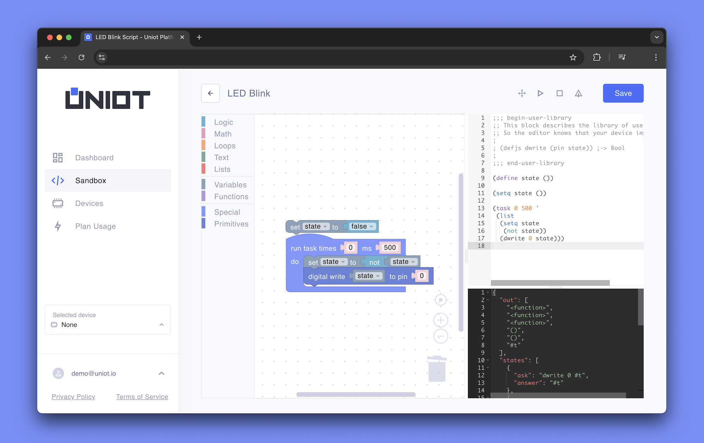

# Scripting

**Scripts** are one of the most interesting features of Uniot - they define how your device thinks and behaves. Think of scripts as a set of instructions that tell your device what to do: when to turn the lights on, how to respond to button presses, how to process sensor data, or how to interact with other devices and dashboards via MQTT.

This flexibility means both beginners and experienced developers can create powerful IoT systems, from simple automated switches to complex networks. Whether you're just starting your IoT journey or you're a seasoned programmer, Uniot's scripting capabilities provide the tools you need to bring your ideas to life.

## Overview

Scripts in Uniot can be created in two ways:

1. **Visual Editor**: A drag-and-drop interface based on [Blockly](https://developers.google.com/blockly) that allows you to create scripts visually.
2. **UniotLisp Code**: Direct programming using the UniotLisp language, offering more advanced control and flexibility.



You can not use both methods simultaneously. Once you start writing UniotLisp code directly, you'll need to recompile your visual blocks to return to the Visual Editor.



## Visual Editor

The Visual Editor provides an intuitive way to create scripts using a drag-and-drop interface. Read more about it in the [Visual Editor](../platform/sandbox/visual-editor/README.md) documentation.

Ideal for:

- Beginners learning IoT programming
- Rapid prototyping
- Understanding program flow visually
- Learning UniotLisp concepts

## UniotLisp

UniotLisp is a lightweight Lisp implementation for embedded systems. It provides basic data types, operations, control structures, and hardware access primitives. Read more about it in the [UniotLisp](../advanced/uniot-lisp/README.md) documentation.

Ideal for:

- Experienced developers
- Complex applications
- Performance optimization
- Advanced program structures

## Script Execution

Scripts run in an autonomous environment powered by the UniotLisp interpreter on your microcontroller. The interpreter:

- Executes scripts in a lightweight virtual machine
- Manages memory for embedded systems efficiently
- Handles garbage collection automatically
- Provides error checking and reporting
- Maintains isolated execution environments

Scripts can:

- **Access Hardware**: Interact with sensors and actuators through primitives
- **Process Data**: Perform calculations and logic operations using built-in functions
- **Handle MQTT**: Send and receive MQTT messages for remote communication
- **Control Timing**: Manage execution frequency

## Development Workflow

1. **Create**: Write your script using either the Visual Editor or UniotLisp code
2. **Test**: Use the built-in [Emulator](../platform/sandbox/emulator.md) to verify behavior
3. **Debug**: Utilize the [Logger](../platform/sandbox/logger.md) to track execution and identify issues
4. **Deploy**: Upload the verified script to your device

## Example Script

This example script toggles an LED connected to pin 0 on and off every 500ms using the `dwrite` primitive. Read more about primitives [here](./primitives.md).

<figure><figcaption></figcaption></figure>

In this script, the following components are used:

- [`task`](../platform/sandbox/visual-editor/special.md#task) block: Defines the main execution loop
- [`set`](../platform/sandbox/visual-editor/variables.md#set) variable: Updates the value of the `state` variable
- [`not`](../platform/sandbox/visual-editor/logic.md#not) variable: Inverts the value of the `state` variable
- [`dwrite`](../platform/sandbox/visual-editor/primitives.md#digital-write) primitive: Writes a digital value to a pin 0

## Related Topics

- [Primitives](./primitives.md): Learn about hardware interaction functions
- [Visual Editor](../platform/sandbox/visual-editor/README.md): Detailed guide to visual programming
- [UniotLisp](../advanced/uniot-lisp/README.md): Complete language documentation
