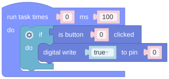
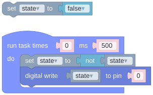
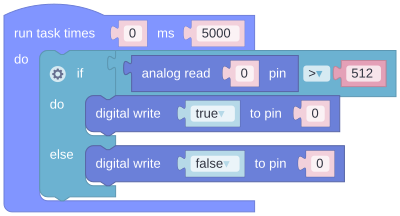
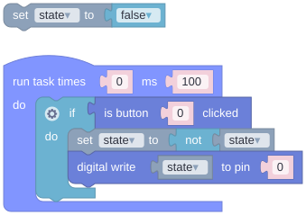

# Scripting

## Overview

Scripting is a core feature of Uniot that enables dynamic device behavior through remote code execution. Instead of hardcoding all logic in firmware, you can send scripts to devices via MQTT, allowing you to:

- **Update logic without reflashing**: Change device behavior instantly
- **Deploy different behaviors**: Same firmware, different scripts per device
- **A/B test features**: Try different algorithms on different devices
- **Rapid prototyping**: Test ideas without compilation cycles
- **User customization**: Let end-users define their own automation rules

Scripts are written in **UniotLisp**, a lightweight Lisp dialect optimized for embedded systems, and executed by the on-device interpreter.

## Workflow

### Script Creation

Uniot provides two ways to create scripts, catering to different user skill levels:

#### Visual Editor (Blockly)

A drag-and-drop interface for users who prefer graphical programming:

- **Block-based Programming**: Drag blocks representing actions, conditions, and logic
- **No Syntax Knowledge Required**: Visual blocks prevent syntax errors
- **Automatic Code Generation**: Blocks are converted to UniotLisp code
- **Instant Preview**: See the generated Lisp code in real-time
- **Perfect for**: Beginners, quick prototyping, common automation tasks

**Example Visual Blocks**:

<div><figure><figcaption></figcaption></figure></div>

**Generated UniotLisp Code**:

```lisp
(task 0 100 '
 (progn
  (if
   (bclicked 0)
   (progn
    (dwrite 0 #t)))))
```

#### Manual Code Editor

A text-based editor for advanced users who want full control:

- **Full Language Access**: Use all UniotLisp features and primitives
- **Syntax Highlighting**: Visual feedback for code structure
- **Error Detection**: When you compile, the line with an error is marked and the expression that failed is underlined
- **Perfect for**: Advanced users, complex logic, performance-critical code

For example, **"My First Script"**, the script every new account comes with, as UniotLisp code:

```lisp
;;; begin-user-library
;; This block describes the library of user functions.
;; So the editor knows that your device implements it.
;
; (defjs bclicked (button_id)) ;-> Bool
; (defjs dwrite (pin state)) ;-> Bool
;
;;; end-user-library

(define state ())

(setq state ())

; Runs the task every '50' ms. Since 'times' is '0',
; it runs indefinitely. The context is released after
; each run, allowing other processes to run smoothly.
(task 0 50 '
 (progn
; If the button '0' is clicked, emit an event 'led' to toggle state.
  (if
   (bclicked 0)
   (progn
    (push_event 'led
     (not
      (bool state)))))
; When the ‘led’ event is triggered, set ‘state’ to the received
; value and write to pin ‘0’, driving the LED accordingly.
  (if
   (is_event 'led)
   (progn
    (setq state
     (pop_event 'led))
    (dwrite 0 state)))))
```

### Script Delivery

Scripts are delivered to devices through MQTT:

```
Uniot Platform → MQTT Broker → Device → UniotLisp Interpreter → Execution
```

**Delivery Flow**:

1. **User creates/edits script** in the [Sandbox](../platform/sandbox/README.md)
2. **The script is sent to the device** over MQTT. A device that is offline receives it when it next connects.
3. **The device stores the script**, so it runs again after a reboot
4. **Interpreter executes** the script

### Script Execution

Before a script is sent, the Sandbox compiles it in the browser, against the selected device's memory limits, so syntax errors and most mistakes are caught before the script reaches the device. See [Compile, emulate, deploy](../platform/sandbox/README.md#compile-emulate-deploy).

On the device:

1. **A fresh interpreter is built for the script**, with memory of its own, sized by the firmware, and the primitives the firmware registered. A new script replaces the one that was running.
2. **The script runs from top to bottom.** Definitions and assignments run once. A `task` schedules its body to run on a timer; a script without one simply finishes, and the interpreter is shut down.
3. **The task body runs on its schedule**, and between runs the device does its other work: the network, buttons, timers.
4. **Printed lines and errors go to the platform**, and appear under the device's **Logs** tab. An error stops the script; the device itself keeps running.

**What a script can reach:**

- **Only what the firmware provides.** A script works through the primitives the firmware registered. Pins and buttons are addressed by their index in the [register](primitives.md#the-register-system), so a script can only reach the ones the firmware made available.
- **Only its own memory.** Running out stops the script with `Memory exhausted`, not the device.
- **No endless loops.** A loop, together with the loops inside it, may run for 20,000 passes ([Loops](../platform/sandbox/visual-editor/loops.md#how-long-a-loop-may-run)), and recursion too deep for the device is stopped with an error as well. Work that should go on for as long as the device runs belongs in the task.

### Task-based Execution Model

A script does its ongoing work in a `task`, which the device runs on a schedule. A script has at most one task; the Sandbox warns about a second. A script without a task runs once, from top to bottom, and stops.

- `(task times period ' body)`
  - `times`: how many times to run (use `0` for infinite)
  - `period`: interval between runs in milliseconds
  - `body`: quoted list of expressions to evaluate each tick

Example (run forever every 100 ms):

<div><figure><figcaption></figcaption></figure></div>

```lisp
(task 0 100 '
 (progn
  (if
   (bclicked 0)
   (progn
    (dwrite 0 #t)))))
```

This model keeps scripts cooperative and responsive.

### Script Persistence

The platform keeps the last script sent to each device, and delivers it whenever the device connects. On top of that, the device can store the script itself, so that it starts again as soon as the device does, before the network is back.

Deploying from the Sandbox stores the script on the device. When you choose a device in the dialog, or in a **Deploy** widget's settings on a dashboard, the **Store script on the device** option decides it; it is on by default.

| After a restart | Stored on the device | Not stored |
| --- | --- | --- |
| **Runs again** | Straight away, even without a network | Once the device has reconnected and received it |
| **Use for** | Anything the device should keep doing on its own | Trying a script out |

A stored script that stops with an error doesn't stop the device: the error is reported, and the device carries on without a script until one is delivered again — the next deploy, or the platform's copy the next time the device connects.

## Examples

Below are pairs of visual blocks and the generated UniotLisp code.

### Button → Turn LED On

Run task every 100 ms; if button 0 clicked → digital write true to pin 0.

<div><figure><figcaption></figcaption></figure></div>

Generated code:

```lisp
(task 0 100 '
 (progn
  (if
   (bclicked 0)
   (progn
    (dwrite 0 #t)))))
```

### Blink LED (toggle state)

Run task every 500 ms; toggle LED at pin 0.

<div><figure><figcaption></figcaption></figure></div>

Generated code:

```lisp
(define state ())

(setq state ())

(task 0 500 '
 (progn
  (setq state
   (not
    (bool state)))
  (dwrite 0 state)))
```

### Sensor Threshold Control

Run task every 5 s; if sensor (A0) > 512 → LED on else LED off.

<div><figure><figcaption></figcaption></figure></div>

Generated code:

```lisp
(task 0 5000 '
 (progn
  (if
   (>
    (aread 0) 512)
   (progn
    (dwrite 0 #t))
   (progn
    (dwrite 0 ())))))
```

### Button Toggle Latch

Run task every 100 ms; if button clicked → toggle LED.

<div><figure><figcaption></figcaption></figure></div>

Generated code:

```lisp
(define state ())

(setq state ())

(task 0 100 '
 (progn
  (if
   (bclicked 0)
   (progn
    (setq state
     (not
      (bool state)))
    (dwrite 0 state)))))
```

## Best Practices

### Keep Scripts Simple

Break complex logic into functions:

```lisp
; Good - modular and readable
(defun read_sensor ()
 (aread 0))
(defun is_too_hot
 (t)
 (> t 512))
(defun activate_cooling ()
 (dwrite 0 #t))

(task 0 500 '
 (list
  (if
   (is_too_hot
    (read_sensor))
   (list
    (activate_cooling)))))

; Avoid - complex monolithic code
(task 0 500 '
 (list
  (if
   (>
    (aread 0) 512)
   (list
    (dwrite 0 #t)))))
```

### Use Meaningful Names

```lisp
; Good
(define temprature_treshold 20)
(defun turn_on_heater ()
 (dwrite 0 #t))

; Avoid
(define tt 20)
(defun toh ()
 (dwrite 0 #t))
```

### Add Comments

```lisp
; Check if room temperature is below threshold
; and activate heating if necessary
(defun check_heating ()
 (setq temp
  (read_temp_sensor)) ; Read DS18B20 sensor
 (if
  (< temp temrature_treshold)
  (list
   (activate_heating)))) ; Turn on relay
```

## Debugging Scripts

### Logging

Use the `print` statement (the corresponding [visual block](../platform/sandbox/visual-editor/text.md#print)) for debugging:

```lisp
(print 'script-started)
(print (eval ' (aread 0)))
```

Printed messages appear:

- Under the “Logs” tab on the device page, for a deployed script
- In [the emulator logs](../platform/sandbox/emulator.md#logs), while emulating

### Errors

If the interpreter encounters an error while executing a script, the device reports it to the platform.

You can see in the device list when an error occurs on one of them. The error message is displayed in the same place as the logs (device page → "Logs" tab).

### Common Issues

#### Script Not Running

**Check**:

1. Device is online and connected
2. Script was successfully deployed (check the "Script" tab on the device page)
3. No syntax errors (check whether device has an error)
4. Device has enough memory

#### Unexpected Behavior

**Debug Steps**:

1. Add `print` statements at key points
2. Verify GPIO registration matches script indices (the "Registers" tab on the device page)
3. Check variable values with `print` and `eval` statements
4. Test primitives individually

#### Memory Errors

**Solutions**:

1. Reduce heap size usage
2. Avoid large lists
3. Clear unused variables
4. Increase `UNIOT_LISP_HEAP` in firmware

## Conclusion

Scripting transforms devices from fixed-function hardware into dynamic, programmable platforms. By combining:

- **Easy Creation** (Visual editor for beginners, code editor for experts)
- **Remote Deployment** (MQTT-based delivery)
- **Sandboxed Execution** (Safe, isolated environment)
- **Hardware Access** (Primitives for GPIO and sensors)
- **Persistence** (Survive reboots)

You can create IoT solutions that are:

- **Flexible**: Change behavior without reflashing
- **User-Friendly**: Non-programmers can create automations
- **Powerful**: Advanced users have full control
- **Safe**: Sandboxed execution protects devices
- **Maintainable**: Version control and rollback

Whether you're building smart home automation, industrial monitoring, or custom IoT solutions, scripting enables rapid iteration and deployment of device logic.

## Further Reading

- [**Primitives**](./primitives.md): Understanding built-in and custom primitives
- [**UniotLisp Reference**](../advanced/uniot-lisp/README.md): Complete language documentation
- [**Sandbox**](../platform/sandbox/README.md): Using the visual editor and code editor
