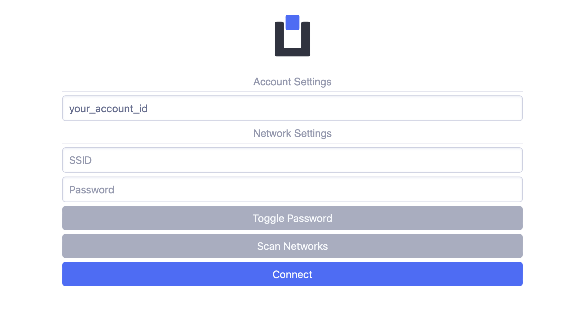

# Connect Device

To connect your device to the Uniot Platform, you need to have:

1. Registered account in [Uniot App](https://app.uniot.io/)
2. Device with a [firmware](./firmware.md) based on Uniot Core

To add a device, visit the [devices](https://app.uniot.io/devices) page on the Platform, where you can initiate the addition of a device. You will be redirected to the settings page, follow the instructions.

<figure><figcaption></figcaption></figure>


Note: If you are using an Apple device (iPhone, MacBook, etc.) you will not be able to use this page after connecting to your device's WiFi. The Captive Portal will open in a separate window. Manually copy your account ID before connecting to the device's WiFi.



Note: If you do not see your account ID on the settings page, you can get it on your [profile](https://app.uniot.io/profile) page.


You will see the Captive Portal after connecting to the device's WiFi. Enter your account ID and your WiFi network credentials so that the device can connect to the Internet:

<figure><figcaption></figcaption></figure>


Note: These credentials are used ONLY on your device and ONLY to connect your device to the Internet.



Note: It may take up to 15 seconds for the device to connect to the network and register in the Uniot. During this time, there will be no visual changes on the Captive Portal page. We will add visualization of the connection process in the next releases.


The device will now appear on the devices page under the Unauthorized tab. The last thing you need to do is authorize the device. That's it, the device is connected to the Platform, and you can create scripts for your device.

Learn more about how to create a script [here](../general-concepts/scripting.md)
