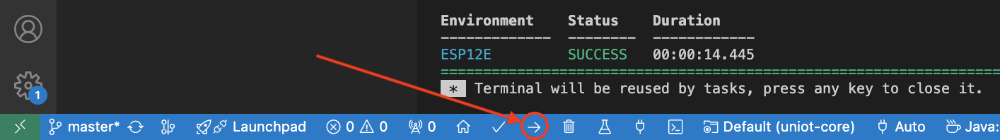

# Firmware

With Uniot Core, you don't have to worry about complexity anymore. Task scheduling, networking, storage management, and more - Uniot Core takes care of it all. You just need to describe the functionality of your specific device to unlock its full potential within the Uniot Platform.

We have a [library](https://github.com/uniot-io/uniot-library) of ready-made templates. Any member of the community can submit their own solution, and we will be happy to review and add it to the library. If there is a ready-made firmware for your device, you can go straight to [flashing a device](firmware.md#flashing-a-device).

## Customizing a firmware


For a better understanding of how Uniot Core works, we recommend that you read the related documentation [here](../advanced/uniot-core/)


Integrating Uniot Core requires only a handful of lines of code, allowing you to focus on your device's unique features without getting bogged down by low-level firmware development.

### Setup PlatformIO

Uniot Core employs [PlatformIO](https://platformio.org/), an open source ecosystem for IoT development, to manage the project's environment. This includes dependency management, streamlined build processes, and integration with various IDEs, ensuring a smooth development experience. Below is an example of PlatformIO configuration file with two environments (ESP8266 and ESP32):


```ini
[platformio]
default_envs = ESP12E

[env]
board_build.filesystem = littlefs
monitor_speed = 115200
build_unflags =
    -std=gnu++11
build_flags =
    -std=gnu++17
	-D UNIOT_CREATOR_ID=\"UNIOT\" ; Put here your ID (any value to mark the device as yours)
	-D UNIOT_LOG_ENABLED=1
	-D UNIOT_USE_LITTLEFS=1
	-D UNIOT_LOG_LEVEL=4
	-D MQTT_MAX_PACKET_SIZE=2048
lib_deps =
	uniot-io/uniot-core ; Be sure to add Uniot Core to your firmware

[env:ESP12E]
platform = espressif8266
framework = arduino
board = esp12e
monitor_filters = default, esp8266_exception_decoder

[env:ESP32]
platform = espressif32
framework = arduino
board = esp32doit-devkit-v1
monitor_filters = default, esp32_exception_decoder
```


### Hardware common

```cpp
#include <AppKit.h>
#include <Uniot.h>
```

These modules are required for any device. Include them to utilize Uniot Core.

### Definitions

```cpp
#define PIN_LED 2
#define PIN_BUTTON 0
#define LED_PIN_LEVEL LOW
#define BTN_PIN_LEVEL LOW
```

Here you should define all pins used by peripherals. In this example a LED connected to GPIO02 and a button connected to GPIO0.

### Tasks

```cpp
auto taskPrintHeap = TaskScheduler::make([](SchedulerTask& self, short t) {
  Serial.println(ESP.getFreeHeap());
});

auto taskPrintTime = TaskScheduler::make([](SchedulerTask& self, short t) {
  Serial.println(Date::getFormattedTime());
});
```

You can define your own [tasks](../advanced/uniot-core/scheduler/taskscheduler.md) to be scheduled and executed at runtime. In this example, there are two tasks that print the free heap and the current time to the Serial.

### Setup


```cpp
void setup() {
  Uniot.begin(); // required

  auto& MainAppKit = AppKit::getInstance(); // required

  MainAppKit.configureNetworkController({
    .pinBtn = PIN_BUTTON,
    .activeLevelBtn = BTN_PIN_LEVEL,
    .pinLed = PIN_LED,
    .activeLevelLed = LED_PIN_LEVEL,
    .maxRebootCount = 255
  }); // required

  PrimitiveExpeditor::getRegisterManager().setDigitalOutput(PIN_LED);

  Uniot.getEventBus().registerKit(MainAppKit); // required

  Uniot.getScheduler()
      .push(MainAppKit) // required
      .push("print_time", taskPrintTime)
      .push("print_heap", taskPrintHeap);

  taskPrintHeap->attach(500);
  taskPrintTime->attach(500);

  MainAppKit.attach(); // required
}
```


This is a standard Arduino function that runs once when the device boots up. Here we initialize the core services, configure the [network controller](../advanced/uniot-core/network/networkcontroller.md), configure digital and analog inputs and outputs, and describe your own [primitives](../general-concepts/primitives.md) if necessary. Let's dive deeper into each part.

***

The following code initializes the core services by setting up task schedulers for event handling and date storage:

```cpp
Uniot.begin();
```

***

The next code is the configuration of the network controller. Here we pass the LED pin and the button pin that will be used to indicate the network status and initiate actions such as reconnecting to the network or resetting the network configuration:

```cpp
MainAppKit.configureNetworkController({
  .pinBtn = PIN_BUTTON,
  .activeLevelBtn = BTN_PIN_LEVEL,
  .pinLed = PIN_LED,
  .activeLevelLed = LED_PIN_LEVEL,
  .maxRebootCount = 255
});
```

***

The next step is the GPIO pins configuration: Here you should configure digital and analog inputs and outputs. You should describe your own [primitives](../general-concepts/primitives.md) here if necessary.

```cpp
PrimitiveExpeditor::getRegisterManager().setDigitalOutput(PIN_LED);
```

In this example, we set the LED as a digital output so that we can control its state later in the [Visual Editor](../platform/sandbox/visual-editor/) or in [UniotLisp](../advanced/uniot-lisp/) code.

***

Registers the [AppKit](../advanced/uniot-core/appkit/) with the [EventBus](../advanced/uniot-core/eventbus/):

```cpp
Uniot.getEventBus().registerKit(MainAppKit);
```

***

Pushes the AppKit and your tasks to the [Scheduler](../advanced/uniot-core/scheduler/):

```cpp
Uniot.getScheduler()
  .push(MainAppKit)
  .push("print_time", taskPrintTime)
  .push("print_heap", taskPrintHeap);
```

***

Schedules a task to be executed with a certain frequency:

```cpp
taskPrintHeap->attach(500);
taskPrintTime->attach(500);
```

***

Attaches the AppKit to the system by initializing [default primitives](../advanced/uniot-core/lispwrapper/defaultprimitives.md), attaching network and MQTT components, and running stored [UniotLisp](../advanced/uniot-lisp/) script:

```cpp
MainAppKit.attach();
```

### Loop

```cpp
void loop() {
  Uniot.loop();
}
```

This is a standard Arduino function that continuously runs after `void setup()`

### Complete Example


```cpp
#include <AppKit.h>
#include <Uniot.h>
#include <Date.h>

#define PIN_LED 2
#define PIN_BUTTON 0
#define LED_PIN_LEVEL LOW
#define BTN_PIN_LEVEL LOW

using namespace uniot;

auto taskPrintHeap = TaskScheduler::make([](SchedulerTask& self, short t) {
  Serial.println(ESP.getFreeHeap());
});

auto taskPrintTime = TaskScheduler::make([](SchedulerTask& self, short t) {
  Serial.println(Date::getFormattedTime());
});

void setup() {
  Uniot.begin();

  auto& MainAppKit = AppKit::getInstance();

  MainAppKit.configureNetworkController({
    .pinBtn = PIN_BUTTON,
    .activeLevelBtn = BTN_PIN_LEVEL,
    .pinLed = PIN_LED,
    .activeLevelLed = LED_PIN_LEVEL,
    .maxRebootCount = 255
  });

  PrimitiveExpeditor::getRegisterManager().setDigitalOutput(PIN_LED);

  Uniot.getEventBus().registerKit(MainAppKit);

  Uniot.getScheduler()
      .push(MainAppKit)
      .push("print_time", taskPrintTime)
      .push("print_heap", taskPrintHeap);

  taskPrintHeap->attach(500);
  taskPrintTime->attach(500);

  MainAppKit.attach();
}

void loop() {
  Uniot.loop();
}
```


## Flashing a device

Once the code is ready, you can build it and flash the device using PlatformIO. You can simply do this with the VSCode extension as shown in the screenshot:

<figure><figcaption></figcaption></figure>
