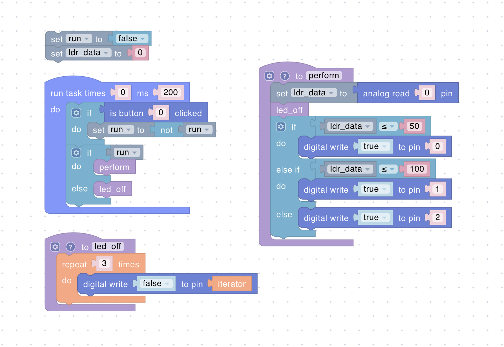
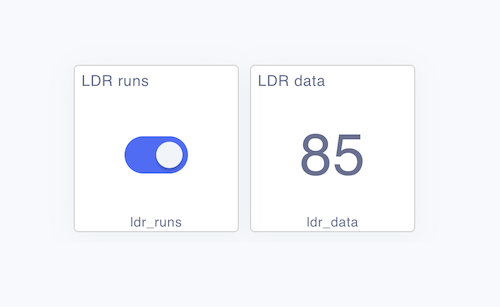
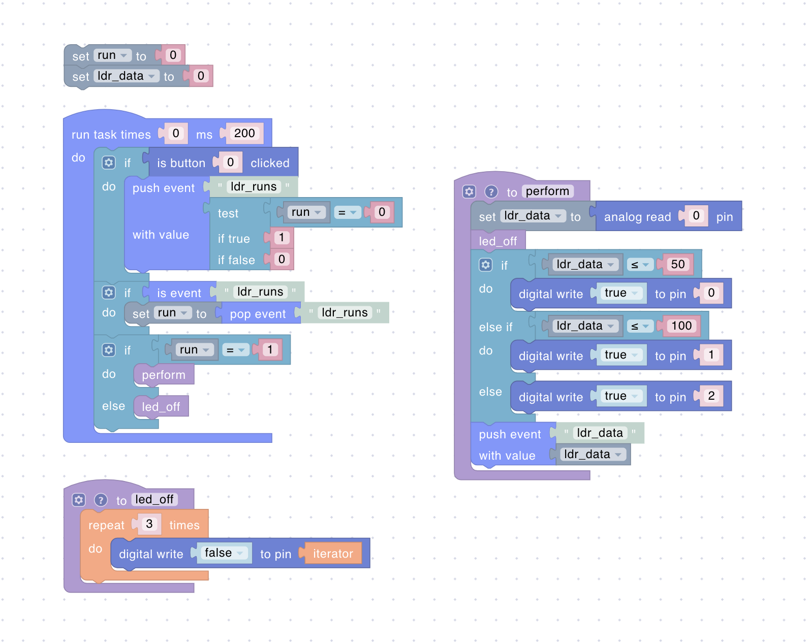

# ESP Dev Board



For a better understanding, we recommend that you read the documentation on [Dashboard](../platform/dashboard.md), [Sandbox](../platform/sandbox/README.md), and [Uniot Core](../advanced/uniot-core/README.md).



In this guide, we will take a detailed look at the entire process of connecting a development board, from writing firmware and authorizing the board to writing a script and interacting with the dashboard. We will be using the ESP8266 Witty Cloud board, but you can easily use another board with minor adjustments. We chose Witty Cloud because this board has built-in external devices such as a button, 3 LEDs, and a light sensor (LDR).



If you do not have a board, you can still take the [script](#script) and test it in the [emulator](../platform/sandbox/emulator.md)



Let's start with setting up PlatformIO, below is the configuration file:

## PlatformIO Configuration



```ini
[env:ESP12E]
platform = espressif8266
framework = arduino
board = esp12e
board_build.filesystem = littlefs
monitor_filters = default, esp8266_exception_decoder
monitor_speed = 115200
build_unflags =
    -std=gnu++11
build_flags =
    -std=gnu++17
	-D UNIOT_CREATOR_ID=\"UNIOT\" ; Put here your ID (any value to mark the device as yours)
	-D UNIOT_LOG_ENABLED=1
	-D UNIOT_USE_LITTLEFS=1
	-D UNIOT_LOG_LEVEL=4
	-D MQTT_MAX_PACKET_SIZE=2048
lib_deps =
	uniot-io/uniot-core ; Be sure to add Uniot Core to your firmware
```



## Main Code

First, let's take a look at the ESP8266 Witty Cloud Pinout:

* **LDR**: ADC (A0)
* **Button**: GPIO0 (D2)
* **RGB LED**:
  * **Red**: GPIO15 (D8)
  * **Green**: GPIO12 (D6)
  * **Blue**: GPIO13 (D7)

All we need to do is define the external devices, configure the [NetworkController](../advanced/uniot-core/network/networkcontroller.md) and set up the [primitives](../general-concepts/primitives.md) so that we can later control the external devices in the script.



```c++
#include <AppKit.h>
#include <Uniot.h>

// Defining all the pins used on the board
#define PIN_LDR A0
#define PIN_RED D8
#define PIN_GREEN D6
#define PIN_BLUE D7
#define PIN_BUTTON D2

// Define logic levels
#define BTN_PIN_LEVEL LOW
#define LED_PIN_LEVEL HIGH

using namespace uniot;

void setup() {
  Uniot.begin();

  auto &MainAppKit = AppKit::getInstance();

  //
  MainAppKit.configureNetworkController({
    .pinBtn = PIN_BUTTON,
    .activeLevelBtn = BTN_PIN_LEVEL,
    .pinLed = PIN_RED,
    .activeLevelLed = LED_PIN_LEVEL,
    .maxRebootCount = 255
  });

  // Configure pins as digital and analog inputs and outputs
  PrimitiveExpeditor::getRegisterManager().setDigitalOutput(PIN_RED, PIN_GREEN, PIN_BLUE);
  PrimitiveExpeditor::getRegisterManager().setDigitalInput(PIN_RED, PIN_GREEN, PIN_BLUE);
  PrimitiveExpeditor::getRegisterManager().setAnalogOutput(PIN_RED, PIN_GREEN, PIN_BLUE);
  PrimitiveExpeditor::getRegisterManager().setAnalogInput(PIN_LDR);

  Uniot.getEventBus().registerKit(MainAppKit);
  Uniot.getScheduler().push(MainAppKit);

  MainAppKit.attach();
}

void loop() {
  Uniot.loop();
}
```



That's it! You are ready to build the code and flash the board. The next step is to connect the board to the Platform. The instructions can be found [here](../getting-started/connect-device.md). Once the board is added, you can create a script!

## Script

Let's describe an imaginary scenario. We will read the value of the light sensor and, depending on the value received, we will turn on one or another LED. The button will enable/disable reading data from the sensor. The values from the sensor can be in the range 0-1023. For example:

* 0 - 50: Turn on the **red** LED
* 51 - 100: Turn on the **green** LED
* 101 - 1023: Turn on the **blue** LED

The script for this scenario may look like this:

<div><figure><figcaption></figcaption></figure></div>

Compile the script, send it to the board and play with the light sensor to change the LEDs state.

Now let's assume that we want to control the board from the dashboard and display data from the light sensor. We will now enable/disable data reading using both a physical button and a widget from the dashboard (besides, the buttons will be synchronized). We will display the read value from the light sensor on the dashboard using the corresponding widget:

<div align="left"><figure><figcaption></figcaption></figure></div>

The new script may look like this:

<div><figure><figcaption></figcaption></figure></div>

Pay attention to the data type of the `run` variable. In the first script, this variable was a Boolean flag. When the physical button was pressed, we changed the value of the variable locally. In the second script, this variable has a numeric type, since the state change now occurs on an event from the MQTT broker.



The event value is always of type Number. A Boolean value will be converted to a Number. A String value is not allowed.


