# Add a Real Sensor with a Custom Primitive

The built-in primitives cover pins. For anything else you teach the script vocabulary a new word, written in C++. Here that word is `get_temp`, backed by a DHT22, and the script is the thermostat sketched on the [Edge Logic Deployment](../foundations/edge-logic-deployment.md) page, made real: the device reads the temperature, decides whether the "AC" runs, and reports to the dashboard. You mock the sensor in the Emulator, so the script is finished before the wiring is. About 40 minutes.

## What You'll Build

- A `get_temp` primitive in `main.cpp` that returns the temperature in tenths of a degree, as an integer.
- An Emulator mock for it, written as a small JavaScript function.
- A thermostat script that drives the breadboard LED as the "AC" with a little hysteresis, publishes `temperature` when the reading changes and `ac` when the AC switches, and takes a `setpoint` from a slider.
- A dashboard with the temperature, the setpoint and the AC state.

Primitives are the bridge between scripts and the hardware you actually have. The firmware declares the vocabulary and the script uses it; neither knows how the other is written. See [Creating Custom Primitives](../general-concepts/primitives.md#creating-custom-primitives).

## Prerequisites

- The board from the previous guides, with the PlatformIO project at hand. You will upload once more. The breadboard LED on GPIO13 from [Dim an LED from a Slider](dim-an-led-from-a-slider.md), digital output `1` since [A Night Light That Thinks for Itself](night-light.md), plays the AC. If it is gone, the onboard LED works as digital output `0`, inverted on ESP8266.
- A DHT22 temperature sensor, or a DHT11 with coarser readings. The three-pin modules have the pull-up resistor on board; a bare four-pin sensor needs a 10 kΩ resistor between its data pin and 3V3.
- Three jumper wires.

## Step 1: Write the Primitive

### Wire the Sensor

Connect the sensor's **VCC** (or **+**) to **3V3**, **GND** (or **-**) to **GND**, and **DATA** (or **OUT**) to **GPIO4**, labelled **D2** on NodeMCU boards and **4** on ESP32 DevKit boards. GPIO4 is free on both and has no role at boot. On a bare four-pin sensor, with the grille facing you, the pins are VCC, DATA, unused, GND from left to right; the 10 kΩ resistor goes between the first two.

### Add the Library

The Adafruit DHT library talks to the sensor, and it depends on Adafruit's Unified Sensor library. Add both to `lib_deps` in `platformio.ini`, under the Uniot Core line:



```ini
lib_deps =
    uniot-io/uniot-core@^0.9.0
    adafruit/DHT sensor library@^1.4.6
    adafruit/Adafruit Unified Sensor@^1.1.14
```



The names with spaces are the registry names; PlatformIO downloads both on the next build.

### Implement get_temp

Open `src/main.cpp` and add four things: a second include and a `using namespace` line at the top, the sensor object and the primitive above `setup()`, and two lines in `setup()` before `Uniot.begin()`. Everything from the previous guides stays as it was.



```c++
#include <Uniot.h>
#include <DHT.h>

using namespace uniot;

#define PIN_DHT 4  // D2 on NodeMCU, GPIO4 on ESP32

DHT dht(PIN_DHT, DHT22);  // use DHT11 if that is what you have

// (get_temp) -> temperature in tenths of a degree, or -1000 when the read failed
Object get_temp(Root root, VarObject env, VarObject list) {
  auto expeditor = PrimitiveExpeditor::describe("get_temp", Lisp::Int, 0)
                       .init(root, env, list);
  expeditor.assertDescribedArgs();

  float t = dht.readTemperature();
  if (isnan(t)) {
    return expeditor.makeInt(-1000);
  }
  return expeditor.makeInt((int)roundf(t * 10));
}

void setup() {
  // ... everything from the previous guides ...

  dht.begin();
  Uniot.addLispPrimitive(get_temp);  // before begin()

  Uniot.begin();
}
```



- **`describe` comes first** — `PrimitiveExpeditor::describe("get_temp", Lisp::Int, 0)` declares the Lisp name, the return type and the argument count, and `.init(root, env, list)` binds that to the current call. It must be the first statement: when you register a primitive, Uniot Core calls it once with empty arguments just to read this description, and leaves before the body runs. The name in `describe` is what scripts call; the C++ name is irrelevant. See [Using PrimitiveExpeditor](../general-concepts/primitives.md#using-primitiveexpeditor).
- **`assertDescribedArgs`** — checks the call against the description. With no arguments there is little to check, but keep the habit: a primitive with arguments gets its type errors reported for free.
- **Integers only** — UniotLisp has no floating point, so 23.4 °C travels as `234`. Scale before returning, and say so in the primitive's comment.
- **Every primitive returns something** — a failed read cannot return nothing, so pick a sentinel the real world never produces. `-1000` is minus 100 °C. The script checks for it and skips the pass. A failed read is a condition the script can handle, so it is a value rather than a `terminate()`; see [Reporting Errors](../general-concepts/primitives.md#reporting-errors).
- **Register before `begin()`** — `addLispPrimitive` queues the primitive; the persisted script starts inside `begin()`, and the device announces its primitives to the platform when it connects. `dht.begin()` only sets up the pin.


**A primitive should read a value, not wait for one.** Everything else on the device pauses while a primitive runs. A DHT read takes about 5 ms, and the library refuses to talk to the sensor more than once every 2 s; a second call inside that window returns the previous reading at once. That is short enough to read inline. A sensor that needs a long conversation, or one you want sampled on its own schedule, is better read by a scheduler task that keeps the latest value for the primitive to return. See [Keep Primitives Short and Non-blocking](../general-concepts/primitives.md#keep-primitives-short-and-non-blocking).


### Upload

Connect the board via USB and upload as before:

```bash
pio run --target upload
```

The first build downloads the two libraries. The device reconnects on its own and restarts the script it had, which you replace in Step 2.


**Checkpoint** — open your device's page and switch to the **Primitives** tab: `get_temp` is listed with an empty **Param Types** column and **Return Type** `Int`. The firmware described it once, in `describe()`; the platform learned it from the device.


## Step 2: Mock It in the Emulator

Open the **Sandbox** page, select your device in the sidebar, and create a script called `Thermostat`. The **Primitives** category now has a **get_temp** block below the built-ins. It is generated from what the device reported, and it is there only while that device is selected. The first version only prints the reading: a task every 2000 ms with one **print** block holding **get_temp**.




<div><figure><figcaption></figcaption></figure></div>





```lisp
;;; begin-user-library
;; This block describes the library of user functions.
;; So the editor knows that your device implements it.
;
; (defjs get_temp ()) ;-> Int
;
;;; end-user-library

(task 0 2000 '
 (progn
  (print
   (get_temp))))
```





The `defjs` line in the user library block is generated with the block. If you type scripts by hand, write it yourself, or the Emulator stops with "Undefined symbol: get_temp"; see [User Library Block](../general-concepts/primitives.md#user-library-block).

Press **Compile**, then play. The Emulator has no sensor, so the **get_temp** card shows `---` as its return value: a [User Primitive](../platform/sandbox/emulator.md#user-primitive) card, waiting to be told what to answer. Click its gear:

- Switch **Enable Return Value** on. **Select Return Type** is locked to `Int`, because the device declared it.
- Under **Return Value Source** choose **Use Function** and paste this into **JavaScript Function**:



```javascript
() => {
  const t = 240 + 20 * Math.sin(Date.now() / 30000);
  return Math.round(t + Math.random() * 2 - 1);
}
```



- Press **Apply**.

The function runs on every call. It draws a slow wave, about three minutes long, between 22.0 and 26.0 °C with a little noise on top, so later on the temperature crosses the setpoint by itself, in both directions. Inside the function you have `Math`, `Date.now()`, the call's arguments, and a `state` object that survives between calls; nothing else. It must be synchronous and return a finite number within 500 ms, or the card turns red with `ERR` and the run stops. See [Configuring Return Values](../platform/sandbox/emulator.md#configuring-return-values).

Watch the **Logs** panel: a value near `240` every two seconds, drifting. The card shows the latest one.


**Emulate** in the scripts list menu always runs without a device, and it clears the selection. Start every run in this guide with the play button in the script's header, with the device selected, so the card takes its type from the device and the Emulator can check the script against it.


### Compare With the Real Sensor

Press **Deploy** in the Emulator's header and open the device's **Logs** tab. The same script now prints the real reading: `234` for 23.4 °C. Pinch the sensor between two fingers and watch the value climb over the next few readings; let go and it falls back. A `-1000` means the read failed; see [Troubleshooting](#troubleshooting).


**Checkpoint** — the Emulator's logs show a drifting value near `240`, and the device's **Logs** tab shows the room temperature in tenths, rising when you warm the sensor.


## Step 3: Decide on the Device

Back in the Sandbox, the script grows in two edits. Stop the Emulator first if it is still running.

### Turn the AC On and Off

The AC should switch on when the temperature rises above a setpoint, switch off once it has fallen half a degree below it, and stay as it is in between. A failed read must change nothing. Outside the task, add three variables: **set ac to false**, **set temp to 0** and **set setpoint to 240**. Inside the task, replace the print block with **set temp to get_temp**, then an **if** whose condition is the **comparison** **temp > -1000**; type the minus sign into the number block. Everything else goes into that **if**'s **do** slot, as the walkthrough below describes.




<div><figure><figcaption></figcaption></figure></div>





```lisp
;;; begin-user-library
;; This block describes the library of user functions.
;; So the editor knows that your device implements it.
;
; (defjs get_temp ()) ;-> Int
; (defjs dwrite (pin state)) ;-> Bool
;
;;; end-user-library

(define ac ())
(define temp ())
(define setpoint ())

(setq ac ())
(setq temp 0)
(setq setpoint 240)

(task 0 2000 '
 (progn
  (setq temp
   (get_temp))
  (if
   (> temp -1000)
   (progn
    (if
     (and
      (> temp setpoint)
      (not
       (bool ac)))
     (progn
      (setq ac #t)
      (push_event 'ac #t)))
    (if
     (and
      (< temp
       (- setpoint 5))
      (bool ac))
     (progn
      (setq ac ())
      (push_event 'ac ())))
    (dwrite 1 ac)))))
```





- **Read, then check** — **set temp to get_temp** stores the reading: `(setq temp (get_temp))`. The outer **if** skips everything when it is the `-1000` sentinel, so a failed read changes nothing: the AC stays as it was and nothing is published.
- **On above the setpoint** — an **if** whose condition is an **and** joining the comparison **temp > setpoint** and **not ac**; in its **do** slot, **set ac to true** and **push event** `ac` with the value **true**. In code, `(and (> temp setpoint) (not (bool ac)))`: the AC switches on only when it is off and the reading has risen above the setpoint.
- **Off below the margin** — a second **if** with **and** joining the comparison **temp < setpoint - 5**, with an **arithmetic** block on the right, and **ac**; in its **do** slot, **set ac to false** and **push event** `ac` with the value **false**. The AC switches off only once the reading is under `setpoint - 5`, half a degree lower than where it switched on. Between the two lines the previous decision stands. That half degree is hysteresis, and it is the difference between a thermostat and a relay that chatters every time a noisy reading crosses one line. `ac` is the device's memory of its own decision.
- **Publish transitions only** — `(push_event 'ac #t)` and `(push_event 'ac ())` sit inside the two inner `if`s, so the event goes out once per switch, not once per pass. Event values are numbers: `#t` arrives as `1` and `()` as `0`. See [push event](../platform/sandbox/visual-editor/special.md#push-event).
- **Drive the LED every pass** — **digital write ac to pin 1** is the last block inside the outer **if**: `(dwrite 1 ac)` writes the current decision to digital output `1` on every valid reading. That is cheap, and it puts the LED right after a reboot as soon as the first reading is in.

Compile and run. Register `1` on the **Digital Write** card lights when the mocked temperature climbs past `240` and goes dark once it has dropped under `235`; in between it keeps its state. If you do not want to wait for the wave, the setpoint moves in Step 4.

### Publish and Listen

Two more jobs: publish the temperature whenever it changes, and accept a new setpoint from the dashboard. Outside the task add **set last_sent to -1000**. Inside the outer **if**, after the digital write, add an **if** with the **comparison** **temp ≠ last_sent**; in its **do** slot, **set last_sent to temp** and **push event** `temperature` with the value **temp**. At the very end of the task, outside the outer **if**, add an **if** with **is event** `setpoint` as its condition and **set setpoint to pop event setpoint** in its **do** slot.




<div><figure><figcaption></figcaption></figure></div>





```lisp
;;; begin-user-library
;; This block describes the library of user functions.
;; So the editor knows that your device implements it.
;
; (defjs get_temp ()) ;-> Int
; (defjs dwrite (pin state)) ;-> Bool
;
;;; end-user-library

(define last_sent ())
(define ac ())
(define temp ())
(define setpoint ())

(setq last_sent -1000)
(setq ac ())
(setq temp 0)
(setq setpoint 240)

(task 0 2000 '
 (progn
  (setq temp
   (get_temp))
  (if
   (> temp -1000)
   (progn
    (if
     (and
      (> temp setpoint)
      (not
       (bool ac)))
     (progn
      (setq ac #t)
      (push_event 'ac #t)))
    (if
     (and
      (< temp
       (- setpoint 5))
      (bool ac))
     (progn
      (setq ac ())
      (push_event 'ac ())))
    (dwrite 1 ac)
    (if
     (not
      (eql temp last_sent))
     (progn
      (setq last_sent temp)
      (push_event 'temperature temp)))))
  (if
   (is_event 'setpoint)
   (progn
    (setq setpoint
     (pop_event 'setpoint))))))
```





- **Only changes** — `(not (eql temp last_sent))` is true when the reading differs from the one last sent. A room moves by a tenth of a degree every few minutes, so the device is mostly silent; the Emulator's noisy mock publishes more often. The `-1000` start makes the first valid reading publish. This is the `light` event from [A Night Light That Thinks for Itself](night-light.md#publish-only-changes) with a step of one.
- **Listen and take** — `(is_event 'setpoint)` is true while a `setpoint` event waits, and `(pop_event 'setpoint)` takes it into the variable. From the next pass on, the comparisons use it. Without a dashboard, the `240` at the top stays in force. See [is event](../platform/sandbox/visual-editor/special.md#is-event) and [pop event](../platform/sandbox/visual-editor/special.md#pop-event).
- **Vocabulary** — the user library block declares two words, `get_temp` and `dwrite`. Everything else in the script is plain UniotLisp; nothing in it says DHT22, GPIO4 or GPIO13.


Prefer typing? Switch the Sandbox to **Advanced** and paste the listing into the code editor instead of building blocks. Keep a script you write by hand in Advanced mode: switching back to Blockly replaces the code with what the blocks generate. See [Visual Editor vs. Code Editor](../platform/sandbox/README.md#visual-editor-vs-code-editor).



**Checkpoint** — the script compiles and register `1` still follows the mocked temperature. The events show up in Step 4.


## Step 4: Dashboard, Then Deploy

Open the **Dashboard** page, enter **Edit Mode**, and add three widgets with **Add Widget**:

- A **Value** named `Temperature`, event `temperature`. Under **Number format** set **Factor** to `10` with **Divider**, and **Decimal digits** to `1`. The device sends `234` and the widget shows `23.4`. The device only ever deals in integers; turning them into a number a person wants to read is the dashboard's job.
- A **Slider** named `Setpoint`, event `setpoint`, **Min** `150`, **Max** `300`, **Retain** on. It speaks tenths too: `240` is 24.0 °C.
- An **LED** named `AC`, event `ac`, any colour. It lights while the last `ac` value is not `0`.

Save and leave edit mode. See [Widget Configuration](../platform/dashboard.md#widget-configuration).

Back in the **Sandbox**, compile and run with the Dashboard page next to the Emulator window. The **Temperature** widget follows the mock, changing every two seconds. Drag the **Setpoint** slider below the current reading: register `1` on the **Digital Write** card lights and the **AC** widget with it. Now drag it just above the reading, by less than half a degree: the AC stays on. The reading is below the setpoint but not below the margin, so the device keeps its decision. Drag the slider further up and the AC goes off. Everything goes through the real broker, so the widgets see the Emulator exactly as they will see the device ([Events](../platform/sandbox/emulator.md#events)).

Press **Deploy** in the Emulator's header. On its first pass the device finds the retained `setpoint` waiting, reads the real sensor, and decides. Set the slider a few tenths above the room temperature and pinch the sensor: within a couple of readings the breadboard LED comes on and the **AC** widget lights. Let go, and both go off once the reading has fallen half a degree under the setpoint.


**Checkpoint** — the **Temperature** widget shows the room in tenths, the slider moves the point where the breadboard LED switches, and the **AC** widget follows the LED.


### Going Further

The script's only hardware words are `get_temp` and `dwrite`. A board with a different sensor, a DS18B20 on a one-wire bus, a thermistor on an analog pin or an I2C chip, runs this exact script unchanged as long as its firmware answers `get_temp` in tenths of a degree. The same goes the other way: a `get_humidity` primitive on this board is another twenty lines of C++, and every script in your account can use it from the moment the device reconnects, because the device tells the platform what it speaks. Firmware declares vocabulary, scripts use it, and the platform draws the blocks.

## Troubleshooting

**Always `-1000`.** Wiring first: DATA on GPIO4, VCC on 3V3, GND on GND, and the pull-up on a bare sensor. Then the type: a DHT11 declared as `DHT22` reads garbage or nothing; change the constructor argument. A single `-1000` right after boot is normal, the sensor needs about a second to settle.

**Build error mentioning `Object`, `Root` or `PrimitiveExpeditor`.** The `using namespace uniot;` line is missing or sits below the primitive. Both `#include` lines and the `using` line go at the top of `main.cpp`. An error about `DHT.h` not being found means the `lib_deps` lines did not make it into `platformio.ini`.

**The get_temp card says "Unavailable in the selected device".** The selected device has not reported `get_temp`: it was not reflashed with Step 1, it has not reconnected yet, or another device is selected. Check the device's **Primitives** tab. The **Deploy** confirmation warns about the same thing.

**The card turns red with `ERR` and the run stops.** The mock threw, returned something other than a finite number, or took longer than 500 ms. The **Logs** panel has the reason on a line starting with `get_temp: User function error`. Open the gear, fix the function, **Apply**, and run again.

**"Undefined symbol: get_temp" when compiling.** The script was typed by hand without the `; (defjs get_temp ()) ;-> Int` line in the user library block, or the block was removed. The Visual Editor writes it; in the Code Editor you do.

**The get_temp block is missing from the toolbox.** No device is selected, or the selected device has not reported the primitive. Select the device in the sidebar; the **Primitives** category is rebuilt from what it reports.

**The Temperature widget shows `234`.** **Factor** is `0`, which means off, or **Decimal digits** is `0`. Set **Factor** `10` with **Divider** and **Decimal digits** `1`.

**The AC flickers near the setpoint.** The second comparison lost its `- 5`, so on and off share one line and a noisy reading crosses it every pass. Compare your blocks with the listing; the margin is the point.

**The slider does nothing.** The widget's **Event** and the script's event name differ; names are case-sensitive. Or the slider sits outside the room's range: `150` to `300` is 15 to 30 °C, and a setpoint the room never reaches never switches anything.

**The reading on the device repeats or never changes.** The DHT22 answers at most once every 2 s; a faster task gets the previous reading back. Keep the 2000 ms interval. A value stuck for minutes while you warm the sensor is a wiring or pull-up problem; see the first entry.

**The script is deployed but nothing happens.** Open the device's page and check the **Logs** tab; a script error stops the interpreter. See [Debugging Scripts](../general-concepts/scripting.md#debugging-scripts).

## What's Next


[Uniot Badge](uniot-badge.md)



[Primitives](../general-concepts/primitives.md)



[Emulator](../platform/sandbox/emulator.md)

