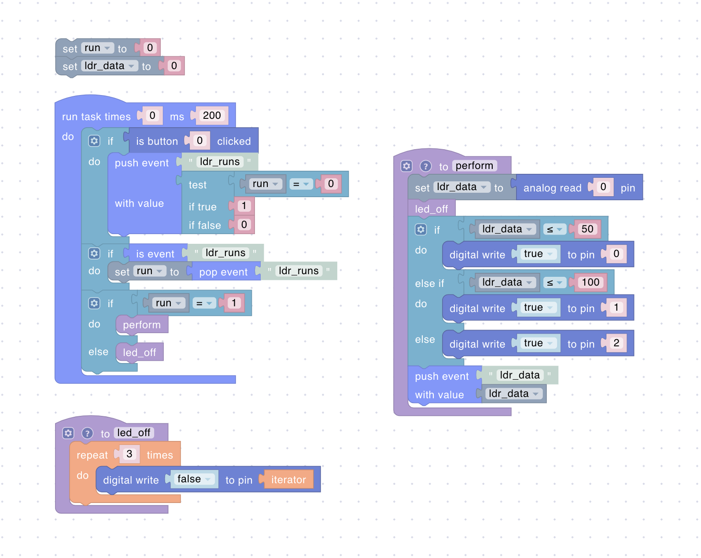

# Development Board

This guide walks you through connecting and using an ESP development board with Uniot. While we use the ESP8266 Witty Cloud board as an example, the principles apply to other ESP boards with minor adjustments.



Before starting, we recommend reviewing:

- [Scripting](../general-concepts/scripting.md)
- [Primitives](../general-concepts/primitives.md)
- [Dashboard](../platform/dashboard.md)
- [Sandbox](../platform/sandbox/README.md)



## Hardware Overview

### ESP8266 Witty Cloud Board

**Built-in Components:**

- Button (GPIO0/D2)
- Light sensor (LDR on ADC/A0)
- RGB LED:
  - Red (GPIO15/D8)
  - Green (GPIO12/D6)
  - Blue (GPIO13/D7)

## Project Setup

### PlatformIO Configuration



```ini
[env:ESP12E]
platform = espressif8266
framework = arduino
board = esp12e
board_build.filesystem = littlefs
monitor_filters = default, esp8266_exception_decoder
monitor_speed = 115200
build_unflags =
    -std=gnu++11
build_flags =
  -std=gnu++17
  -D UNIOT_CREATOR_ID=\"UNIOT\"  ; Your unique identifier
  -D UNIOT_LOG_ENABLED=1
  -D UNIOT_USE_LITTLEFS=1
  -D UNIOT_LOG_LEVEL=4
  -D MQTT_MAX_PACKET_SIZE=2048
lib_deps =
  uniot-io/uniot-core
```



### Main Program



```c++
#include <AppKit.h>
#include <Uniot.h>

// Pin Definitions
#define PIN_LDR A0
#define PIN_RED D8
#define PIN_GREEN D6
#define PIN_BLUE D7
#define PIN_BUTTON D2

// Logic Levels
#define BTN_PIN_LEVEL LOW
#define LED_PIN_LEVEL HIGH

using namespace uniot;

void setup() {
  Uniot.begin();
  auto &MainAppKit = AppKit::getInstance();

  // Network Configuration
  MainAppKit.configureNetworkController({
    .pinBtn = PIN_BUTTON,
    .activeLevelBtn = BTN_PIN_LEVEL,
    .pinLed = PIN_RED,
    .activeLevelLed = LED_PIN_LEVEL,
    .maxRebootCount = 255
  });

  // Register Pin Configuration
  auto& reg = PrimitiveExpeditor::getRegisterManager();
  reg.setDigitalOutput(PIN_RED, PIN_GREEN, PIN_BLUE);
  reg.setDigitalInput(PIN_BUTTON);
  reg.setAnalogOutput(PIN_RED, PIN_GREEN, PIN_BLUE);
  reg.setAnalogInput(PIN_LDR);

  // Initialize System
  Uniot.getEventBus().registerKit(MainAppKit);
  Uniot.getScheduler().push(MainAppKit);
  MainAppKit.attach();
}

void loop() {
  Uniot.loop();
}
```



## Script

Let's describe an imaginary scenario. We will read the value of the light sensor and, depending on the value received, we will activate the corresponding LED. The button will enable/disable reading data from the sensor. The values from the sensor can be in the range 0-1023. For example:

- 0 - 50: Turn on the **red** LED
- 51 - 100: Turn on the **green** LED
- 101 - 1023: Turn on the **blue** LED

The script for this scenario may look like this:

<div><figure><figcaption></figcaption></figure></div>

Compile the script, send it to the board and play with the light sensor to change the LEDs state.

Now let's assume that we want to control the board from the dashboard and display data from the light sensor. We will now enable/disable data reading using both a physical button and a widget from the dashboard (besides, the buttons will be synchronized). We will display the read value from the light sensor on the dashboard using the corresponding widget:

<div align="left"><figure><figcaption></figcaption></figure></div>

The new script may look like this:

<div><figure><figcaption></figcaption></figure></div>

In the first script, the `run` variable is used as a Boolean flag for local button handling, whereas in the second script, it is a Number to accommodate the data received via MQTT events.



Remember that event values are always Numbers. Boolean values are converted to Numbers, and Strings are not supported.



## Troubleshooting

1. **Connection Issues**
   - Verify WiFi credentials
   - Check network stability
   - Confirm power supply

2. **Sensor Problems**
   - Validate pin connections
   - Check voltage levels
   - Test with simple scripts

3. **LED Control**
   - Verify pin assignments
   - Check logic levels
   - Test individual channels
