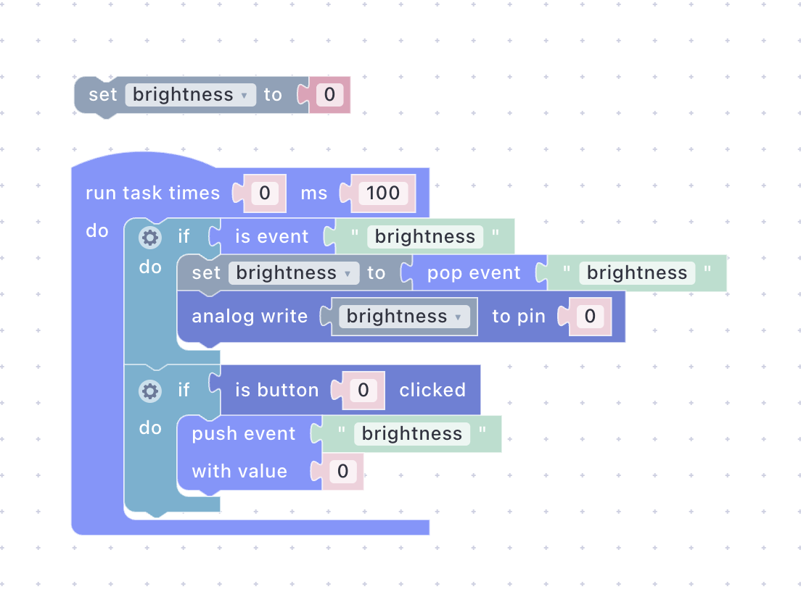

# Dim an LED from a Slider

In [Scripts Without Reflashing](scripts-without-reflashing.md) the LED was either on or off. In this guide a dashboard slider sets its brightness through PWM. Along the way you make the one and only firmware change of this series, see how firmware exposes hardware to scripts, and watch the broker remember the slider position for a device that reboots. About 15 minutes.

## What You'll Build

- One new line in `main.cpp` that registers an analog output.
- A script that receives a `brightness` event and writes its value with `awrite`.
- A **Slider** widget with **Retain** on, tested against the Emulator before the LED ever lights.
- A power cycle after which the LED comes back at the last slider position, with nobody touching anything.

The firmware line is the important part. Scripts address hardware by logical index, not by GPIO number, so the same script runs on any board whose firmware registers the same indices. The firmware declares what the hardware _can_ do; the script decides what it _does_. See [The Register System](../general-concepts/primitives.md#the-register-system) and [Edge Logic Deployment](../foundations/edge-logic-deployment.md).

## Prerequisites

- The board from [Getting Started](getting-started.md), online and authorized under your account, with the PlatformIO project from that guide still at hand. You will upload once more.
- An LED, a 220 Ω resistor, and two jumper wires. A breadboard makes it tidy but is not required.

## Step 1: Register an Analog Output

### Wire the LED

Connect the LED's long leg (anode) to **GPIO13** through the resistor, and its short leg (cathode) to **GND**. Any GPIO-capable pin would do; GPIO13 is used here because it is free on both boards and has no role at boot. It is labelled **D7** on NodeMCU boards and **13** (sometimes **G13**) on ESP32 DevKit boards.

Why not the onboard LED? It already has two jobs: Uniot Core blinks the WiFi status on it, and the earlier guides drive it as digital output `0`. On ESP8266 it is also inverted. A separate LED on its own pin keeps this guide's dimming visible alongside all of that.

### Add One Line to main.cpp

Open `src/main.cpp` from Getting Started and add the two highlighted lines: a pin definition at the top and one registration call before `Uniot.begin()`. Everything else stays as it was.



```c++
#define PIN_LED_PWM 13  // D7 on NodeMCU, GPIO13 on ESP32

void setup() {
  // ... everything from Getting Started ...

  // Let scripts dim the LED as analog output 0: (awrite 0 value).
  Uniot.registerLispAnalogOutput(PIN_LED_PWM);

  Uniot.begin();
}
```



This line is a capability, not logic. It tells Uniot Core that GPIO13 may be driven with PWM and hands it to scripts as analog output `0`. Nothing about brightness, sliders, or events lives in the firmware.

Each primitive has its own index namespace: analog output `0` is GPIO13, while digital output `0` is still the onboard LED from Getting Started, and the two never collide. See [Registering GPIO Pins](../general-concepts/primitives.md#registering-gpio-pins).

The value `awrite` accepts is `0` to `1023`. Uniot Core configures 10-bit PWM on both ESP8266 and ESP32, so the range is the same on either board.

### Upload

Connect the board via USB and upload as before:

```bash
pio run --target upload
```

The device keeps its WiFi credentials and account binding, so it reconnects on its own. It also keeps the persistent script from the previous guide and starts it again, which is fine; you replace it in Step 3.


**Checkpoint** — open your device's page and switch to the **Registers** tab: analog output index `0` is listed on GPIO 13.


## Step 2: Write the Script

Open the **Sandbox** page and create a script called `Dimmer`. The task runs every 100 ms. Inside it, an **if** block checks **is event** `brightness` from **Special**; when it is true, a **set** block from **Variables** stores **pop event** `brightness` into the variable, and **analog write** from **Primitives** sends it to register `0`. A second **if** checks **is button clicked** from **Primitives** and, when it fires, a **push event** block publishes `brightness` with the value `0`.




<div><figure><figcaption></figcaption></figure></div>





```lisp
;;; begin-user-library
;; This block describes the library of user functions.
;; So the editor knows that your device implements it.
;
; (defjs awrite (pin value)) ;-> Int
; (defjs bclicked (button_id)) ;-> Bool
;
;;; end-user-library

(define brightness ())

(setq brightness 0)

(task 0 100 '
 (progn
  (if
   (is_event 'brightness)
   (progn
    (setq brightness
     (pop_event 'brightness))
    (awrite 0 brightness)))
  (if
   (bclicked 0)
   (progn
    (push_event 'brightness 0)))))
```





What the script does:

- **Initial value** — **set brightness to 0** outside the task runs once at start: `(define brightness ())` creates the variable, `(setq brightness 0)` gives it its number.
- **Main loop** — **run task times 0 ms 100** polls ten times a second, forever: `(task 0 100 '...)`. The [task model](../general-concepts/scripting.md#task-based-execution-model) is the same as in the earlier guides.
- **Event check** — **is event brightness** is true while a `brightness` event is waiting in the script's queue. It stays true until something takes the event out, which is what **pop event** does in the next block. See [is event](../platform/sandbox/visual-editor/special.md#is-event) and [pop event](../platform/sandbox/visual-editor/special.md#pop-event).
- **Store and write** — **set brightness to pop event brightness** takes the oldest waiting value and keeps it: `(setq brightness (pop_event 'brightness))`. Then **analog write brightness to pin 0** sends it to analog output `0`: `(awrite 0 brightness)`. Event values are numbers, which is exactly what `awrite` wants. The `0` is the register index from Step 1, not a GPIO number.
- **Button** — when **is button 0 clicked** fires, **push event brightness 0** publishes a `brightness` event with the value `0`: `(push_event 'brightness 0)`. The device does not write the LED directly here. The event goes to the broker and comes back through the same **is event** check as a slider move would, so the dashboard slider follows the button too. See [push event](../platform/sandbox/visual-editor/special.md#push-event).
- **User library block** — the comment block at the top declares the primitives the script uses. The Visual Editor writes it from the blocks you placed.


Prefer typing? Paste the listing into the **Code Editor** instead of building blocks. Once you edit code by hand the Visual Editor becomes read-only for that script. See [Visual Editor vs. Code Editor](../platform/sandbox/README.md#visual-editor-vs-code-editor).


## Step 3: Add the Slider and Test Without Hardware

### Add the Slider

Open the **Dashboard** page and enter **Edit Mode**. Press **Add Widget** and pick **Slider**, then fill in its settings:

- **Name**: `Brightness`
- **Event**: `brightness`, spelled exactly as in the script. Event names are case-sensitive and may contain letters, digits, and underscores only.
- **Min**: `0` and **Max**: `1023`, the range `awrite` accepts.
- **Retain**: on. Step 4 is about what this does.

Press **Save**. The widget is now bound to the `brightness` event, on the same event bus as every device in your account. See [Widget Configuration](../platform/dashboard.md#widget-configuration).

### Run It in the Emulator

Back in the **Sandbox**, select your device in the sidebar, press **Compile**, then play. The [Emulator](../platform/sandbox/emulator.md) checks the script against the device's registers first: if the device was not reflashed with the line from Step 1, the **Analog Write** card shows a warning triangle with "Registers are out of bounds", and the LED would not work on the device either.

The Emulator window floats, so open the **Dashboard** page next to it. Drag the slider: a moment after you let go, the **Analog Write** gauge in the Emulator moves to the same value. Now click the **Button Clicked** card: the slider on the dashboard snaps back to zero.

Nothing here is simulated. The slider publishes a real `brightness` event to the broker, the Emulator receives it the way a device would, and the Emulator's own push goes back out to the dashboard. See [Events](../platform/sandbox/emulator.md#events).


Pushed events are real: any deployed device of yours listening for `brightness` would react to them too. That is the point in this guide, but keep it in mind when you reuse event names later.


### Deploy

Press **Deploy** in the Emulator's header. The script replaces the one from the previous guide.


**Checkpoint** — dragging the slider dims the LED on the breadboard, and pressing BOOT/FLASH turns it off and pulls the slider to zero.


## Step 4: Reboot and Watch Retain Work

Set the slider to about half. Unplug the board and plug it back in. The onboard LED blinks while the device reconnects, and once it goes dark the breadboard LED comes back at half brightness. Nobody moved the slider.

Two things made that happen. The persistent script was restored from flash, as in the previous guide. And because the widget has **Retain** on, the broker kept the last `brightness` value and replayed it to the device as soon as it subscribed, so the script's first **is event** check already found it. See [Retain](../platform/dashboard.md#retain) and [Retained Messages](../api-reference/mqtt-convention.md#retained-messages).

The Emulator behaves the same way. Stop it, start a fresh run, and the **Analog Write** gauge jumps to the slider's level immediately: the retained value seeds the event queue on the first check.

### Try It Without Retain

To see the difference, open the slider's settings with the gear icon, untick **Retain**, and press **Save**. This also clears the value the broker was holding. Move the slider to about half again and power-cycle the board. This time the LED stays dark after the reconnect, until you touch the slider.

Make the slider the last thing you touch before unplugging. Events pushed by a device are always retained, so a button press just before the power cycle would leave a retained `0` on the broker.

Turn **Retain** back on when you are done; the next guide relies on it.


**Checkpoint** — with Retain on, the LED comes back at the last slider level after a power cycle; with it off, it stays dark until the slider moves.


## Troubleshooting

**The LED never lights.** Check the polarity: the long leg goes to the resistor and GPIO13, the short leg to GND. Compare the pin with the device's **Registers** tab, and confirm on the **Script** tab that the Dimmer script is the one deployed.

**The LED is only ever fully on or off.** The value reaching `awrite` is outside `0` to `1023`, or it is a boolean. Check the slider's **Min** and **Max**, and look at the device's **Logs** tab for a script error.

**The slider moves but nothing happens.** The widget's **Event** and the script's event name differ; names are case-sensitive. In the Emulator, hover the warning triangle on the **Analog Write** card: "Registers are out of bounds" means the selected device does not have analog output `0`, so either it was not reflashed with the line from Step 1 or you selected a different device.

**The slider jumps to zero on its own.** Someone pressed BOOT/FLASH, or a retained `brightness 0` from an earlier button press was replayed. Both are expected; move the slider again.

**An old value comes back after a reboot.** A retained event from an earlier project with the same name is being replayed. Use a fresh event name, or clear it as described under [Retain](../platform/dashboard.md#retain).

**The Emulator run stops on its own.** A task set to run forever stops after 9,999 iterations in the Emulator only; see [Limits](../platform/sandbox/emulator.md#limits). On the device it keeps running.

## What's Next


[A Night Light That Thinks for Itself](night-light.md)



[Primitives](../general-concepts/primitives.md)



[Dashboard](../platform/dashboard.md)

