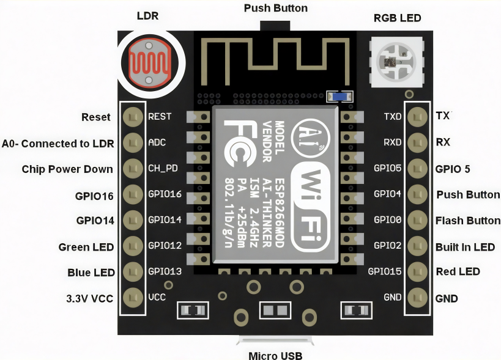
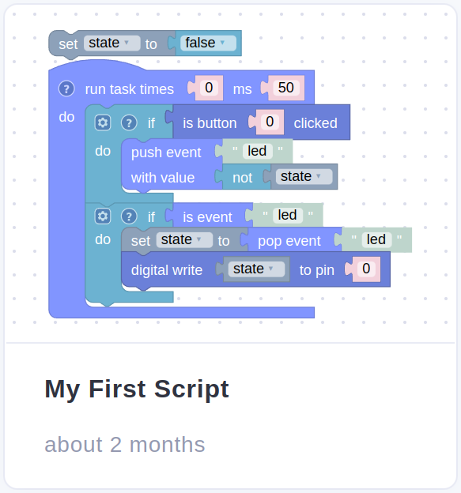

# Getting Started

## **Prerequisites**

Before you begin, ensure you have the following:

* A Uniot-compatible device (e.g., ESP8266/ESP32 or Arduino-based hardware).
* A computer with internet access.
* Basic familiarity with IoT concepts (optional but helpful).

## **Installing Uniot Core Firmware**

1. The best way to get started with Uniot Core is to install it via [PlatformIO](https://platformio.org/). Here’s how to proceed:
2. Create a new PlatformIO project or open an existing one.
3. When configuring your `platformio.ini` file for Uniot Core, pay attention to the following important details:
   * **Uniot-Core Dependency Installation**: Ensure you include the `uniot-core` library in the `lib_deps` section to integrate Uniot's core features. Specify the version explicitly (e.g., `uniot-io/uniot-core@^0.7.2`) to maintain compatibility.
   * **Setting Build Flags**: Use the `build_flags` section to customize the firmware behavior. Key flags include:
     * `-D UNIOT_USE_LITTLEFS` to specify the file system (e.g., LittleFS or SPIFFS by default).
     * `-D UNIOT_CREATOR_ID` for identifying the firmware creator.
     * `-D MQTT_MAX_PACKET_SIZE` to adjust MQTT buffer size if necessary.
     * `-D UNIOT_LISP_HEAP` to adjust the memory size of UniotLisp environment
     * `-D UNIOT_LOG_ENABLED` and `-D UNIOT_LOG_LEVEL` for enabling and configuring logging levels.
   * **Microcontroller Selection**: Define separate environments for each supported microcontroller model. For example:
     * `ESP12E` for ESP8266-based boards.
     * `ESP32` for ESP32 boards.
     * `ESP32C3` for ESP32-C3 boards with USB-specific configurations.
   * **Platform and Framework**: Ensure that the `platform` and `framework` settings match your microcontroller (e.g., `espressif8266` for ESP8266 or `espressif32` for ESP32).
   * **Filesystem Configuration**: Use the `board_build.filesystem` setting (e.g., `littlefs` - if `UNIOT_USE_LITTLEFS` is set to `1`) to specify the filesystem type supported by Uniot Core.
   * **Default Environment**: Set the `default_envs` to the environment corresponding to your primary microcontroller (e.g., `ESP12E`).
   * **USB and Debug Settings (Optional)**: For certain devices like the `ESP32C3`, additional USB-specific flags may be required, such as `-D ARDUINO_USB_MODE=1`.

By carefully customizing these parameters, you can ensure that your development environment is optimized for Uniot Core.


```ini
[platformio]

default_envs = ESP12E

[env]
board_build.filesystem = littlefs
monitor_speed = 115200
lib_deps =
    uniot-io/uniot-core@^0.7.2
build_unflags =
    -std=gnu++11
build_flags =
    -std=gnu++17
    -D UNIOT_USE_LITTLEFS=1
    -D UNIOT_CREATOR_ID=\"UNIOT\"
    -D MQTT_MAX_PACKET_SIZE=2048
    -D UNIOT_LOG_ENABLED=1
    -D UNIOT_LOG_LEVEL=4

[env:ESP12E]
platform = espressif8266
framework = arduino
board = esp12e

[env:ESP32]
platform = espressif32
framework = arduino
board = esp32doit-devkit-v1

[env:ESP32C3]
platform = espressif32
framework = arduino
board = esp32-c3-devkitm-1
build_flags =
    ${env.build_flags}
    -D ARDUINO_USB_MODE=1
    -D SERIALCONS=USBSerial
    -D ARDUINO_USB_CDC_ON_BOOT=1
```


1. As an example, we will use the ESP8266 Witty Cloud module. The module’s compact design and onboard LED's and sensors make it ideal for small IoT applications.

<div align="left"><figure><figcaption></figcaption></figure></div>

The following code demonstrates setting up Uniot Core to manage digital and analog inputs/outputs for this module:


```c++
#include <AppKit.h>
#include <Uniot.h>

#define PIN_LDR A0
#define PIN_RED 15
#define PIN_GREEN 12
#define PIN_BLUE 13
#define PIN_LED 2
#define PIN_BUTTON 4
#define LED_PIN_LEVEL HIGH
#define BTN_PIN_LEVEL LOW

using namespace uniot;

void setup() {
  Uniot.begin();
  auto& MainAppKit = AppKit::getInstance();

  MainAppKit.configureNetworkController({.pinBtn = PIN_BUTTON, .activeLevelBtn = BTN_PIN_LEVEL, .pinLed = PIN_RED, .activeLevelLed = LED_PIN_LEVEL, .maxRebootCount = 255});
  PrimitiveExpeditor::getRegisterManager().setDigitalOutput(PIN_RED, PIN_GREEN, PIN_BLUE);
  PrimitiveExpeditor::getRegisterManager().setDigitalInput(0, PIN_BUTTON);
  PrimitiveExpeditor::getRegisterManager().setAnalogOutput(PIN_RED, PIN_GREEN, PIN_BLUE);
  PrimitiveExpeditor::getRegisterManager().setAnalogInput(PIN_LDR);

  Uniot.getEventBus().registerKit(MainAppKit);
  Uniot.getScheduler().push(MainAppKit);

  MainAppKit.attach();
}

void loop() {
  Uniot.loop();
}
```


This example showcases how to utilize Uniot Core features like managing digital/analog IOs and attaching a network controller. The Witty Cloud module’s capabilities, including onboard LEDs and a button, allow for a seamless testing environment.

5. After successful compilation, connect your device to your computer via USB.
6. Ensure your device is in bootloader mode before initiating the flashing process. For ESP8266, you may need to press and hold the FLASH button during power-up to enter the correct mode. Use commands like `pio run --target upload` to simplify the process with PlatformIO.

## **Adding Devices to the Platform**

1. Open the [Uniot Platform](https://app.uniot.io) on your browser.
2. Create an account or log in if you already have one.
3.  To add a new device to the Uniot Platform, navigate to the [Devices](https://app.uniot.io/devices) page and select the **“Add new device”** button. This will open the device configuration page. Verify that your Account ID, shown in the Account Settings field, is correct (cross-check it with the information on the [My Account](https://app.uniot.io/profile) page).

    Follow the on-screen instructions:

    * Ensure the settings are accurate.
    * Power on your device.
    * Connect your computer or smartphone to the device’s WiFi network named “UNIOT-xxxxxxxx.”
    * Refresh the page to proceed with configuration steps.
      > Note: If you are using an Apple computer or smartphone, you will not be able to use this page after connecting to your device's WiFi. Manually copy your account ID and use it in the captive portal.
4. When connected to the device’s WiFi, the captive portal should automatically open. If not, you can access it manually via [http://settings.uniot.io/](http://settings.uniot.io/) or the IP address [1.1.1.1](http://1.1.1.1).
5. Use the portal to select the target WiFi network for the device.
6. After a successful connection, rejoin your original WiFi network and locate the new device in the **“Unauthorized”** tab under [Devices](https://app.uniot.io/devices).\
  
  It may take up to 10 seconds for the device to connect to the network and register in the Uniot. During this time, there will be no visual changes on the captive portal page. We will add visualization of the connection process in the next releases.
  
7. Authorize the device, assign it a recognizable name, and complete the setup.

Congratulations, your new uniot-device is now added to the platform!

## **Your First Automation Script**

1. For an easy start, navigate to the [Sandbox](https://app.uniot.io/sandbox) page and locate the welcome script titled **“My First Script”**.&#x20;

<div align="left"><figure><figcaption></figcaption></figure></div>

This visual script generates the following code, which is executed directly on the device:

```lisp
;;; begin-user-library
;; This block describes the library of user functions.
;; So the editor knows that your device implements it.
;
; (defjs bclicked (button_id)) ;-> Bool
; (defjs dwrite (pin state)) ;-> Bool
;
;;; end-user-library

(define state ())

(setq state ())

; Runs the task every '50' ms. Since 'times' is '0',
; it runs indefinitely. The context is released after
; each run, allowing other processes to run smoothly.
(task 0 50 '
 (list
  ; If the button '0' is clicked, emit an event 'led' to toggle state.
  (if
   (bclicked 0)
   (list
    (push_event 'led
     (not state))))
  ; When the ‘led’ event is triggered, set ‘state’ to the received
  ; value and write to pin ‘0’, driving the LED accordingly.
  (if
   (is_event 'led)
   (list
    (setq state
     (pop_event 'led))
    (dwrite 0 state)))))
```

This script uses several blocks to demonstrate key concepts of automation:

* **State Variable Initialization**: The block initializes a `state` variable as `false`. This variable tracks the LED's on/off status.
* **Run Task Block**: Configured to run every 50 milliseconds indefinitely (as the `times` parameter is set to `0`), ensuring the script continuously checks button activity and event triggers.
* **Button Check Block**: Monitors if the button (that occupies the register with index `0`, for details check the list of registers, which can be found in the device information on the [Devices](https://app.uniot.io/devices) page) is clicked. When clicked, a global event named `led` is generated. This event can be heard by other devices in the network as well as by the dashboard, emitted with the toggled state value (`not state`).
* **Event Trigger Block**: Responds to the `led` event by updating the `state` variable to the event's value and writing the new state to pin with registered index `0`, controlling the LED.
