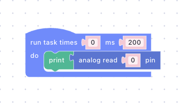
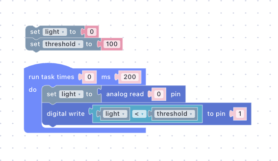
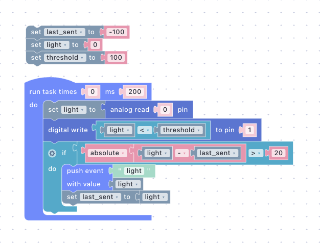
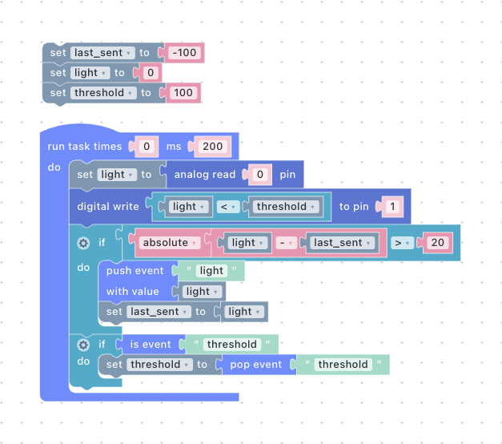

# A Night Light That Thinks for Itself

A light sensor, a threshold, and an LED. The device reads, decides and acts on its own; the dashboard only watches the value and tunes the threshold. At the end you switch the WiFi off and the night light keeps working. About 30 minutes.

## What You'll Build

- An analog input registered in firmware and read with `aread`.
- A script that turns the LED on when it gets dark, without sending anything anywhere.
- A `light` event published only when the reading moves by more than a step, and a **Value** widget showing it.
- A `threshold` slider on the dashboard, retained, that the script reads back.
- A demonstration that none of this needs the network.

This is [Edge Logic Deployment](../foundations/edge-logic-deployment.md) in one page: the logic lives on the device, the cloud is an observer.

## Prerequisites

- The board and the LED on GPIO13 from [Dim an LED from a Slider](dim-an-led-from-a-slider.md), with the PlatformIO project at hand. You will upload once more.
- A light-dependent resistor (LDR) and a 10 kΩ resistor, or a 10 kΩ potentiometer instead of both.

## Step 1: Register the Analog Input

### Wire the Sensor

The LDR and the resistor form a voltage divider: LDR from **3V3** to a free breadboard row, resistor from that row to **GND**, and the row to the analog pin, **A0** on NodeMCU or **GPIO34** on ESP32. With the LDR on the 3V3 side, light gives a high reading and darkness a low one, which is what the script assumes.

With a potentiometer, connect the outer legs to **3V3** and **GND** and the wiper to the analog pin. Turning towards GND is nightfall.


**ESP8266**: A0 on NodeMCU takes 0 to 3.3 V. On a bare ESP-12 module it takes 0 to 1 V; use a 2.2 kΩ resistor there instead of 10 kΩ.

**ESP32**: use GPIO32 to GPIO39. The other ADC pins share hardware with WiFi and stop reading while the radio is on.


### Edit main.cpp

Open `src/main.cpp` and make two changes: register the sensor, and add GPIO13 to the digital output line from Getting Started so the LED can be switched on and off as well as dimmed.





```c++
#define PIN_LED_PWM 13  // D7, the LED from the previous guide
#define PIN_LDR A0      // the divider's middle point

void setup() {
  // ... everything from Getting Started ...

  // Digital output 0 stays the onboard LED; GPIO13 becomes digital output 1.
  Uniot.registerLispDigitalOutput(PIN_LED, PIN_LED_PWM);

  // Let scripts read the light sensor as analog input 0: (aread 0).
  Uniot.registerLispAnalogInput(PIN_LDR);

  Uniot.begin();
}
```







```c++
#define PIN_LED_PWM 13  // GPIO13, the LED from the previous guide
#define PIN_LDR 34      // GPIO34, the divider's middle point

void setup() {
  // ... everything from Getting Started ...

  // Digital output 0 stays the onboard LED; GPIO13 becomes digital output 1.
  Uniot.registerLispDigitalOutput(PIN_LED, PIN_LED_PWM);

  // Let scripts read the light sensor as analog input 0: (aread 0).
  Uniot.registerLispAnalogInput(PIN_LDR);

  Uniot.begin();
}
```





Keep the `registerLispAnalogOutput` line from the previous guide. GPIO13 is now analog output `0` and digital output `1` at the same time; each primitive has its own index namespace. See [Registering GPIO Pins](../general-concepts/primitives.md#registering-gpio-pins). `aread` returns `0` to `1023` on both boards.

Upload with `pio run --target upload`. The device reconnects on its own and restarts the Dimmer script, which you replace in Step 2.


**Checkpoint** — the device's **Registers** tab lists analog input `0` on A0 or GPIO 34, and digital output `1` on GPIO 13.


## Step 2: Read and Log the Sensor

Open the **Sandbox** page and create a script called `Night Light`. The task runs every 200 ms and holds a single **print** block from **Text** with **analog read** from **Primitives** set to register `0`.




<div><figure><figcaption></figcaption></figure></div>





```lisp
;;; begin-user-library
;; This block describes the library of user functions.
;; So the editor knows that your device implements it.
;
; (defjs aread (pin)) ;-> Int
;
;;; end-user-library

(task 0 200 '
 (progn
  (print
   (aread 0))))
```





Select your device, press **Compile**, then play. Turn the **Analog Read** knob in the Emulator and watch the **Logs** panel: the printed value follows about half a second after you stop turning ([Analog Read](../platform/sandbox/emulator.md#analog-read)).

Press **Deploy** and open the device's **Logs** tab. Note the value in room light, then cover the sensor and note it again. Pick a threshold halfway between uncovered and covered; this guide uses `100`.


**Checkpoint** — covering the sensor changes the printed value.


## Step 3: Decide on the Device

The script grows in three edits, and the LED works from the first one on.

### Turn the LED On When It Gets Dark

Outside the task, add **set threshold to** your number and **set light to 0**. Inside it, replace the print block with **set light to analog read 0**, then **digital write** to register `1` with a **comparison** from **Logic** as its value: **light < threshold**.




<div><figure><figcaption></figcaption></figure></div>





```lisp
;;; begin-user-library
;; This block describes the library of user functions.
;; So the editor knows that your device implements it.
;
; (defjs aread (pin)) ;-> Int
; (defjs dwrite (pin state)) ;-> Bool
;
;;; end-user-library

(define light ())
(define threshold ())

(setq light 0)
(setq threshold 100)

(task 0 200 '
 (progn
  (setq light
   (aread 0))
  (dwrite 1
   (< light threshold))))
```





- **Read** — `(setq light (aread 0))` stores the current reading. The `0` is the analog input index from Step 1.
- **Decide and act** — `(dwrite 1 (< light threshold))` lights digital output `1` while the reading is below the threshold. The comparison happens in the device's own memory; no event, no broker.

Compile and run. The **Digital Write** card now shows two registers; turn the knob below the threshold and register `1` lights. Deploy.


**Checkpoint** — the breadboard LED comes on when you cover the sensor and goes off when you uncover it.


### Publish Only Changes

Add **set last_sent to -100** outside the task. At the end of the task add an **if** whose condition compares a **math operation** (**abs**) of the **arithmetic** **light - last_sent** with **> 20**. In its **do** slot, **set last_sent to light** and **push event** `light` with the value **light**.




<div><figure><figcaption></figcaption></figure></div>





```lisp
;;; begin-user-library
;; This block describes the library of user functions.
;; So the editor knows that your device implements it.
;
; (defjs aread (pin)) ;-> Int
; (defjs dwrite (pin state)) ;-> Bool
;
;;; end-user-library

(define last_sent ())
(define light ())
(define threshold ())

(setq last_sent -100)
(setq light 0)
(setq threshold 100)

(task 0 200 '
 (progn
  (setq light
   (aread 0))
  (dwrite 1
   (< light threshold))
  (if
   (>
    (abs
     (- light last_sent)) 20)
   (progn
    (push_event 'light light)
    (setq last_sent light)))))
```





- **Distance** — `(abs (- light last_sent))` is how far the reading has drifted since the last publish. The **if** fires only when that exceeds `20`, about two percent of the range.
- **Publish** — `(setq last_sent light)` remembers the value and `(push_event 'light light)` sends it. See [push event](../platform/sandbox/visual-editor/special.md#push-event).
- **Start** — `last_sent` begins at `-100`, further than `20` from any reading, so the first pass always publishes once.

Why not publish every reading? Five messages a second from every device, forever, mostly saying that nothing changed: broker load and dashboard noise for no information. The device has the previous value in memory and can tell when a change matters. That filtering is the device thinking, the same as the LED decision; the network carries information, not samples. The `20` is a policy, and a different project may want `5` or `100`.


**Checkpoint** — the script compiles and the LED still follows the knob. The events show up in Step 4.


### Accept a Threshold from the Dashboard

At the end of the task add a second **if** with **is event** `threshold` as its condition and **set threshold to pop event threshold** in its **do** slot.




<div><figure><figcaption></figcaption></figure></div>





```lisp
;;; begin-user-library
;; This block describes the library of user functions.
;; So the editor knows that your device implements it.
;
; (defjs aread (pin)) ;-> Int
; (defjs dwrite (pin state)) ;-> Bool
;
;;; end-user-library

(define last_sent ())
(define light ())
(define threshold ())

(setq last_sent -100)
(setq light 0)
(setq threshold 100)

(task 0 200 '
 (progn
  (setq light
   (aread 0))
  (dwrite 1
   (< light threshold))
  (if
   (>
    (abs
     (- light last_sent)) 20)
   (progn
    (push_event 'light light)
    (setq last_sent light)))
  (if
   (is_event 'threshold)
   (progn
    (setq threshold
     (pop_event 'threshold))))))
```





- **Listen and take** — the same pattern as `brightness` in the previous guide: [is event](../platform/sandbox/visual-editor/special.md#is-event) is true while a `threshold` event waits, and [pop event](../platform/sandbox/visual-editor/special.md#pop-event) takes it into the variable. From the next pass on, the comparison uses it.
- **Default stays** — with no event, the `100` at the top remains in force. The dashboard is optional.

This is the complete script, including the user-library block the editor adds. Save it; the checkpoint for this edit is in Step 4.


Prefer typing? Paste the listing into the **Code Editor**. Once you edit code by hand the Visual Editor becomes read-only for that script. See [Visual Editor vs. Code Editor](../platform/sandbox/README.md#visual-editor-vs-code-editor).


## Step 4: Watch and Tune from the Dashboard

Open the **Dashboard** page, enter **Edit Mode**, and add two widgets with **Add Widget**:

- A **Value** named `Light`, event `light`, **Decimal digits** `0`.
- A **Slider** named `Threshold`, event `threshold`, **Min** `0`, **Max** `1023`, **Retain** on.

Save both and drag the slider to the threshold from Step 2. See [Widget Configuration](../platform/dashboard.md#widget-configuration).

Back in the **Sandbox**, compile and run with the Dashboard page next to the Emulator window. Turn the **Analog Read** knob slowly: the **Light** widget follows in jumps of at least `20` and stays still while the knob is still. Leave the knob at some value and drag the **Threshold** slider past it: register `1` on the **Digital Write** card flips as the slider crosses. Everything goes through the real broker, so the widgets see the Emulator exactly as they will see the device ([Events](../platform/sandbox/emulator.md#events)).

Press **Deploy** in the Emulator's header. The device picks up the retained slider position on its first pass.


**Checkpoint** — the **Light** widget follows the sensor in steps, and moving the **Threshold** slider changes where the breadboard LED switches.


## Step 5: Pull the Plug on WiFi

Switch the router off, or carry the board out of range. The onboard LED starts blinking as Uniot Core tries to reconnect. The breadboard LED does not care: cover the sensor and it lights, uncover it and it goes dark, at the threshold the slider last set. The script never stopped; the `light` events it tried to publish were simply dropped.

Bring the network back. The onboard LED goes dark, the broker replays the retained `threshold`, and the **Light** widget catches up on the next change of `20` or more. Nothing needed resetting or redeploying.

In the [imperative model](../foundations/edge-logic-deployment.md#imperative-model-direct-commands) the device would stream readings and a cloud rule would send "turn on" back, so a dead link means a dark room. Here the cloud only ever saw a number and offered a threshold. The decision was the device's from the start, and losing the cloud loses nothing but the view.


**Checkpoint** — the LED keeps reacting to the sensor with the network down, and after reconnecting the widget and the slider are as you left them.


## Troubleshooting

**The reading is stuck at 0 or 1023.** The analog pin is not on the point between the LDR and the resistor, or the pin is wrong for the board: ESP32 needs GPIO32 to 39, and a bare ESP8266 module tops out at 1 V.

**Dark gives a high number.** The LDR and the resistor are swapped. Swap them back, or change the comparison to **light > threshold**.

**The Light widget updates constantly.** The reading jitters more than the step. Raise the `20` to `50`, or move the sensor away from a flickering light.

**The slider has no effect.** The widget's **Event** and the script's event name differ (names are case-sensitive), or the slider is outside the range you saw in Step 2. If you toggled **Retain**, the broker forgot the value; drag the slider again.

**The LED never lights, or the Emulator says "Registers are out of bounds".** The device does not have the firmware from Step 1, or another device is selected. The **Registers** tab must list digital output `1` and analog input `0`.

**Nothing works after the network comes back.** Check the device's **Logs** tab; a script error stops the interpreter. See [Debugging Scripts](../general-concepts/scripting.md#debugging-scripts).

**The Emulator run stops on its own.** A forever task stops after 9,999 iterations in the Emulator only, about half an hour at 200 ms; see [Limits](../platform/sandbox/emulator.md#limits).

## What's Next


[Two Devices, One Event](two-devices-one-event.md)



[Edge Logic Deployment](../foundations/edge-logic-deployment.md)



[Primitives](../general-concepts/primitives.md)

