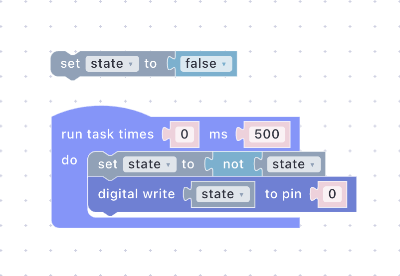
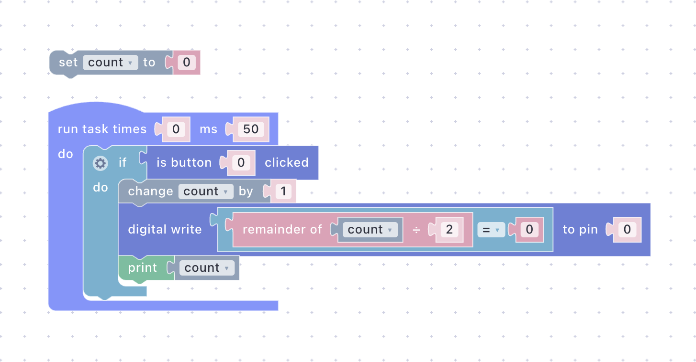

# Scripts Without Reflashing

You flashed the firmware once in [Getting Started](getting-started.md). In this guide you never touch the USB cable again: you write two different scripts, test each one in the browser, and push each one to the board over the air. Then you power-cycle the board and watch the last script come back on its own. About 10 minutes.

## What You'll Build

- A blinking LED, built from blocks and tested in the Emulator before it reaches the board.
- A press counter that replaces the blink with one click and reports through `print`, introducing the logs you will debug with from now on.
- Proof that a persistent script survives a power cycle.

This is the everyday loop of the platform: the board is generic, the behavior is a script, and changing it costs seconds instead of a compile-upload cycle. Read more in [Edge Logic Deployment](../foundations/edge-logic-deployment.md).

## Prerequisites

- The board from [Getting Started](getting-started.md), online and authorized under your account.
- Nothing else. The firmware from Getting Started already exposes the onboard LED as digital output `0` and the BOOT/FLASH button as button `0`, and this guide does not change it.


On ESP8266 boards the onboard LED is inverted: `dwrite` writes raw pin levels, and GPIO2 lights when LOW, so "on" in a script means the LED goes dark. The Emulator does not know this; its Digital Write card lights whenever the script writes true. The blink looks the same either way, but the counter's LED is lit after odd presses instead of even. Every checkpoint below still holds with light and dark swapped. To make the board match the Emulator, wire an external LED with a resistor from GPIO2 to GND, as described in Getting Started's [Write main.cpp](getting-started.md#write-maincpp) section.


## Step 1: Blink, from the Emulator to the Board

### Build the Script

Open the **Sandbox** page and create a new script; call it `Blink`.

In the **Visual Editor**, assemble the blocks shown below. The **run task** block comes from **Special**, **set** and the `state` variable from **Variables**, **not** and **false** from **Logic**, and **digital write** from **Primitives**. Press **Compile** to turn the blocks into the UniotLisp code on the second tab; that code is what actually runs on the device.




<div><figure><figcaption></figcaption></figure></div>





```lisp
;;; begin-user-library
;; This block describes the library of user functions.
;; So the editor knows that your device implements it.
;
; (defjs dwrite (pin state)) ;-> Bool
;
;;; end-user-library

(define state ())

(setq state ())

(task 0 500 '
 (progn
  (setq state
   (not
    (bool state)))
  (dwrite 0 state)))
```





What the script does:

- **Initial value** — the **set state to false** block outside the task runs once, when the script starts. The compiler turns every variable into a `define` that creates it as `()`, followed by a `setq` with the block's value; `()` is how UniotLisp writes `false`, so here both lines set the same thing.
- **Main loop** — **run task times 0 ms 500** is the program's entry point: everything in its **do** slot runs every 500 ms, and `0` times means forever. In code it is `(task 0 500 '...)`, and the `progn` inside it just means "run these in order". See the [task-based execution model](../general-concepts/scripting.md#task-based-execution-model).
- **Toggle** — **set state to not state** reads the variable, flips it with the **not** block, and stores it back. The **not** block compiles to `(not (bool state))`: `bool` first turns whatever is in the variable into true or false, so **not** works even when the variable holds a number.
- **Output** — **digital write state to pin 0** sends the value to digital output `0`, which the firmware mapped to the onboard LED: `(dwrite 0 state)`. The `0` is a register index, not a GPIO number; see [The Register System](../general-concepts/primitives.md#the-register-system).
- **User library block** — the comment block at the top of the code declares which primitives the script uses. The Visual Editor writes it from the blocks you placed; there is nothing to add for it.


Prefer typing? Paste the listing into the **Code Editor** instead of building blocks. Once you edit code by hand the Visual Editor becomes read-only for that script, and compiling the blocks again would overwrite your code. See [Visual Editor vs. Code Editor](../platform/sandbox/README.md#visual-editor-vs-code-editor).


### Run It in the Emulator

The [Emulator](../platform/sandbox/emulator.md) runs your script in the browser on the same interpreter a device uses, with an interactive card standing in for each primitive.

1. Select your device in the sidebar. The Emulator then uses the device's registers and warns you if the script asks for something the device does not have.
2. Press the play button, or Ctrl+Enter (Cmd+Enter on Mac).

A floating window opens with cards, included **Digital Write**. Its LED blinks every half second.

### Deploy

Press **Deploy** in the Emulator's header. The script is sent to the device and the window closes.


**Checkpoint** — the onboard LED blinks once a second. No cable, no compiler, no upload.



Two Emulator details worth knowing: task intervals are waited in real time, and a task set to run forever stops after 9,999 iterations in the Emulator. On the device, `0` iterations really means forever. See [Limits](../platform/sandbox/emulator.md#limits).


## Step 2: Count Button Presses

The second script reacts to input and talks back. Create a script called `Counter`. The task polls every 50 ms, which is fast enough to never miss a press. Inside it, an **if** block checks **is button clicked** from **Primitives**; when it fires, a **change** block from **Variables** adds `1` to `count`, **digital write** lights the LED while the count is even, and **print** from **Text** reports the count.




<div><figure><figcaption></figcaption></figure></div>





```lisp
;;; begin-user-library
;; This block describes the library of user functions.
;; So the editor knows that your device implements it.
;
; (defjs bclicked (button_id)) ;-> Bool
; (defjs dwrite (pin state)) ;-> Bool
;
;;; end-user-library

(define count ())

(setq count 0)

(task 0 50 '
 (progn
  (if
   (bclicked 0)
   (progn
    (setq count
     (+ count 1))
    (dwrite 0
     (eql
      (% count 2) 0))
    (print count)))))
```





What the script does:

- **Initial value** — **set count to 0** outside the task runs once at start. As before it becomes a `define` and a `setq`: `(define count ())` creates the variable, `(setq count 0)` gives it its number.
- **Main loop** — **run task times 0 ms 50** polls twenty times a second, forever: `(task 0 50 '...)`. Fast enough that a click is never missed, slow enough to leave the device idle most of the time.
- **Button check** — the **if** block's condition is **is button 0 clicked**, which is true exactly once per press-and-release and then clears itself, so the **do** slot runs once per click no matter how long the button is held. Compiled: `(if (bclicked 0) (progn ...))`, with `progn` again grouping the blocks inside the **do** slot.
- **Counter** — **change count by 1** adds one to the variable: `(setq count (+ count 1))`. The **change** block is a shortcut for "set to itself plus a number".
- **Output** — **digital write** takes a **comparison** as its value: **remainder of count ÷ 2 = 0**, true while the count is even. The `=` in the comparison block compiles to `eql`, so the code reads `(dwrite 0 (eql (% count 2) 0))`. The LED turns off on the first press and on again on the second.
- **Report** — the **print count** block from **Text** sends the value out of the script as a log line: `(print count)`. Where it lands depends on where the script runs, which is the point of the next section.

### Read the Logs

Compile and run with the device selected. The Emulator now shows a **Button Clicked** card next to the **Digital Write** card. Click the button a few times: the LED card toggles, and the **Logs** panel on the right prints a timestamped line with the count after each click. If the panel is hidden, press **Logs** in the header. To follow the order of calls, turn on **Debug** (the bug icon in the header): each primitive call lights up its card and the run pauses 300 ms after every call.

There are two different logs, and it helps to know which is which:

- The Emulator's **Logs** panel shows what the script _says_: every `print`, plus any error with its full message. See [Logs](../platform/sandbox/emulator.md#logs).
- The **Logger** pane in the Sandbox shows what the script _asks for_: the compiler's output and a trace of primitive calls and their answers. See [Logger](../platform/sandbox/logger.md).

Press **Deploy**, then press BOOT/FLASH on the board. Open your device's page and switch to the **Logs** tab: the same count lines appear there, delivered over MQTT. Errors from a deployed script arrive in the same place, which makes `print` your main tool for [debugging scripts](../general-concepts/scripting.md#debugging-scripts) on hardware.


**Checkpoint** — each press of BOOT/FLASH adds a line to the device's **Logs** tab, and the LED is on after even presses.


## Step 3: Survive a Reboot

A deployed script can be volatile or persistent (by default). A volatile script runs until the device restarts. A persistent script is saved to the device's flash, verified by checksum, and started again on every boot; if it ever fails to load, the device still boots normally. See [Script Persistence](../general-concepts/scripting.md#script-persistence).

Unplug the board and plug it back in. The status LED blinks while the device reconnects and goes dark once it is online. Press BOOT/FLASH: the LED toggles and a new line appears in the **Logs** tab. Nobody deployed anything; the device restored the script itself. The count starts from zero, because variables live in memory, not in flash.


**Checkpoint** — the counter works after a power cycle without a new deploy.


## Troubleshooting

**The play button is disabled.** The Sandbox shows **Recompile required** after any edit. Press **Compile** first; if the Emulator is still running from before, stop it, since Compile waits for the run to end.

**Compile fails with "Undefined symbol".** This happens with hand-written code when a primitive is missing from the user library block at the top of the script. Add a `defjs` line for it; the Visual Editor adds these automatically. See [User Library Block](../general-concepts/primitives.md#user-library-block).

**A card shows a warning triangle.** Hover it. "Registers are out of bounds" means the script uses an index the selected device never registered; compare with the device's **Registers** tab. "Unavailable in the selected device" means the device's firmware does not provide that primitive at all.

**The Emulator run stops on its own.** A task set to run forever stops after 9,999 iterations in the Emulator only; the window title changes to **Finished**. On the device it keeps running.

**Deployed, but the board does nothing.** Check the device is **Online** on the **Devices** page, then the **Script** tab on the device page to confirm the deployment, then the **Logs** tab for an error message. See [Debugging Scripts](../general-concepts/scripting.md#debugging-scripts).

**The LED seems inverted.** On ESP8266 boards the onboard LED is active LOW, so "on" is dark; see the hint under Prerequisites. If the LED instead blinks steadily on its own and ignores the script, the device lost WiFi and Uniot Core has taken the LED back to show the connection status until it reconnects.

**The script did not come back after a reboot.** It was deployed as volatile. Deploy again and pick the persistent option.

## What's Next


[Dim an LED from a Slider](dim-an-led-from-a-slider.md)



[Scripting](../general-concepts/scripting.md)



[Emulator](../platform/sandbox/emulator.md)



[Visual Editor](../platform/sandbox/visual-editor/README.md)

