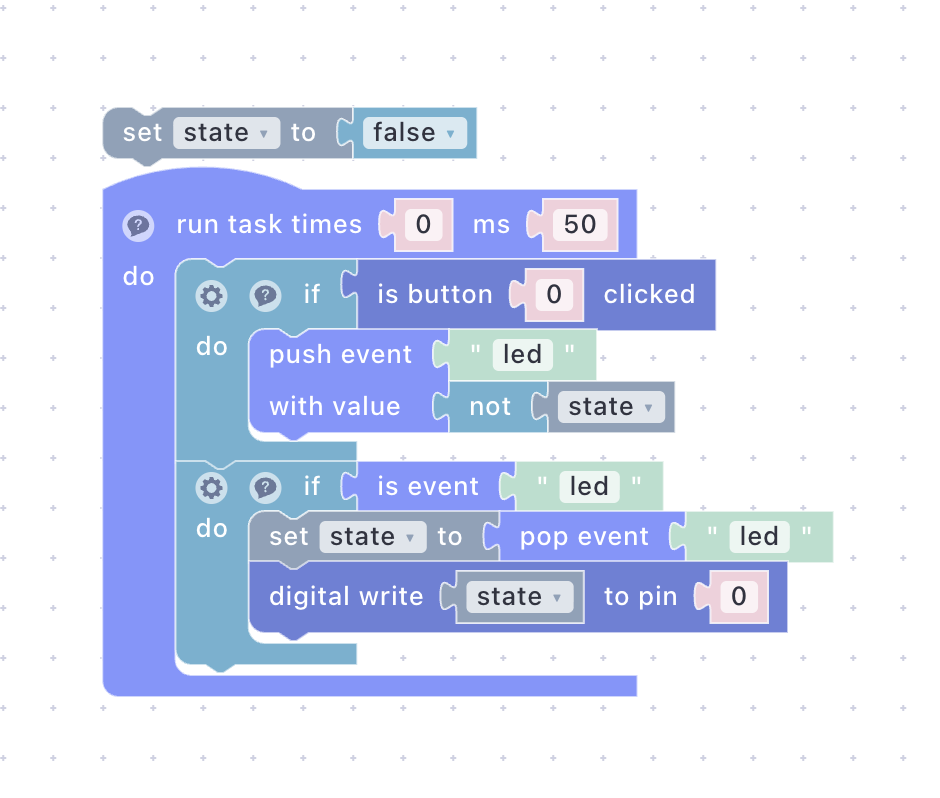
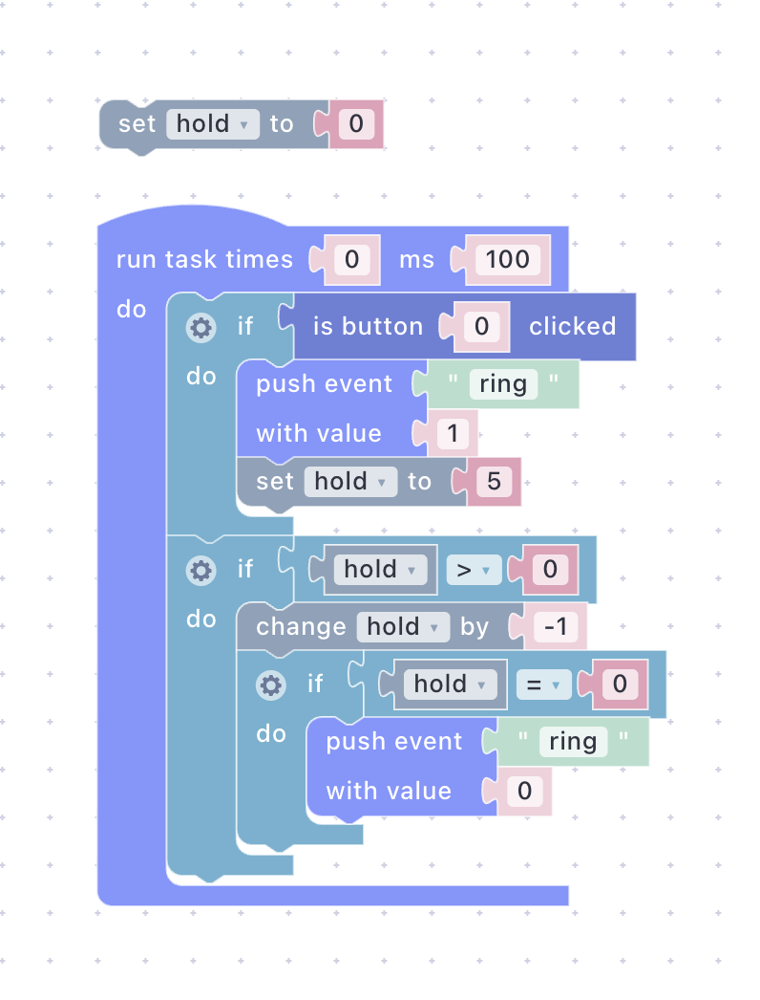
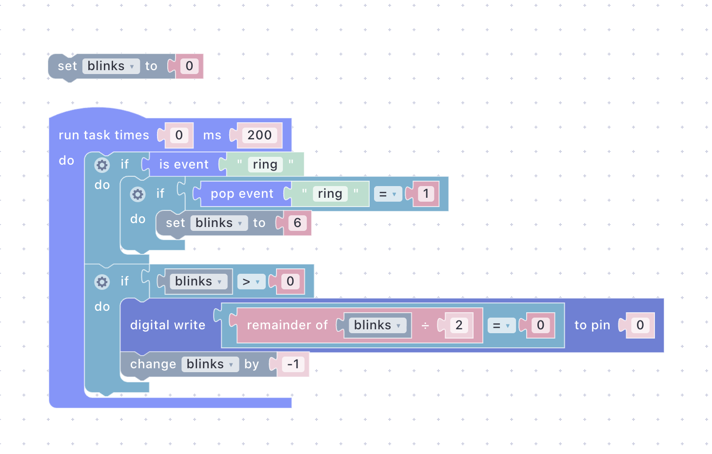

# Two Devices, One Event

Two boards run the script from [Getting Started](getting-started.md). Press the button on one and the LED on both toggles, and the dashboard follows. Then the two get different jobs, a doorbell button and a bell, by deploying different scripts: no firmware change, no rule written in the cloud, no configuration linking them. About 15 minutes, and no extra hardware if the Emulator stands in for the second board.

## What You'll Build

- A second peer: another ESP board with the Getting Started firmware, or the Emulator.
- The same script on both peers, proving a script is portable across boards.
- A doorbell: one peer publishes `ring`, the other blinks three times when it hears it.
- The dashboard as a third peer, with a **Push Button** that rings the bell and an **LED** that flashes with it.

Every device, dashboard and Emulator in your account shares one event bus. A device knows nothing about the other devices; it only knows event names. Publish `ring`, and whoever listens for `ring` reacts, whether that is a board, a widget, or a browser tab.

## Prerequisites

- The board from the previous guides, online and authorized. This guide calls it **A**. Its firmware already has everything needed: the button as `bclicked 0` and the onboard LED as digital output `0`.
- A second peer, called **B**. Either a second ESP8266 or ESP32 board, or nothing at all: the [Emulator](../platform/sandbox/emulator.md#events) publishes and receives real events and can play B from a browser tab.
- No PlatformIO work. If you have a spare board of the other family, use it: an ESP8266 and an ESP32 side by side make the portability point better than two identical boards.


**Pushed events are real.** Every device in your account that handles `led` or `ring` will react to this guide. If something else already uses those names, pick different ones and use them consistently in the scripts and widgets below.


On ESP8266 boards the onboard LED is inverted: "on" in a script means the LED goes dark. Every checkpoint below still holds with light and dark swapped, and a mixed pair will simply blink out of phase with each other. See the note in Getting Started's [Write main.cpp](getting-started.md#write-maincpp) section.

## Step 1: Bring Up the Second Peer



Repeat Step 1 and Step 2 of [Getting Started](getting-started.md) on the second board: flash the firmware for its family, connect it to your WiFi, and authorize it under the same account. Use the `platformio.ini` and `main.cpp` from that guide as they are; the only thing the two boards must share is the account.

Give it a name you can tell apart from A. Open the device's page from the **Devices** page and rename it, for example `Bell`.


**Checkpoint** — the **Devices** page shows both boards with the status **Online**.




Nothing to set up yet. The Emulator becomes peer B the moment you run a script in it without selecting a device: it then publishes on your account's event topic with sender type `emulator`, and queues the events that devices and widgets publish, exactly as a board would ([Events](../platform/sandbox/emulator.md#events)).

Two things to keep in mind on this path. Only one emulation runs at a time, so you deploy to A first and start B afterwards. And the floating Emulator window is B: leave it open while you browse to the dashboard, and close it only when the guide is done.


**Checkpoint** — board A is **Online** on the **Devices** page. The Emulator is ready whenever you are.




## Step 2: One Script, Two Peers

The welcome script from Getting Started already does everything this step needs. On a click it publishes `led` with the toggled state; when `led` arrives it stores the value and writes it to digital output `0`. Nothing in it names a device, so it will run identically on both peers.

Open the **Sandbox** page and open **My First Script**.




<div><figure><figcaption></figcaption></figure></div>





```lisp
;;; begin-user-library
;; This block describes the library of user functions.
;; So the editor knows that your device implements it.
;
; (defjs bclicked (button_id)) ;-> Bool
; (defjs dwrite (pin state)) ;-> Bool
;
;;; end-user-library

(define state ())

(setq state ())

; Runs the task every '50' ms. Since 'times' is '0',
; it runs indefinitely. The context is released after
; each run, allowing other processes to run smoothly.
(task 0 50 '
 (progn
; If the button '0' is clicked, emit an event 'led' to toggle state.
  (if
   (bclicked 0)
   (progn
    (push_event 'led
     (not
      (bool state)))))
; When the ‘led’ event is triggered, set ‘state’ to the received
; value and write to pin ‘0’, driving the LED accordingly.
  (if
   (is_event 'led)
   (progn
    (setq state
     (pop_event 'led))
    (dwrite 0 state)))))
```





### Deploy to A

Select board A in the sidebar, press **Compile**, then the play button. Press **Deploy** in the Emulator's header. Board A now runs the welcome script again instead of the night light from the previous guide.

### Run It on B



Select board B in the sidebar and deploy the same script the same way. Two boards, one script, and the second deployment took ten seconds.

Now press the **BOOT/FLASH** button on A. The LED on A toggles, and so does the LED on B. Press the button on B: both toggle again. Open the **Dashboard** page and watch **My First Dashboard**: the **Switch** and **LED** widgets follow every press on either board, and toggling the **Switch** flips both boards.



Go back to the scripts list and choose **Emulate** from the script's menu; that always runs without a device. The **Deploy** button is absent from the header and the title reads **Running...** without a device name. That is peer B.

Now press the **BOOT/FLASH** button on A. The LED on A toggles, and the register `0` LED on the Emulator's **Digital Write** card toggles with it. Click the Emulator's **Button Clicked** card: the card's LED flips, and so does the LED on A. Open the **Dashboard** page in another tab and watch **My First Dashboard**: the **Switch** and **LED** widgets follow every press on either peer, and toggling the **Switch** flips both.



What happened:

- **One topic, many listeners** — `push_event` publishes `led` on your account's event topic. Every device of the account, every dashboard widget bound to `led`, and a running Emulator all receive it. A's script and B's script each pop the same event and each write the same value to their own digital output `0`.
- **The value travels, not a command** — the event carries the new state, `1` or `0`, rather than "toggle". Both peers end up in the same state no matter which one started, and they cannot drift apart.
- **Scripts are per device, events are shared** — you deployed the script twice, once per peer. Nothing was configured to connect them. Two peers with the same script agree on `led` simply because they both use the name.


**Checkpoint** — pressing the button on either peer toggles both LEDs and the dashboard **Switch**, and the **Switch** toggles both peers.


## Step 3: Different Roles, Same Firmware

The doorbell needs two scripts. A becomes the button at the door: it announces a press and does nothing else. B becomes the bell: it blinks when it hears one.

### The Bell Button

Create a script called `Bell Button`. On a click it publishes `ring` with the value `1`, and about half a second later it publishes `ring` with the value `0`: a press and a release, like a real button. The half second is a countdown in a variable called `hold`. The blocks are **set hold to 0** outside a **run task** with interval `100`, and two **if** blocks inside it.




<div><figure><figcaption></figcaption></figure></div>





```lisp
;;; begin-user-library
;; This block describes the library of user functions.
;; So the editor knows that your device implements it.
;
; (defjs bclicked (button_id)) ;-> Bool
;
;;; end-user-library

(define hold ())

(setq hold 0)

(task 0 100 '
 (progn
  (if
   (bclicked 0)
   (progn
    (push_event 'ring 1)
    (setq hold 5)))
  (if
   (> hold 0)
   (progn
    (setq hold
     (+ hold -1))
    (if
     (eql hold 0)
     (progn
      (push_event 'ring 0)))))))
```





What the script does:

- **Press** — the first **if** checks **is button 0 clicked**. On a click, **push event ring 1** publishes the press, `(push_event 'ring 1)`, and **set hold to 5** starts the countdown.
- **Countdown** — the second **if** runs while **hold > 0**. **Change hold by -1** takes one off on every pass, so five passes at 100 ms are about half a second: `(setq hold (+ hold -1))`.
- **Release** — an inner **if** with the comparison **hold = 0** publishes the release the moment the countdown ends: `(push_event 'ring 0)`. A press followed by a release is exactly what a dashboard **Push Button** widget sends, and Step 4 uses that.
- **Nothing else** — the script never touches an LED. The button peer has no idea what a bell is.

### The Bell

Create a second script called `Bell`. When a `ring` event with the value `1` arrives, it blinks the LED three times; a `ring` with any other value is taken off the queue and ignored. The blinking is a countdown too, in a variable called `blinks`. The blocks are **set blinks to 0** outside a **run task** with interval `200`, and two **if** blocks inside it.




<div><figure><figcaption></figcaption></figure></div>





```lisp
;;; begin-user-library
;; This block describes the library of user functions.
;; So the editor knows that your device implements it.
;
; (defjs dwrite (pin state)) ;-> Bool
;
;;; end-user-library

(define blinks ())

(setq blinks 0)

(task 0 200 '
 (progn
  (if
   (is_event 'ring)
   (progn
    (if
     (eql
      (pop_event 'ring) 1)
     (progn
      (setq blinks 6)))))
  (if
   (> blinks 0)
   (progn
    (dwrite 0
     (eql
      (% blinks 2) 0))
    (setq blinks
     (+ blinks -1))))))
```





What the script does:

- **Listen** — the first **if** checks **is event ring**, true while a `ring` event waits in the queue. Inside it, an inner **if** compares **pop event ring = 1**: the pop takes the event off the queue whatever its value, so each `ring` is handled once. Without the pop it would stay in the queue and ring forever.
- **Press only** — only a value of `1` reaches **set blinks to 6**: `(if (eql (pop_event 'ring) 1) ...)`. The `0` that follows every press, from the Bell Button script or from a dashboard widget, is popped and ignored.
- **Blink** — the second **if** runs while **blinks > 0**. **Digital write** to register `0` with **remainder of blinks ÷ 2 = 0** as its value lights the LED while the count is even, and **change blinks by -1** counts down: `(dwrite 0 (eql (% blinks 2) 0))`. Six half-periods of 200 ms play as three blinks over about a second; then the count reaches `0` and the task idles until the next `ring`.
- **No sender check** — the bell does not care who rang. A board, the Emulator, or a widget: any `ring` with value `1` will do.


Prefer typing? Switch the Sandbox to **Advanced** and paste the listings into the code editor instead of building blocks. Keep a script you write by hand in Advanced mode: switching back to Blockly replaces the code with what the blocks generate. See [Visual Editor vs. Code Editor](../platform/sandbox/README.md#visual-editor-vs-code-editor).


### Try It in the Emulator

Before anything reaches a board, run the bell against yourself. Start **Bell** with **Emulate** from the scripts list so it runs without a device. Then open the **Dashboard** page in another tab, enter **Edit Mode**, and add a **Push Button** widget named `Doorbell` with event `ring` and **Retain** off; Step 4 adds the rest. Save and press it: the **Digital Write** card in the Emulator blinks three times. Every press is a `1` and a `0` through the real broker, and the script rang once per press.

Stop the run before moving on.

### Deploy the Roles



Open **Bell Button**, select board A, compile, play, and **Deploy**. Open **Bell**, select board B, compile, play, and **Deploy**.

Press the **BOOT/FLASH** button on A. Its own LED does nothing. About a second later B has finished blinking three times.



Open **Bell Button**, select board A, compile, play, and **Deploy**. Then start **Bell** with **Emulate** from the scripts list. The Emulator is the bell; leave it running.

Press the **BOOT/FLASH** button on A. Its own LED does nothing. The **Digital Write** card in the Emulator blinks three times.



Neither board was reflashed for this. B runs the plain Getting Started firmware and A still carries the extra registers from the earlier guides, but both scripts use only `bclicked 0` and `dwrite 0`, which every board in this series has. So the two are interchangeable: swap the scripts and B becomes the button and A the bell, again with no upload. The roles came entirely from the scripts, and the link between them is one word, `ring`.


**Checkpoint** — a press on A makes B blink three times. A's own LED stays as it was.


## Step 4: The Dashboard as a Third Peer

Open the **Dashboard** page, enter **Edit Mode**, and add the widget still missing with **Add Widget**:

- The **Push Button** named `Doorbell`, event `ring`, **Retain** off, from Step 3.
- An **LED** named `Ringing`, event `ring`, any colour.

Save and leave edit mode. See [Widget Configuration](../platform/dashboard.md#widget-configuration).

Press **Doorbell**. The widget sends `1` on press and `0` on release, the same pair A sends, and B rings. Now press the physical button on A: the **Ringing** widget lights for about half a second and goes dark, because the LED widget lights while the last `ring` value is not `0` and A's script publishes the `0` after its countdown.

Three peers now share `ring`: a board that publishes it, a board or Emulator that acts on it, and a browser tab that does both. None of them was told about the other two. The dashboard is not a control plane sitting above the devices; it is one more publisher and subscriber on the same bus, which is why a widget and a script can be swapped for one another without either side noticing ([Events](../platform/dashboard.md#events)).


**Checkpoint** — the **Doorbell** widget rings B, and a press on A flashes the **Ringing** widget. Three peers, one event name, no configuration linking them.


### Going Further

A third board with the Getting Started firmware joins the doorbell by having **Bell** deployed to it, and nothing else. It will ring together with B, and the button peer and the dashboard need no change because they never knew how many bells there were. The same goes the other way: a second button peer running **Bell Button**, or a second dashboard with its own **Doorbell**, rings every bell in the account. Event names, not device lists, are how things in Uniot find each other, and the number of peers behind a name is nobody's concern but the broker's.

## Troubleshooting

**Only one peer reacts.** Both peers must be authorized under the same account and both must run a script that handles the event. Check the **Devices** page for **Online**, and each device's **Script** tab for the script you expect. On the Emulator path, make sure the floating window still says **Running...**; a closed or **Finished** window is not a peer.

**The Emulator does not react to the board.** Stop the run and start it again with no device selected; the Emulator only queues events that arrive while it is running. If it has been running a while, note that a forever task stops after 9,999 iterations in the Emulator only, about 17 minutes at 100 ms or 33 minutes at 200 ms; see [Limits](../platform/sandbox/emulator.md#limits).

**The Emulator's LED flips by itself when the run starts.** If the **Switch** widget on My First Dashboard has **Retain** on, the broker replays the last `led` value to every new subscriber, and the Emulator seeds its queue from it on the first check. This is the same replay a rebooting board gets; see [Retain](../platform/dashboard.md#retain).

**B rings twice per press, or keeps ringing.** Twice: the bell script reacts to any value instead of only `1`, so the release `0` rings it again. Keeps ringing: the event is checked with **is event** but never popped, so it stays in the queue. Compare your blocks with the listing.

**Pressing the button on A resets its WiFi.** A long hold on the BOOT/FLASH button is the WiFi reset gesture from Getting Started. Press briefly; a click is a press and release well under a second.

**A's LED is lit all the time on ESP8266.** Nothing is wrong. The Bell Button script never writes the LED, so it stays at the level Uniot Core left it after connecting; and the bell script's "off" is a LOW level, which lights an inverted onboard LED. Wire an external LED as described in Getting Started if it bothers you.

**Old values come back.** A retained `ring` or `led` from an earlier project replays to every new peer. Keep **Retain** off on the **Doorbell** widget, or clear a stale value as described in [Retain](../platform/dashboard.md#retain), or use fresh event names.

**The script is deployed but a board does nothing.** Open the device's page and check the **Logs** tab; a script error stops the interpreter. See [Debugging Scripts](../general-concepts/scripting.md#debugging-scripts).

## What's Next


[Add a Real Sensor with a Custom Primitive](custom-primitive-sensor.md)



[Dashboard](../platform/dashboard.md)

