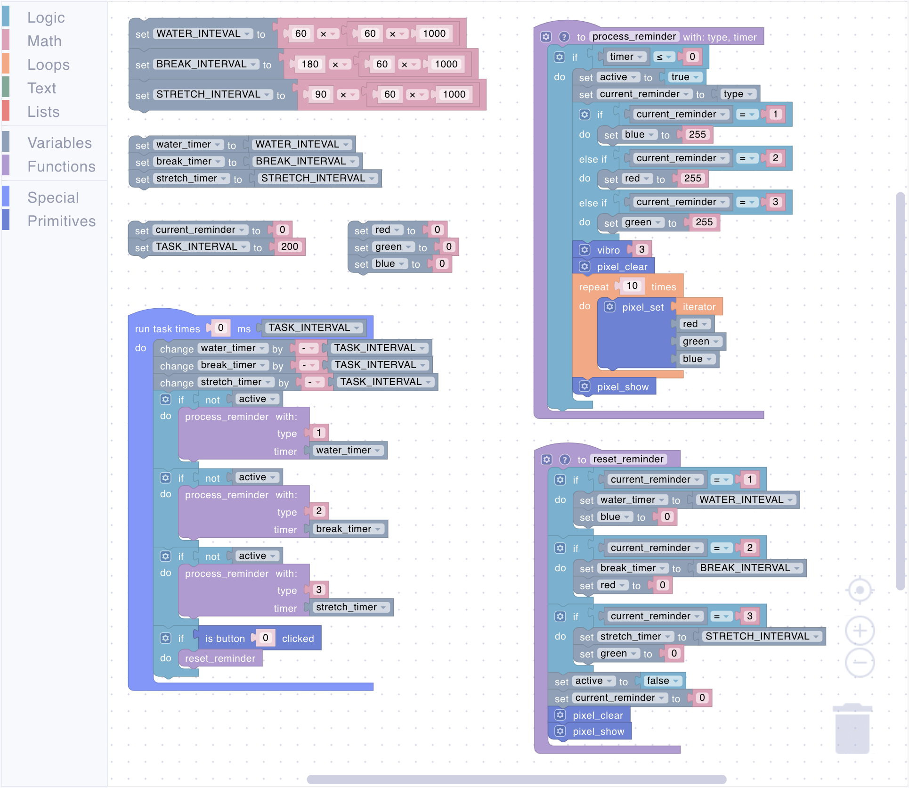

# Uniot Badge

The Uniot Badge is a mini IoT development board. Made in the size of a credit card, this badge is designed to be both a fun gadget and a showcase of what IoT can achieve. The board has several interactive components, including colorful LEDs, a button, a vibration motor, and a sensor, all packed into a sleek form factor.

<figure><figcaption><p>Uniot Badge</p></figcaption></figure>

## Hardware Overview

The Uniot Badge is equipped with the following hardware components:

* **ESP32-C3 Dev Board**: The main microcontroller board that runs on the [Uniot Core](../advanced/uniot-core/).
* **VL53L0X ToF Sensor**: A time-of-flight sensor for distance measurement.
* **Button**: A button for user interaction.
* **Vibration Motor**: A small motor that can vibrate to provide haptic feedback.
* **10x addressable RGB LEDs**: A circle of 10 RGB LEDs for displaying colors and patterns (NeoPixel-like).

## Getting Started

To start working with the Uniot Badge, you need to flash the board and add it to the platform. The firmware source code can be found [here](https://github.com/uniot-io/uniot-promo-badge-firmware). Instructions for flashing and adding the device to the platform are available in the [Getting Started](../guides/getting-started.md) section.

## Promo

You can redeem the promo code by scanning the QR code on your badge. This promo code will extend your plan by:

* **Device: +1**
* **Dashboard: 1**
* **Script: +1**

A script and a dashboard, both named 'Uniot Promo Badge,' will also be created on the platform for demonstration purposes. You can deploy the script to the badge and try it out in interaction with the dashboard.

Learn more about this script below in the [Script Examples](uniot-badge.md#promo-badge) section. If you wish, you can delete these dashboard and script and create your own (the plan extension will remain).

## Functionality Overview

The Uniot Badge can light up, vibrate, measure distances, and even react to your actions. With just the press of a button, you can activate various features like making lights flash in patterns or making the badge respond to movement.

### Primitives

To interact with peripherals, the firmware has corresponding primitives. Read more about primitives [here](../general-concepts/primitives.md).

#### vibro

<div align="left"><figure><figcaption></figcaption></figure></div>

Vibrates the specified number of times (the period of one vibration is set in the [firmware](https://github.com/uniot-io/uniot-promo-badge-firmware/blob/main/lib/Vibro/Vibro.h#L9)).

**Parameters:**

* **Times** (Number): Number of vibrations

#### tof\_distance

<div align="left"><figure><figcaption></figcaption></figure></div>

Reads the value of the distance sensor.

**Returns:**

* **Distance** (Number): Distance to obstacle in **millimeters**

#### pixel\_clear

<div align="left"><figure><figcaption></figcaption></figure></div>

Turns all LEDs off.

#### pixel\_set

<div align="left"><figure><figcaption></figcaption></figure></div>

Sets an LED's color.

**Parameters:**

* **Index** (Number): LED index (**0-9**)
* **Red** (Number): Red color brightness (**0-255**)
* **Green** (Number): Green color brightness (**0-255**)
* **Blue** (Number): Blue color brightness (**0-255**)

#### pixel\_show

<div align="left"><figure><figcaption></figcaption></figure></div>

Turns on the set LEDs.

## Firmware

The Uniot Badge is powered by firmware based on [Uniot Core](../advanced/uniot-core/). You can find the source code of the firmware [here](https://github.com/uniot-io/uniot-promo-badge-firmware).

## Script Examples

### Promo Badge

<figure><figcaption><p>The visual script</p></figcaption></figure>

The visual script generates the following code:


```lisp
;;; begin-user-library
;; This block describes the library of user functions.
;; So the editor knows that your device implements it.
;
; (defjs bclicked (button_id)) ;-> Bool
; (defjs vibro (_0)) ;-> Bool
; (defjs tof_distance ()) ;-> Int
; (defjs pixel_clear ()) ;-> Bool
; (defjs pixel_set (_0 _1 _2 _3)) ;-> Bool
; (defjs pixel_show ()) ;-> Bool
;
;;; end-user-library

(define led ())
(define red ())
(define run ())
(define led_fill ())
(define green ())
(define rise ())
(define blue ())
(define delta ())
(define distance ())
; Re-maps a number from one range to another.
(defun map
 (x in_min in_max out_min out_max)
 (setq run
  (- in_max in_min))
 (setq rise
  (- out_max out_min))
 (setq delta
  (- x in_min))
 (/
  (* delta rise)
  (+ run out_min)))

(setq led 0)
(setq led_fill ())

(setq red 10)
(setq green 10)
(setq blue 10)

(task 0 80 '
 (list
  (if
   (is_event 'red)
   (list
    (setq red
     (pop_event 'red))))
  (if
   (is_event 'green)
   (list
    (setq green
     (pop_event 'green))))
  (if
   (is_event 'blue)
   (list
    (setq blue
     (pop_event 'blue))))
  (if
   (bclicked 0)
   (list
    (setq led_fill
     (not led_fill))
    (vibro 2)))
  (setq distance
   (tof_distance))
  (setq led
   (map distance 40 360 0 10))
  (pixel_clear)
  (if led_fill
   (list
    (while
     (< #itr
      (+ led 1))
     (pixel_set #itr red green blue)))
   (list
    (pixel_set led red green blue)))
  (pixel_show)
  (if
   (is_event 'capture)
   (list
    (if
     (=
      (pop_event 'capture) 1)
     (list
      (push_event 'distance distance)))))))
```


To demonstrate the functionality of the badge, this script uses several blocks:

* **Variables Initialization**: The blocks initializes several variables.
  * **`led`**: The number of active (glowing) LEDs.
  * **`led_fill`**: The indicator of the pattern according to which the LEDs will turn on.
  * **`red`**: The brightness of the red color of the LEDs.
  * **`green`**: The brightness of the green color of the LEDs.
  * **`blue`**: The brightness of the blue color of the LEDs.
* **Function Block**: Function `map` accepts 5 arguments and performs a linear interpolation to calculate the number of active LEDs relative to the distance sensor value.
  * **`x`**: The distance sensor value
  * **`in_min`**: The minimum value of the distance sensor (in **millimeters**).
  * **`in_max`**: The maximum value of the distance sensor (in **millimeters**).
  * **`out_min`**: The minimum number of active LEDs.
  * **`out_max`**: The maximum number of active LEDs.
* **Run Task Block**: Configured to run every 80 milliseconds indefinitely (as the `times` parameter is set to `0`).
* **Color Events Trigger Block**: Responds to the `red`/`green`/`blue` events by updating corresponding variables to the event's value.
* **Button Check Block**: Monitors if the button (that occupies the register with index `0`, learn more about registers [here](../general-concepts/primitives.md#registers)) is clicked. When clicked, inverts the state of the `led_fill` variable and calls `vibro` primitive to provide a haptic feedback.
* **Distance Sensor Reading**: Calls the `tof_distance` primitive and sets the value of the sensor to the `distance` variable.
* **Determining Active LEDs**: Calls the `map` function to calculate the number of active LEDs relative to `distance`.
* **Update LEDs Block**: Updates LEDs according to current data.
  * **Turn Off Block**: Calls the `pixel_clear` primitive to turn off all LEDs.
  * **Set Color Block**: Set the color for the active LED(s) according to the pattern (`led_fill`) using the `pixel_set` primitive.
  * **Turn On Block**: Calls the `pixel_show` primitive to turn on the set LEDs.
* **Event Trigger Block**: Responds to the `capture` event by emmiting a global event `distance` with the `distance` variable value. Checks whether the value of the `capture` event is equal to `1` to generate the `distance` event only once when the corresponding Push Button widget is pressed on the dashboard (this widget generates an event with a value of `1` when pressed and an event with a value of `0` when the button is released)

### Health and Wellness Reminder

With this script, you can turn the badge into a personal reminder tool. It can vibrate at set frequencies to remind you to take a break, drink water, or stretch. The LEDs are also used to show different colors based on the type of reminder – blue for hydration, green for stretching, red for break.

<figure><figcaption><p>The visual script</p></figcaption></figure>

The visual script generates the following code:


```lisp
;;; begin-user-library
;; This block describes the library of user functions.
;; So the editor knows that your device implements it.
;
; (defjs vibro (_0)) ;-> Bool
; (defjs pixel_clear ()) ;-> Bool
; (defjs pixel_set (_0 _1 _2 _3)) ;-> Bool
; (defjs pixel_show ()) ;-> Bool
; (defjs bclicked (button_id)) ;-> Bool
;
;;; end-user-library

(define WATER_INTEVAL ())
(define water_timer ())
(define current_reminder ())
(define red ())
(define BREAK_INTERVAL ())
(define break_timer ())
(define TASK_INTERVAL ())
(define green ())
(define STRETCH_INTERVAL ())
(define active ())
(define stretch_timer ())
(define blue ())
; Describe this function...
(defun process_reminder
 (type timer)
 (if
  (<= timer 0)
  (list
   (setq active #t)
   (setq current_reminder type)
   (if
    (= current_reminder 1)
    (list
     (setq blue 255))
    (if
     (= current_reminder 2)
     (list
      (setq red 255))
     (if
      (= current_reminder 3)
      (list
       (setq green 255)))))
   (vibro 3)
   (pixel_clear)
   (while
    (< #itr 10)
    (pixel_set #itr red green blue))
   (pixel_show))))
; Reset active reminder
(defun reset_reminder ()
 (if
  (= current_reminder 1)
  (list
   (setq water_timer WATER_INTEVAL)
   (setq blue 0)))
 (if
  (= current_reminder 2)
  (list
   (setq break_timer BREAK_INTERVAL)
   (setq red 0)))
 (if
  (= current_reminder 3)
  (list
   (setq stretch_timer STRETCH_INTERVAL)
   (setq green 0)))
 (setq active ())
 (setq current_reminder 0)
 (pixel_clear)
 (pixel_show))

(setq WATER_INTEVAL
 (* 60
  (* 60 1000)))
(setq BREAK_INTERVAL
 (* 180
  (* 60 1000)))
(setq STRETCH_INTERVAL
 (* 90
  (* 60 1000)))

(setq water_timer WATER_INTEVAL)
(setq break_timer BREAK_INTERVAL)
(setq stretch_timer STRETCH_INTERVAL)

(setq current_reminder 0)
(setq TASK_INTERVAL 200)

(setq red 0)
(setq green 0)
(setq blue 0)

(task 0 TASK_INTERVAL '
 (list
  (setq water_timer
   (+ water_timer
    (- TASK_INTERVAL)))
  (setq break_timer
   (+ break_timer
    (- TASK_INTERVAL)))
  (setq stretch_timer
   (+ stretch_timer
    (- TASK_INTERVAL)))
  (if
   (not active)
   (list
    (process_reminder 1 water_timer)))
  (if
   (not active)
   (list
    (process_reminder 2 break_timer)))
  (if
   (not active)
   (list
    (process_reminder 3 stretch_timer)))
  (if
   (bclicked 0)
   (list
    (reset_reminder)))))
```


Let's take a closer look at the individual parts of the script:

* **Variables Initialization**
  * **`TASK_INTERVAL`**: The task execution interval (in **ms**).
  * **`WATER_INTERVAL`**: How often you want to drink water (every 60 minutes, in **ms**).
  * **`BREAK_INTERVAL`**: How often you want to take a break (every 180 minutes, in **ms**).
  * **`STRETCH_INTEVAL`**: How often you want to stretch (every 90 minutes, in **ms**).
  * **`water_timer`**: The water timer, set to the corresponding frequency value.
  * **`break_timer`**: The break timer, set to the corresponding frequency value.
  * **`stretch_timer`**: The stretch timer, set to the corresponding frequency value.
  * **`red`**: The brightness of the red color of the LEDs.
  * **`green`**: The brightness of the green color of the LEDs.
  * **`blue`**: The brightness of the blue color of the LEDs.
  * **`current_reminder`**: The numeric value of the reminder (`1` for water, `2` for break, `3` for stretch).
* **Run Task Block**: Configured to run every `TASK_INTERVAL` milliseconds indefinitely (as the `times` parameter is set to `0`).
* **Process Reminder Block**: The `process_reminder` function processes provided reminder type (numeric value of the reminder) and it's corresponding timer (`timer`). If the timer is expired:
  * **Set Info**: Sets variable `active` as `true` (an indicator that there is an active reminder). Sets variable `current_reminder` to the numeric value of the reminder (the `type` argument passed to the function).
  * **Set Color**: Sets color according to the `current_reminder`.
  * **Notification Block**: Runs vibration motor and turns LEDs on by calling the corresponding primitives.
* **Reset Reminder Block**: The `reset_reminder` function, as the name implies, resets the current reminder.
* **Update Timers Block**: Reduces the value of the timers by `TASK_INTERVAL` every task execution.
* **Check Reminders Block**: Checks each type of reminder by calling the `process_reminder` function if no reminder is active (do not processes new reminders until the current one is acknowledged).
* **Button Check Block**: Monitors if the button is clicked. When clicked, resets current reminder by calling the `reset_reminder` function.

### Gesture-Based Appliance Control

With the following script the badge can act as as a control device for household appliances. There is a tap gesture (quick down-up motion) detection. The appliance state switched when tap is detected.

<figure><figcaption><p>The visual script</p></figcaption></figure>

The visual script generates the following code:


```lisp
;;; begin-user-library
;; This block describes the library of user functions.
;; So the editor knows that your device implements it.
;
; (defjs pixel_clear ()) ;-> Bool
; (defjs pixel_set (_0 _1 _2 _3)) ;-> Bool
; (defjs pixel_show ()) ;-> Bool
; (defjs tof_distance ()) ;-> Int
;
;;; end-user-library

(define TAP_DURATION ())
(define TASK_INTERVAL ())
(define is_detector ())
(define distance ())
(define TAP_TRESH_MIN ())
(define fixed_distance ())
(define tap_timer ())
(define TAP_TRESH_MAX ())
(define state ())
(define tap_state ())
; Describe this function...
(defun updateLEDs ()
 (pixel_clear)
 (if
  (is_event 'appliance-state)
  (list
   (setq state
    (=
     (pop_event 'appliance-state) 1))))
 (if state
  (list
   (while
    (< #itr 10)
    (pixel_set #itr 0 5 0))))
 (pixel_show))
; Describe this function...
(defun trackGesture ()
 (if
  (= tap_state 0)
  (list
   (if
    (and
     (>= distance TAP_TRESH_MIN)
     (<= distance TAP_TRESH_MAX))
    (list
     (setq tap_state 1)
     (setq tap_timer TAP_DURATION))))
  (list
   (setq tap_timer
    (+ tap_timer
     (- TASK_INTERVAL)))
   (if
    (<= tap_timer 0)
    (list
     (setq tap_state 0)
     (setq tap_timer 0))
    (if
     (and
      (= tap_state 1)
      (< distance TAP_TRESH_MIN))
     (list
      (setq tap_state 2))
     (if
      (and
       (= tap_state 2)
       (and
        (>= distance TAP_TRESH_MIN)
        (< distance TAP_TRESH_MAX)))
      (list
       (push_event 'appliance-state
        (not state))
       (setq tap_state 0)
       (setq tap_timer 0))))))))

(setq TAP_DURATION 400)
(setq TAP_TRESH_MIN 150)
(setq TAP_TRESH_MAX 500)
(setq tap_state 0)
(setq tap_timer 0)

(setq TASK_INTERVAL 30)
(setq distance 0)
(setq state ())

(task 0 TASK_INTERVAL '
 (list
  (setq distance
   (tof_distance))
  (trackGesture)
  (updateLEDs)))
```


The script consist of the following parts:

* **Variables Initialization**
  * **`TASK_INTERVAL`**: The frequency of task execution (in **ms**).
  * **`distance`**: The current value of the distance sensor.
  * **`state`**: The apliance state (switched by a tap).
  * **`tap_state`**: The current gesture state:
    * **`0`**: No tap in progress.
    * **`1`**: Hand started moving within the thresholds.
    * **`2`**: Hand detected below minimum threshold.
    * **`3`**: Hand is back within the thresholds.
  * **`TAP_DURATION`**: The maximum allowed time (in **ms**) for a valid tap.
  * **`TAP_TRESH_MAX`**: The sensor distance below which gesture detecion starts.
  * **`TAP_TRESH_MIN`**: The sensor distance below which a tap state is considered as **`2`**.
  * **`tap_timer`**: The timer to track a tap validity.
* **Run Task Block**: Configured to run every `TASK_INTERVAL` milliseconds indefinitely (as the `times` parameter is set to `0`).
* **Distance Sensor Reading**: Calls the `tof_distance` primitive and sets the value of the sensor to the `distance` variable.
* **Gesture Recognition Block**: The `trackGesture` function determines whether a tap has been performed and emits a global event if it has.
* **Update LEDs Block**: Listens to a global event, changes the local state and updates LEDs according to this state.

### Appliance Control and Security Alarm

With a few additions to the previous script, the device can turn into a motion detector with just one event (this event can be generated by a widget on the dashboard or by another device).

<figure><figcaption><p>The visual script</p></figcaption></figure>

The visual script generates the following code:


```lisp
;;; begin-user-library
;; This block describes the library of user functions.
;; So the editor knows that your device implements it.
;
; (defjs pixel_clear ()) ;-> Bool
; (defjs pixel_set (_0 _1 _2 _3)) ;-> Bool
; (defjs pixel_show ()) ;-> Bool
; (defjs tof_distance ()) ;-> Int
;
;;; end-user-library

(define TAP_DURATION ())
(define TASK_INTERVAL ())
(define TAP_TRESH_MIN ())
(define distance ())
(define TAP_TRESH_MAX ())
(define state ())
(define tap_timer ())
(define is_detector ())
(define tap_state ())
(define fixed_distance ())
; Describe this function...
(defun updateLEDs ()
 (pixel_clear)
 (if
  (is_event 'appliance-state)
  (list
   (setq state
    (=
     (pop_event 'appliance-state) 1))))
 (if state
  (list
   (while
    (< #itr 10)
    (pixel_set #itr 0 5 0))))
 (pixel_show))
; Describe this function...
(defun guardCheck ()
 (if
  (is_event 'protection)
  (list
   (setq is_detector
    (=
     (pop_event 'protection) 1))
   (if is_detector
    (list
     (setq fixed_distance distance))
    (list
     (push_event 'alarm 0))))))
; Describe this function...
(defun trackIntrusion ()
 (if
  (not
   (= distance fixed_distance))
  (list
   (push_event 'alarm 1))))
; Describe this function...
(defun trackGesture ()
 (if
  (= tap_state 0)
  (list
   (if
    (and
     (>= distance TAP_TRESH_MIN)
     (<= distance TAP_TRESH_MAX))
    (list
     (setq tap_state 1)
     (setq tap_timer TAP_DURATION))))
  (list
   (setq tap_timer
    (+ tap_timer
     (- TASK_INTERVAL)))
   (if
    (<= tap_timer 0)
    (list
     (setq tap_state 0)
     (setq tap_timer 0))
    (if
     (and
      (= tap_state 1)
      (< distance TAP_TRESH_MIN))
     (list
      (setq tap_state 2))
     (if
      (and
       (= tap_state 2)
       (and
        (>= distance TAP_TRESH_MIN)
        (< distance TAP_TRESH_MAX)))
      (list
       (push_event 'appliance-state
        (not state))
       (setq tap_state 0)
       (setq tap_timer 0))))))))

(setq TASK_INTERVAL 30)
(setq distance 0)
(setq state ())
(setq is_detector ())
(setq fixed_distance 0)

(setq TAP_DURATION 400)
(setq TAP_TRESH_MIN 150)
(setq TAP_TRESH_MAX 500)
(setq tap_state 0)
(setq tap_timer 0)

(task 0 TASK_INTERVAL '
 (list
  (setq distance
   (tof_distance))
  (guardCheck)
  (if is_detector
   (list
    (trackIntrusion))
   (list
    (trackGesture)
    (updateLEDs)))))
```

This script has everything from the previous script and the following additions:

* **Variables Initialization**
  * **`is_detector`**: Indicates that the device is operating as a motion detector.
  * **`fixed_distance`**: Stores the value from the distance sensor at the time of arming
* **Intrusion Recognition Block**: The `trackIntrusion` function checks whether the value from the distance sensor has changed after arming, and if so, generates a global event `alarm` with value `1`.
* **Check Guard Block**: Responds to the `protection` event by updating the `is_detector` variable to the event's value. Fixes the current value of the distance sensor if the device is in armed mode, or generates an `alarm` event with a value of `0` if the device is in the switch mode.
