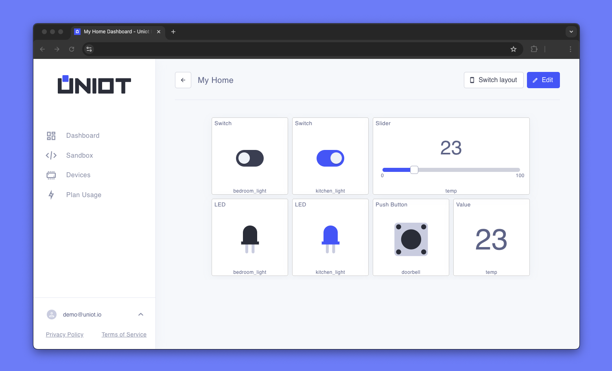
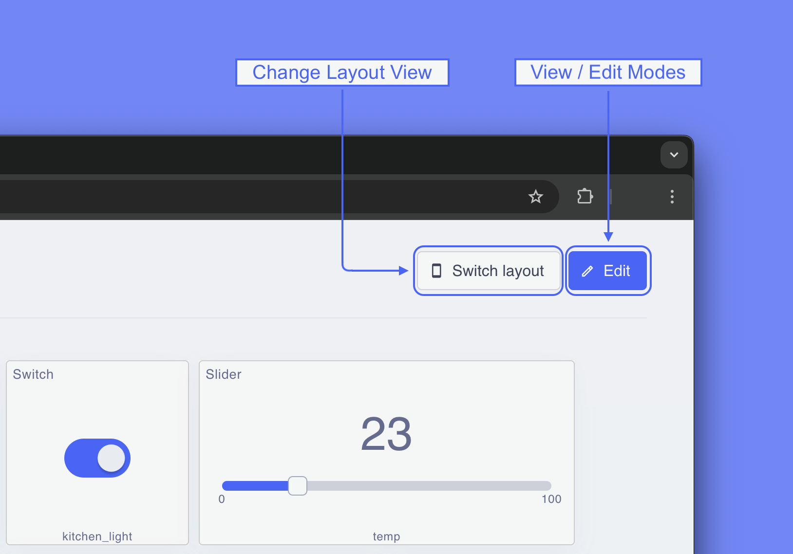
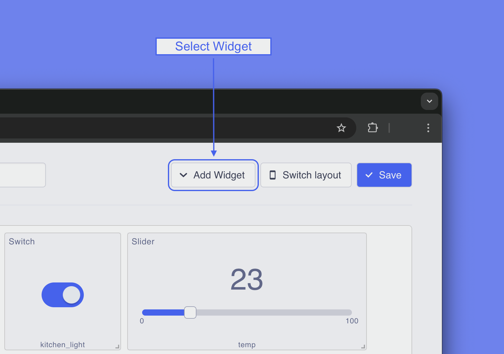
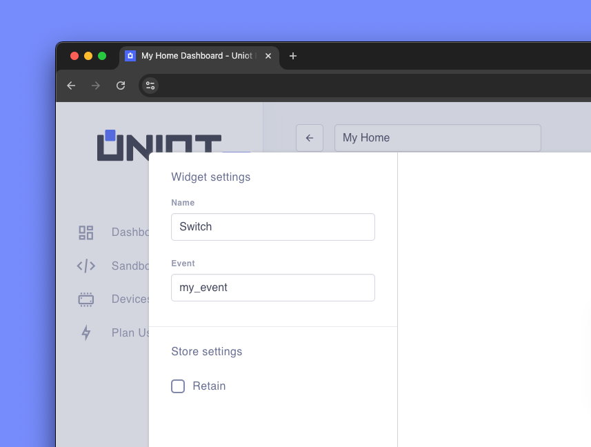

# Dashboard

[Dashboards](https://app.uniot.io/dashboard) are an integral part of any IoT system. They allow you to monitor, analyze, and control devices. The basis of a dashboard is widgets. Each widget performs a specific input/output function when interacting with your hardware.

## Overview

<figure><figcaption></figcaption></figure>

You can access dashboards by opening the corresponding page in the left menu. If there is not default dashboard, a page with a list of all dashboards will be opened. If there is a default dashboard, you will be redirected directly to it. Dashboards consist of one or several widgets that are linked to a specified events.

## Edit/View Modes

Dashboards have two modes: **edit** and **view**. You should use edit mode to configure a dashboard.

There are two layout types: **desktop** and **mobile**. You can switch layout to see how the widgets will be displayed on different devices.

<figure><figcaption></figcaption></figure>

In edit mode, you can add widgets, edit and delete them, and move them around to create the most convenient dashboard for you.

## Widgets

To add a widget to your dashboard, go to edit mode. There will be a dropdown, where you can see a list of all available widgets.

<figure><figcaption></figcaption></figure>



We are working on expanding the available widgets. We will regularly add new ones in future releases. If you have any requests for specific widgets, please describe your request in our [forum](https://community.uniot.io/), we will be happy to implement the new functionality.



There are 2 required fields when adding a widget to the dashboard:

1. **name** - The name of the widget that will be used to label it on the dashboard.
2. **event** - The event the widget will be linked to.

<figure><figcaption></figcaption></figure>

For control widgets (Push Button, Switch, Slider), you can enable the **retain** parameter. Read more about retained messages [here](../api-reference/mqtt-convention.md#retained-messages). Other parameters are widget-specific settings (LED color, slider range, etc.)
