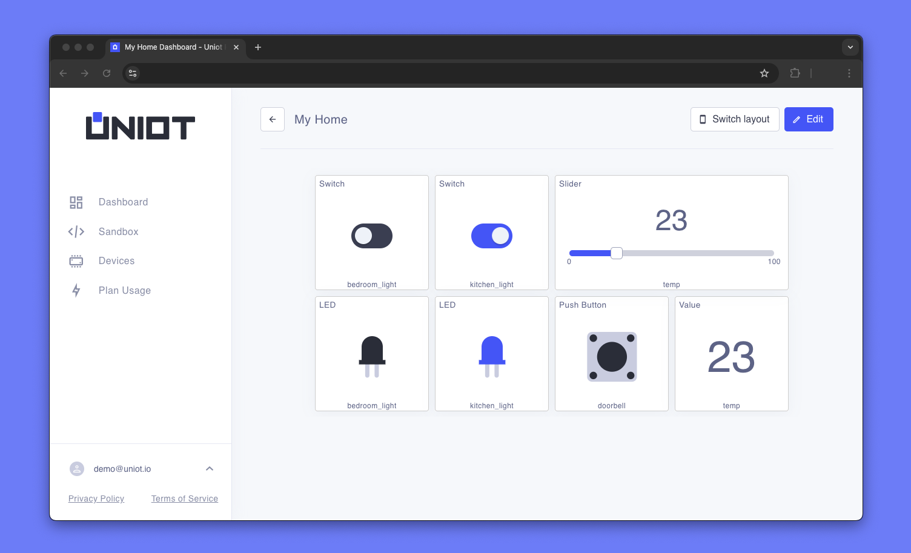
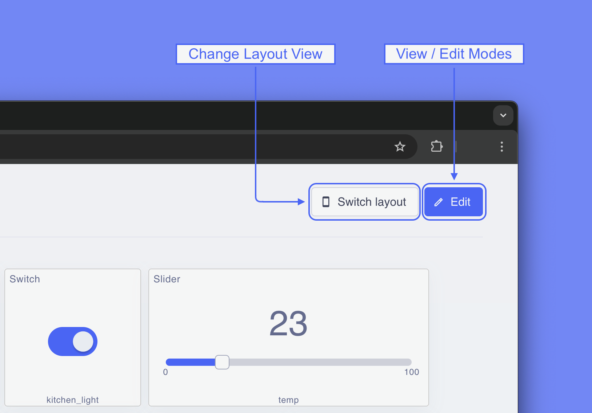
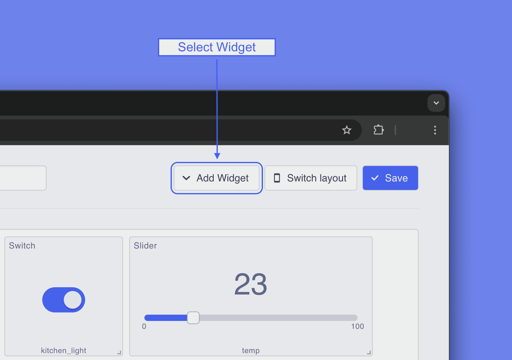
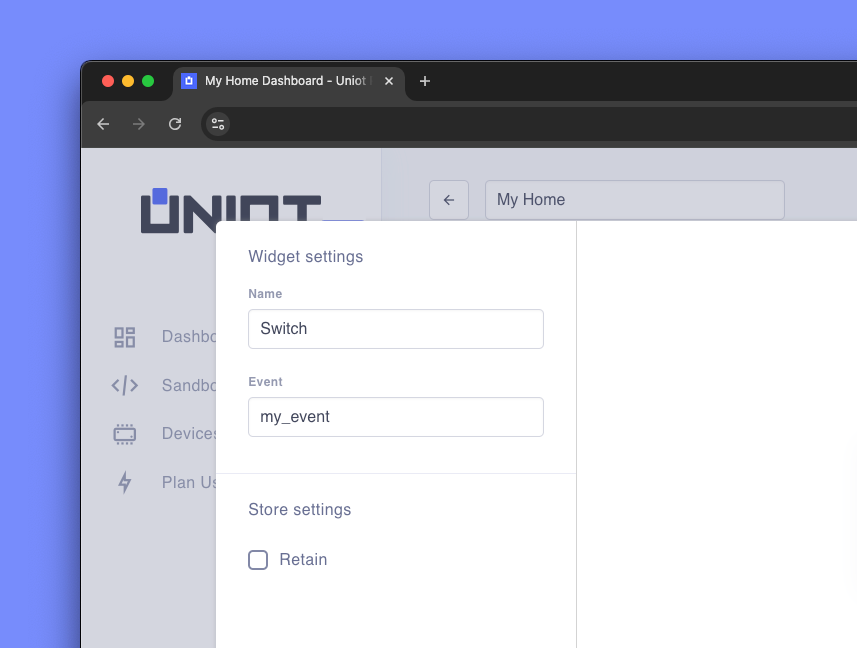

# Dashboard

A dashboard is a grid of widgets, each bound to an Event. Every dashboard, device, and the Emulator in your account share one event bus, so what you do on a widget reaches your devices, and what a device pushes shows up on the widget. You switch between viewing a dashboard and editing it, and each dashboard keeps a desktop and a mobile layout.

<figure><figcaption>A dashboard in view mode</figcaption></figure>

## Quick Start

1. **Open** a dashboard from **Dashboards** in the sidebar. A new account already has one.
2. **Edit** with the button in the header.
3. **Add Widget** and pick a type.
4. **Name it and bind it** to an event in the widget settings, then **Save** the settings.
5. **Arrange** the widgets by dragging and resizing, then press **Save** in the header.
6. **Use it** in view mode, with a script on the device that uses the same event name.



**New account?** "My First Dashboard" comes with a Switch and an LED, both bound to the event `led`, and a script that ties them to a pin. [Getting Started](../guides/getting-started.md#step-4-control-it-from-the-dashboard) walks through it.



## View and Edit Mode

One button in the header switches between using a dashboard and building it: **Edit** enters edit mode, **Save** leaves it and stores the layout. There is no cancel. A dashboard with no widgets opens in edit mode so you can start adding right away.

<figure><figcaption>Switch layout and Edit in the dashboard header</figcaption></figure>

A dashboard has a desktop and a mobile layout. They share the same widgets and settings; only where each widget sits and how big it is are stored per layout. The one you see is chosen by your screen size, and **Switch layout** flips it at any time, in either mode.

In edit mode, **Add Widget** adds a widget, and hovering a widget shows a gear that opens its settings and a trash icon that removes it immediately. Drag a widget to move it and use the handle in its bottom-right corner to resize it; widgets never overlap. Positions and sizes are stored when you press **Save**, which also refreshes the dashboard's thumbnail from the layout on screen.

<figure><figcaption>The Add Widget dropdown in edit mode</figcaption></figure>

## Widgets

Every widget except Deploy Script is bound to an Event: the widget publishes to it when you use it and reacts when a device/emulator/another widget publishes it. The widget's header shows its name and the footer shows the event name.

Missing a widget type? Tell us on the [community forum](https://community.uniot.io).

## Widget Configuration

The gear on a widget, or picking a type in **Add Widget**, opens its settings with a live preview on the right. **Save** applies, **Close** discards.

<figure><figcaption>Widget settings: Name, Event and Retain, with a live preview</figcaption></figure>

- **Name** - shown in the widget header.
- **Event** - letters, digits, and underscore only. It must match the event name your script uses.
- **Retain** - for Switch, Push Button, and Slider. Keeps the last value on the broker, see [Retain](#retain).

Deploy Script has its own fields instead of Event and Retain.

## Widget Types

| Widget        | What it does                                                     | Settings                                                   |
| ------------- | ---------------------------------------------------------------- | ---------------------------------------------------------- |
| Switch        | Sends 1 when on and 0 when off, and flips when the event changes | None                                                       |
| Push Button   | Sends 1 on press and 0 on release                                | None                                                       |
| Slider        | Sends the number you drag to, and moves when the event changes   | Min and Max                                                |
| LED           | Lights when the event value is not 0                             | Colour: red, green, or blue                                |
| Value         | Shows the latest event value                                     | Decimal digits, round or truncate, a divider or multiplier |
| Deploy Script | Sends a script to a device after a confirmation                  | Script, device, store the script on the device             |

Deploy Script always sends the latest saved version of the script. The confirmation warns when the device is offline (the script is applied when it reconnects) and when the device lacks a primitive the script uses. **Store script on the device** keeps the script across power cycles.

## Events

Every dashboard, device, and the Emulator in your account share one event bus. A widget publishes under its event name and every device of the account receives it; a device publishes the same way with `push event`, and every widget bound to that name updates. The name must be spelled exactly as in the script's [push event](sandbox/visual-editor/special.md#push-event), [is event](sandbox/visual-editor/special.md#is-event), and [pop event](sandbox/visual-editor/special.md#pop-event) blocks. Values are numbers; booleans become 1 and 0.

The [Emulator](sandbox/emulator.md#events) is on the same bus: widgets react to an emulated script, and the emulated script sees what you press on the dashboard.

### Retain

With **Retain** on, the broker keeps the last value a widget published and replays it to a device when it connects and to the dashboard when it loads, so a switch position or a slider level survives a reboot or a page refresh. With it off, values reach whoever is listening at that moment and are then forgotten. Turning Retain off on a widget also clears the value the broker kept. See [Retained Messages](../api-reference/mqtt-convention.md#retained-messages) for the protocol side.



**Old retained values come back.** A retained event from an earlier project is replayed to any new widget or device that uses the same name. Use fresh event names, or clear the old value: bind a widget to the name with Retain on, save, then turn Retain off and save again.



See [Getting Started](../guides/getting-started.md#step-4-control-it-from-the-dashboard) for the seeded Switch and LED in action, and the [MQTT convention](../api-reference/mqtt-convention.md#event-communication) for the topics involved.
