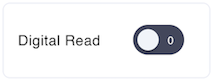
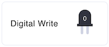
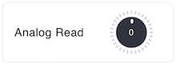
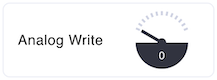
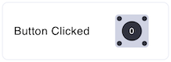
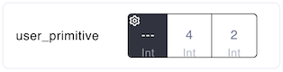
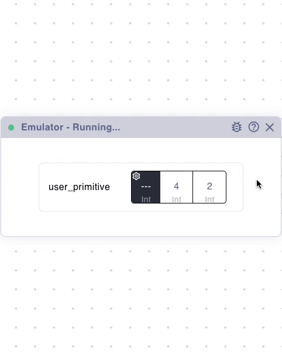

# Emulator

The emulator is a debugging tool that provides a virtual simulation of the primitives in your script. It allows you to test and verify the behavior of your script before deploying it to a physical device. You can select a device, then the emulator will simulate a specific device, or if no device is selected, the emulator will use the primitives defined in the script.

By interacting with the emulator, you can simulate input and output, and test user-defined primitives with ease. This ensures your script behaves as expected in a controlled environment.

### Digital Read

<figure><figcaption></figcaption></figure>

The Digital Read component simulates the digital state of a specific pin. It acts as a toggle switch, allowing you to change the state manually and observe how the script reacts.

> [A block in the visual editor](visual-editor/primitives.md#digital-read)

**Features**:

* Toggle between 0 and 1 to simulate the state of a digital pin.
* Real-time updates reflect the state change in your script.

**Usage**:

* Use this component to test scripts that rely on digital input (e.g., buttons, sensors).

### DigitalWrite

<figure><figcaption></figcaption></figure>

The Digital Write component displays the current state of a digital pin as set by your script. It provides visual feedback to verify that your script correctly controls the pin.

> [A block in the visual editor](visual-editor/primitives.md#digital-write)

**Features**:

* Displays the state of the pin as 0 or 1.
* Updates dynamically based on your script's output.

**Usage**:

* Use this component to confirm that digital outputs (e.g., LEDs, relays) are correctly controlled by your script.

### AnalogRead

<figure><figcaption></figcaption></figure>

The Analog Read component is a knob that simulates a range of analog values for a specific pin. By rotating the knob, you can set the input value dynamically.

> [A block in the visual editor](visual-editor/primitives.md#analog-read)

**Features**:

* Range: Simulates values between 0 and 1023.
* Updates your script in real-time as the knob position changes.

**Usage**:

* Use this component to test scripts that depend on analog inputs, such as sensors (e.g., temperature, light, potentiometers).

### AnalogWrite

<figure><figcaption></figcaption></figure>

The Analog Write component displays the current analog output value of a specific pin as controlled by your script. This is commonly used to simulate devices or systems that require fine control over output levels, such as adjusting the intensity of an LED or controlling the position of a servo motor.

> [A block in the visual editor](visual-editor/primitives.md#analog-write)

**Features**:

* Displays the output value as a range between 0 and 1023.
* Updates dynamically to reflect the script's output.

**Usage**:

* Use this component to verify analog outputs.

### ButtonClicked

<figure><figcaption></figcaption></figure>

The Button Clicked component simulates a physical button connected to a specific pin. Clicking the button toggles its state, which is reflected in the script.

> [A block in the visual editor](visual-editor/primitives.md#button-clicked)

**Features**:

* Simulates a button press with a click.
* Toggles between 0 (not clicked) and 1 (clicked).

**Usage**:

* Use this component to test scripts that rely on button inputs for triggering events.

### User Primitive

<figure><figcaption></figcaption></figure>

User-defined primitives provide a way to create custom interactions and behaviors. This component is dynamically generated based on the parameters defined in your script. It displays the parameters provided by the script and allows you to configure the return value interactively.

> [A block in the visual editor](visual-editor/primitives.md#user-primitive)

**Features**:

* All input parameters specified in the script are displayed with their current values and types.
* You can interact with the primitive's return value configuration by clicking the gear icon, which opens a modal window for further customization.

**Configuring Return Values**:

The configuration modal enables you to:

* Enable or disable a return value for the primitive.
* Specify the return type, such as Bool, Int, Symbol, or others.
* Define the return value:
  * Manually: Input a fixed value.
  * Dynamically: Write a JavaScript function that calculates the return value in real-time.

The JavaScript function executes in a secure, sandboxed environment. This ensures safe and isolated execution of user-provided code.

<figure><figcaption></figcaption></figure>

