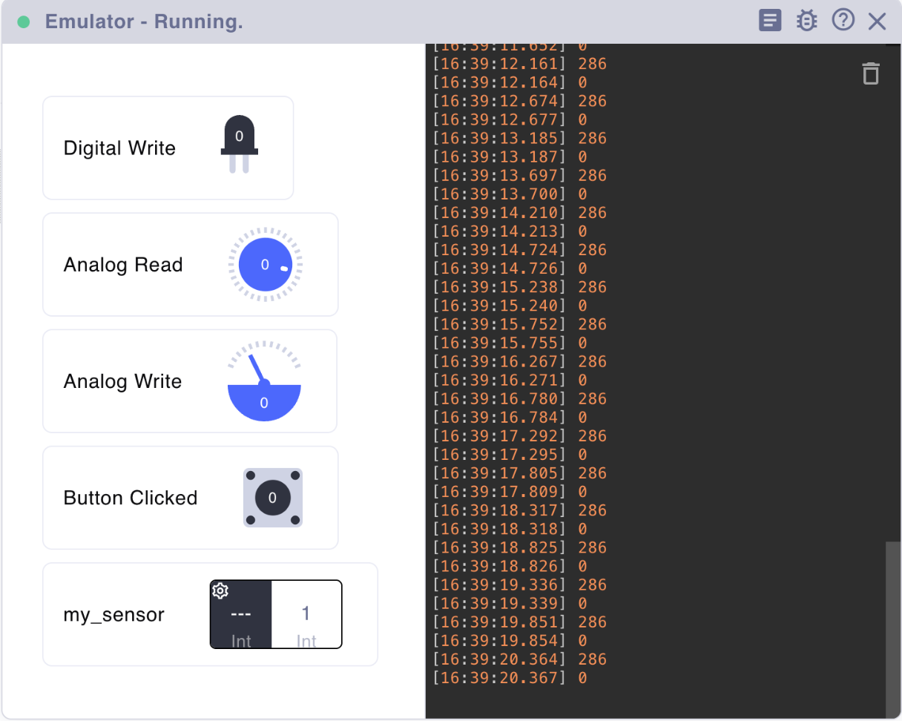
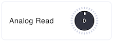
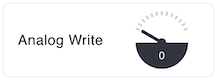
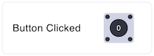
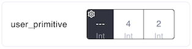
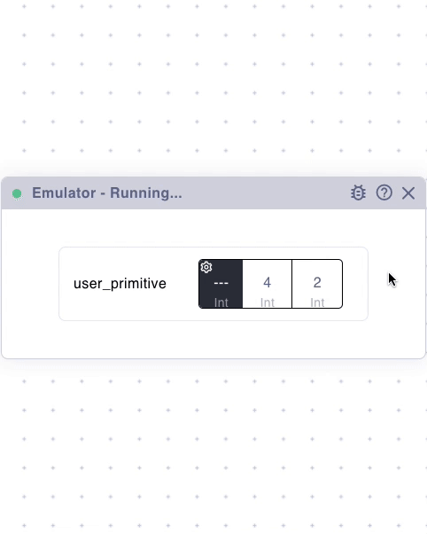
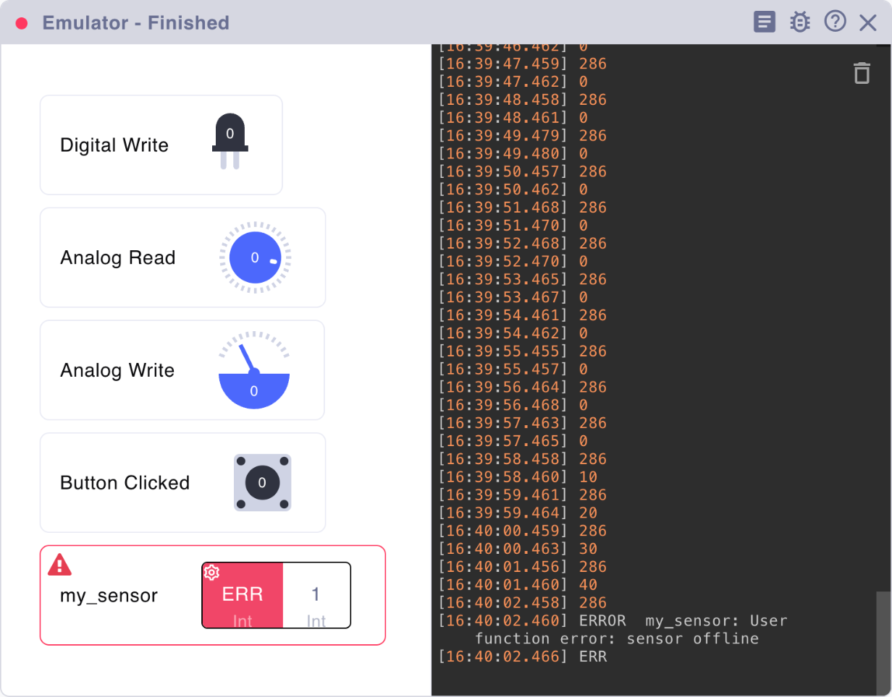

# Emulator

The Emulator runs your script in the browser on the same UniotLisp interpreter a device uses. Every primitive the script calls is answered by an interactive component instead of a GPIO pin, so you can test logic, watch outputs, and debug before deploying to hardware.

<div><figure><figcaption>Primitive cards on the left, script logs on the right</figcaption></figure></div>

## Quick Start

1. **Compile** the script in the Sandbox
2. **Run** it with the play button or Ctrl+Enter (Cmd+Enter on Mac)
3. **Interact** - flip switches, turn knobs, click buttons
4. **Read the logs** on the right for `print` output and errors
5. **Stop, edit, compile, run again** until it behaves, then **Deploy**



The Emulator is a floating window. You can open other pages while it runs; it keeps going until you close it or the script finishes.



## What Gets Emulated

- **Built-in primitives** get a matching control: a switch for `dread`, an LED for `dwrite`, a knob for `aread`, a gauge for `awrite`, a button for `bclicked`.
- **Your own primitives** become [user primitive](#user-primitive) cards whose return value you configure.
- **A device, optionally.** Select one in the sidebar before starting and the Emulator uses its primitives, [registers](../../general-concepts/primitives.md#the-register-system), and memory size, and flags anything the script uses that the device does not have. The **Deploy** button then appears in the header.

Only one emulation runs at a time. While it runs, the device selector is locked and other scripts in your list are greyed out.



**Writing UniotLisp by hand?** The Emulator only knows the primitives declared in the script's [user library block](../../general-concepts/primitives.md#user-library-block), built-ins included. The Visual Editor writes that block for you; in the Code Editor you declare them yourself, or compilation fails with "Undefined symbol".



## Starting and Stopping

| Action                      | How                                                                                                                       |
| --------------------------- | ------------------------------------------------------------------------------------------------------------------------- |
| Start from the Sandbox      | Compile first, then the play button or Ctrl+Enter. The button stays disabled while the code shows **Recompile required**. |
| Start from the scripts list | **Emulate** in a script's menu. Always runs without a device.                                                             |
| Stop                        | The cross in the header, the stop button in the Sandbox, Ctrl+Enter again, or **Deploy** from the header.                 |
| Script finishes on its own  | The window stays open with the title **Finished** so you can still read everything.                                       |



Editing the script during a run does not affect it. The Sandbox shows **Recompile required**, and Compile waits until you stop the Emulator.



## The Window

### Header

| Control          | What it does                                                                                                                           |
| ---------------- | -------------------------------------------------------------------------------------------------------------------------------------- |
| Status dot       | Green and pulsing while running. Yellow when a card has a warning, red when the run ended with an error. Hover it for the reason.      |
| Title            | "Running..." or "Finished", prefixed with the device name when one is selected.                                                        |
| Deploy           | Only with a device selected. Sends the emulated script to it and closes the Emulator.                                                  |
| Logs             | Shows or hides the [logs panel](#logs). Remembered for later runs.                                                                     |
| Debug (bug icon) | Lights a red dot on the card being called and **pauses 300 ms after every call**, so you can follow the order of calls. Slows the run. |
| Help             | Reminds you the Emulator keeps running while you browse.                                                                               |
| Close            | Stops the run and closes the window.                                                                                                   |

Drag the window by its header. Drag cards to reorder them.

### Cards

One card per primitive, one control per register, with the register index on the control. Hover the card name to see the primitive's name in code (**Analog Read** is `aread`).

A triangle icon on a card means it has something to tell you. Hover it to read the message:

| Message                                                                         | Meaning                                                                                    |
| ------------------------------------------------------------------------------- | ------------------------------------------------------------------------------------------ |
| Primitive is not used in the script                                             | The device has it, the script never calls it. Informational.                               |
| Unavailable in the selected device                                              | The script calls a primitive the device does not have.                                     |
| Registers are out of bounds                                                     | The script uses a register the device does not have. Check the device's **Registers** tab. |
| Return type mismatch, Parameter type mismatch, Parameter index is out of bounds | The script calls a device primitive with a different signature than the device declares.   |
| The limit of 10 registers has been reached                                      | A card shows at most ten registers.                                                        |
| User function error                                                             | The JavaScript function of a user primitive failed. The run stops.                         |

A script with no primitives shows "No primitives were found in the script" instead of cards.

## Components

### Digital Read

<div align="left"><figure><figcaption></figcaption></figure></div>

A switch. On, `dread` returns `#t` (pin HIGH); off, it returns `()` (pin LOW).

### Digital Write

<div align="left"><figure><figcaption></figcaption></figure></div>

An LED, lit while the script holds the pin HIGH. Display only.

### Analog Read

<div align="left"><figure><figcaption></figcaption></figure></div>

A knob. Drag or click it to set 0 to 1024. The script sees the new value about half a second after you stop turning.

### Analog Write

<div align="left"><figure><figcaption></figcaption></figure></div>

A gauge showing the last value written, 0 to 1024. Display only.

### Button Clicked

<div align="left"><figure><figcaption></figcaption></figure></div>

A push button. One click is one press: the next `bclicked` call returns **true** and clears it. Holding the button does not repeat the press.

### User Primitive

<div align="left"><figure><figcaption></figcaption></figure></div>

Your own primitives, and any device primitive beyond the built-ins. The blocks on the right show each argument's value and type as the script calls it. The block on the left shows the return value: blue once you enable one, red with `ERR` when a function fails. Click its gear to configure it.

#### Configuring Return Values

<div align="left"><figure><figcaption></figcaption></figure></div>

- **Enable Return Value** - off, the primitive returns its type's default (`0`, `#t`, or `_`).
- **Return Type** - `Int`, `Bool`, or `Symbol`. Fixed to the declared type for device primitives.
- **Enter Manually** - a number, **True**/**False**, or a symbol of up to 30 characters (characters a symbol cannot contain become `?`, spaces become `_`).
- **Use Function** - a JavaScript function computed on every call. Double-click the empty field for a template.

The function is validated on **Apply**: one synchronous function, no `async`, no generators. Inside it you have:

| Available                                 | Notes                                                                                                   |
| ----------------------------------------- | ------------------------------------------------------------------------------------------------------- |
| Arguments                                 | The strings the interpreter sent: `"42"`, `"#t"`, `"()"`                                                |
| `state.get(key)`, `state.set(key, value)` | Kept between calls for the run. Up to 100 keys; values are number, boolean, string, or `null` (deletes) |
| `Math`, `Date.now()`                      | Nothing else: no network, timers, console, or page access                                               |
| Return value                              | A string, boolean, or finite number, within 500 ms                                                      |

```javascript
// Returns how many times the primitive has been called
(_1 /* Int */) => {
  const count = (state.get("calls") || 0) + 1;
  state.set("calls", count);
  return count;
};
```

If the function throws, times out, or returns anything else, the card turns red, the logs get an `ERROR` line with the cause, and the run stops.

<div><figure><figcaption>A failed function marks the card, logs the cause, and ends the run</figcaption></figure></div>

## Logs

The panel on the right shows what the script prints, the way the **Logs** tab on a device page does for a deployed script. Every [print](visual-editor/text.md#print) adds a timestamped line; errors are added as they happen with their full message:

```
[15:04:05.678] 42
[15:04:06.178] (1 2 3)
[15:04:07.178] ERROR  Undefined symbol: foo
```

- Follows the newest line unless you scroll up; scroll back down to resume.
- Keeps the last 500 lines. Cleared on every run, or any time with the trash icon.
- Hide or show it with the **Logs** button in the header; the choice is remembered.



The [Logger](logger.md) pane in the Sandbox is a different view: the compiler's output and, during a run, a trace of the last primitive calls and their answers. Use it to see what the script asked for; use the Emulator's logs to see what the script said.



## Events

[is event, pop event, and push event](visual-editor/special.md) use the real MQTT broker:

- **push event** publishes on your account's event topic with sender type `emulator`. Dashboard widgets and devices listening for that event react as they would to a device.
- Events from widgets or devices are queued for the script, five per event name. The last retained value of an event seeds the queue on the first check.
- The Emulator's own pushes come back to it, so a script can see what it pushed.



**Pushed events are real.** A deployed device subscribed to the event will act on it. Test with event names that are not wired to production devices.



## Limits

| What                    | Limit                                                                                      |
| ----------------------- | ------------------------------------------------------------------------------------------ |
| `task` timing           | Intervals are waited in real time. A task set to run forever stops after 9,999 iterations. |
| Memory                  | The selected device's UniotLisp heap, or 14,336 bytes without a device.                    |
| Registers per primitive | 10                                                                                         |
| Custom function time    | 500 ms per call                                                                            |
| Logs                    | 500 lines                                                                                  |
| Event queue             | 5 values per event name                                                                    |

See [Debugging Scripts](../../general-concepts/scripting.md#debugging-scripts) for how logs and errors reach you from a deployed device, and the [MQTT convention](../../api-reference/mqtt-convention.md) for the event topics involved.
