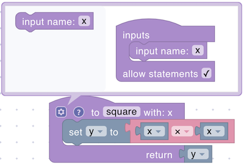

# Functions

The Functions section enables you to organize and streamline your code by encapsulating repetitive or complex logic into reusable components. You can create your own functions with optional parameters and a return value, making it simple to break down larger tasks into smaller, more manageable parts.

Once you’ve defined a function, you can invoke it anywhere in your script.

## function definition

<figure><figcaption></figcaption></figure>

Defines a reusable function. May include parameters and a return value if configured.

<figure><figcaption></figcaption></figure>

**Parameters:**

* **Function Name** (String)
* **Parameters** (Optional, various types)

**Returns:**

* **None** if no return is configured, or **Any type** if a return value is defined.

## function call

<figure><figcaption></figcaption></figure>

Calls a previously defined function, passing any required parameters.

**Parameters:**

* **Function Name** (string): The name of the function being called.
* **Input(s)** (optional): A value or expression for each parameter required by the function.

**Returns:**

* Depends on Function Definition:
  * If the function includes a return statement, this block will return the calculated result.
  * If the function has no return value, it performs the actions defined in the function without returning anything.
