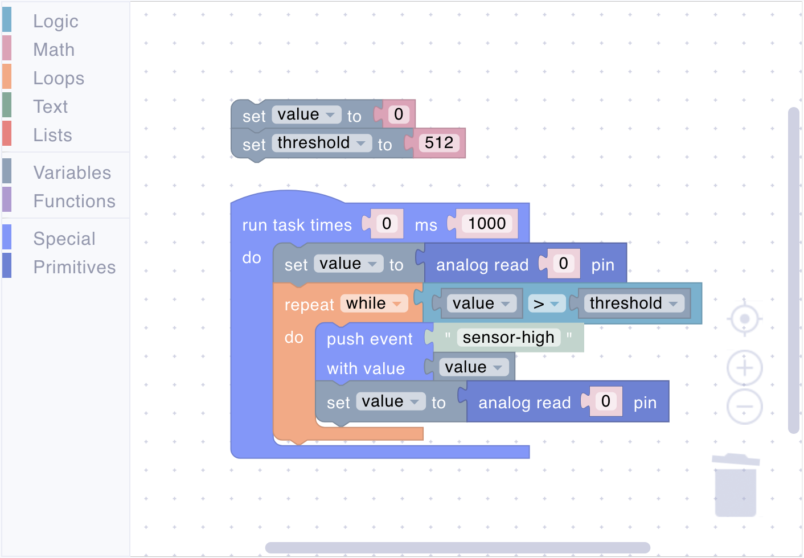
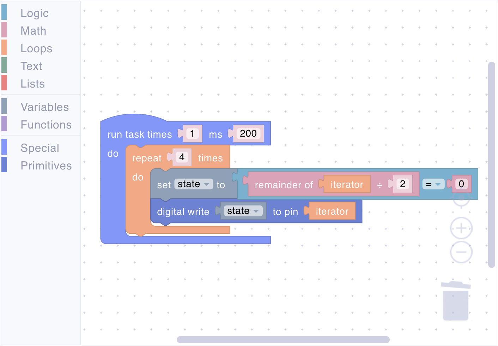

# Loops

Loops provides blocks that enable you to repeatedly execute a set of instructions, making your programs more efficient and powerful. Instead of manually duplicating code for each iteration, you can use loops to:

- Process multiple sensor readings
- Generate patterns for LED displays
- Handle collections of data
- Create sequences of operations

## repeat

<figure><figcaption></figcaption></figure>

Executes code a specific number of times.

**Parameters:**

- **Count** (Number): How many times to repeat

**Example:**

<figure><figcaption>Avarage sensor reading</figcaption></figure>

## repeat while

<figure><figcaption></figcaption></figure>

Repeats code as long as a condition is true.

**Parameters:**

- **Condition** (Boolean): The condition to check

**Example:**

<figure><figcaption>Process values while above threshold</figcaption></figure>

## repeat until

<figure><figcaption></figcaption></figure>

Repeats code until a condition becomes true.

**Parameters:**

- **Condition** (Boolean): The condition to check

**Example:**

<figure><figcaption>Read until valid value received</figcaption></figure>

## iterator

<figure><figcaption></figcaption></figure>

Returns the current loop iteration number (0-based).

**Returns:**

- **Iterator** (Number): The current loop iteration number

**Example:**

<figure><figcaption>Alternate on/off pattern for multiple LEDs</figcaption></figure>



An iterator can not be used outside the loop.


