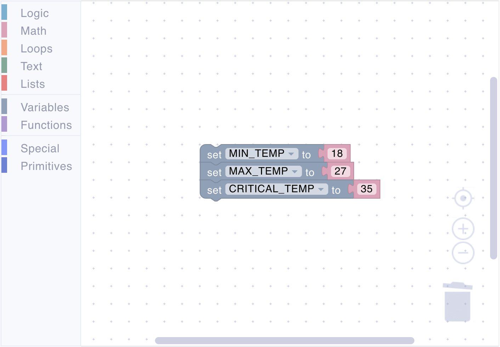
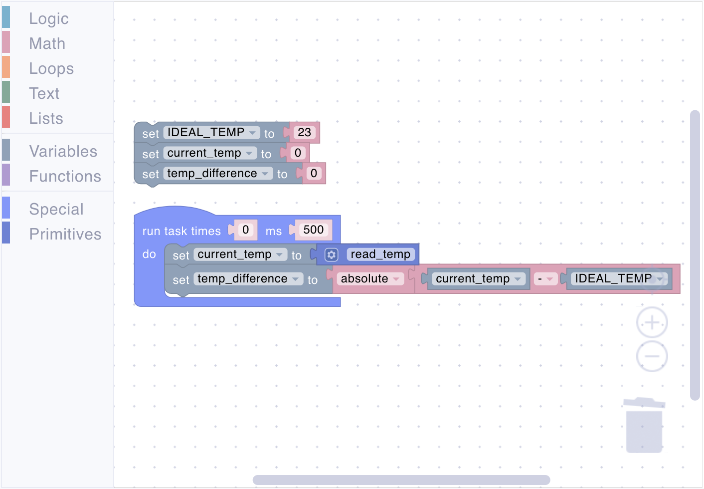
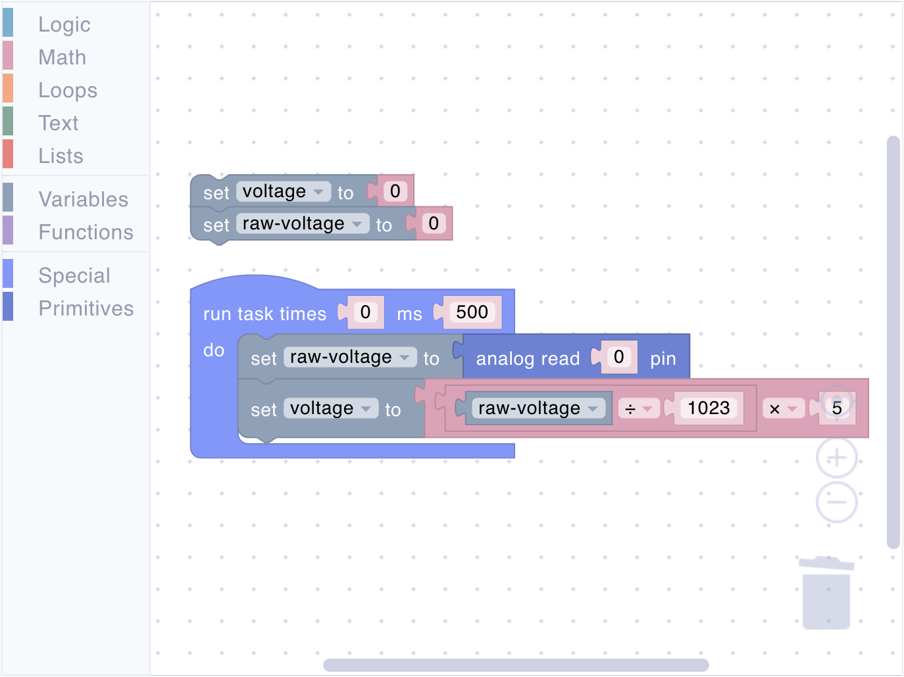

# Math

The Math section provides a range of blocks that enable you to perform numerical operations and transformations within your script. Whether you are adding two values, generating random numbers, or applying advanced mathematical functions like trigonometry or square roots, these blocks help bring numeric logic and computation into your IoT projects.

Using these blocks, you can:

- Perform basic arithmetic (addition, subtraction, multiplication, division).
- Apply mathematical functions (absolute value, negatiation, checking value for compliance with different conditions).
- Combine numeric operations with logic and loops to create complex, dynamic scripts.

## value

<figure><figcaption></figcaption></figure>

Represents a fixed numeric value.

**Parameters:**

- **Input Value** (Number): The numeric value to represent.

**Example:**

<figure><figcaption>Define temperature thresholds</figcaption></figure>

## math operation

<figure><figcaption></figcaption></figure>

Performs operations like absolute value or negation.

**Parameters:**

- **Input Value** (Number): The numeric value to operate on.

**Example:**

<figure><figcaption>Temperature difference calculation</figcaption></figure>

## arithmetic

<figure><figcaption></figcaption></figure>

Performs basic arithmetic: add (+), subtract (-), multiply (*), divide (/).

**Parameters:**

- **Left Value** (Number): The first numeric value.
- **Right Value** (Number): The second numeric value.

**Returns:**

- **Number** (Number): The result of the arithmetic operation.

**Example:**

<figure><figcaption>Convert raw sensor value to voltage</figcaption></figure>

## number condition

<figure><figcaption></figcaption></figure>

Checks numeric properties: even, odd, positive, negative, divisible by.

**Parameters:**

- **Input Value** (Number): The numeric value to check.

**Returns:**

- **Boolean** (Boolean): True if the condition is met, false otherwise.

**Example:**

<figure><figcaption>Read sensor value every 5th script execution</figcaption></figure>

## remainder check

<figure><figcaption></figcaption></figure>

Calculates the remainder after division.

**Parameters:**

- **Left Value** (Number): The first numeric value.
- **Right Value** (Number): The second numeric value.

**Returns:**

- **Number** (Number): The remainder of the division.

**Example:**

<figure><figcaption>Alternate on/off pattern for multiple LEDs</figcaption></figure>

