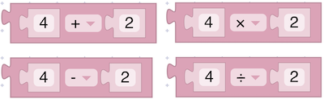
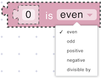

# Math

The Math section provides a range of blocks that enable you to perform numerical operations and transformations within your script. Whether you are adding two values, generating random numbers, or applying advanced mathematical functions like trigonometry or square roots, these blocks help bring numeric logic and computation into your IoT projects.

Using these blocks, you can:

* Perform basic arithmetic (addition, subtraction, multiplication, division).
* Apply mathematical functions (absolute value, negatiation, checking value for compliance with different conditions).
* Combine numeric operations with logic and loops to create complex, dynamic scripts.

## value

<figure><figcaption></figcaption></figure>

Represents a constant numeric value that can be used in mathematical operations, logic expressions, etc.

* **Input Value** (Number)

## math operation

<figure><figcaption></figcaption></figure>

Performs a mathematical operation on a given number. Specifically, it can either return the absolute value of the number or negate it by applying a negative sign (-).

**Parameters:**

* **Input Value** (Number)

## arithmetic

<figure><figcaption></figcaption></figure>

Performs an arithmetic operation (add, subtract, multiply, divide) on two numeric inputs.

**Parameters:**

* **Left Value** (Number)
* **Right Value** (Number)
* **Operator** (Enum): `+`, `-`, `×`, `÷`

**Returns:**

* **Number**: The result of the arithmetic operation.

## number condition

<figure><figcaption></figcaption></figure>

Check if a number is an even, odd, positive, negative, or if it is divisible by certain number.

**Parameters:**

* **Input Value** (Number)
* **Condition** (Enum): e.g. `event`, `odd`, `positive`, `negative`, `divisible by`

**Returns:**

* **Boolean**: `true` if the condition is met, otherwise `false`

## remainder check

<figure><figcaption></figcaption></figure>

Calculates the remainder of dividing two numbers.

**Parameters:**

* **Dividend** (Number)
* **Divisor** (Number)

**Returns:**

* **Number**: The result of the arithmetic operation.
