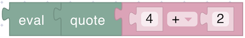

# Text

The Text section provides blocks designed to handle and transform textual data, as well as integrate text-based input and output into your scripts. This section empowers you to:

* Represent fixed pieces of text for use in messages, labels, or conditional checks.
* Convert numbers into strings, making it easier to display values or store them as text.
* Evaluate text-based expressions, bridging the gap between string manipulation and numeric calculations.
* Print logs and messages to the MQTT broker, simplifying the debugging and monitoring of your device’s behavior.

## value

<figure><figcaption></figcaption></figure>

Represents a string of text that can be used as an input for other blocks in Blockly. It allows users to input or define a fixed piece of text for use in text manipulation, display, or logic operations.

**Parameters:**

* **Text Value** (string)

**Returns:**

* **String**: The provided text.

## quote

<figure><figcaption></figcaption></figure>

Takes a numeric expression (or value) and converts it into a text string

**Parameters:**

* **Expression** (number or operation): A number or a mathematical expression that will be evaluated and converted into a string.

**Returns:**

* **String**: The result of the numeric expression, converted to a text format.

## eval

<figure><figcaption></figcaption></figure>

Evaluates a numeric expression that has been converted to a text format and returns the numeric result of the calculation.

**Parameters:**

* **Expression** (number or operation): A number or a mathematical expression that will be evaluated and converted into a string.

**Returns:**

* **String**: The result of the numeric expression, converted to a text format.

## print

<figure><figcaption></figcaption></figure>

Sends a log to the MQTT broker. Logs appear on the device details page.

**Parameters:**

* **Message** (string): A message to be sent as a log
