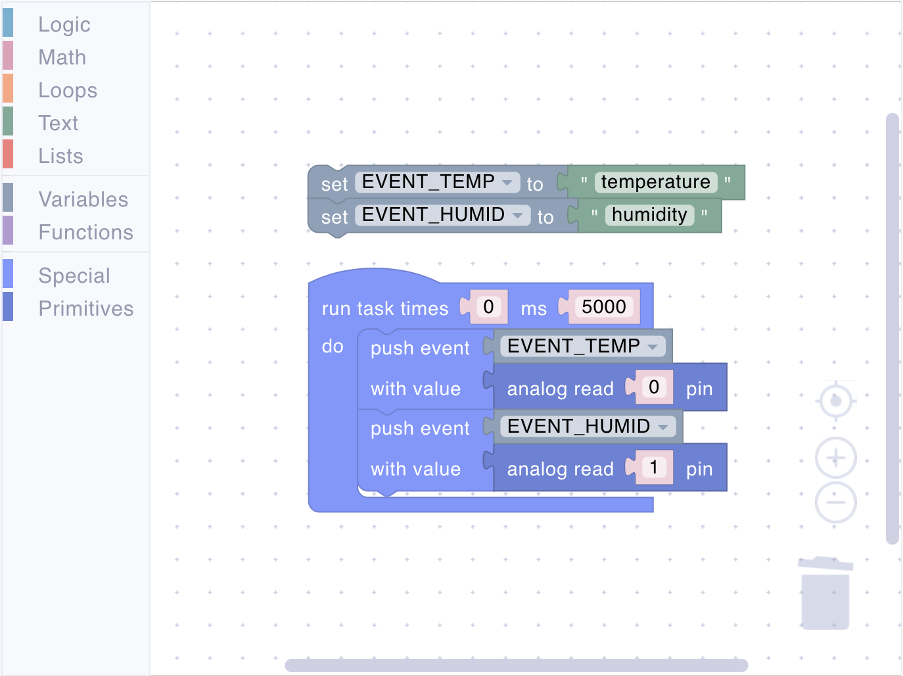
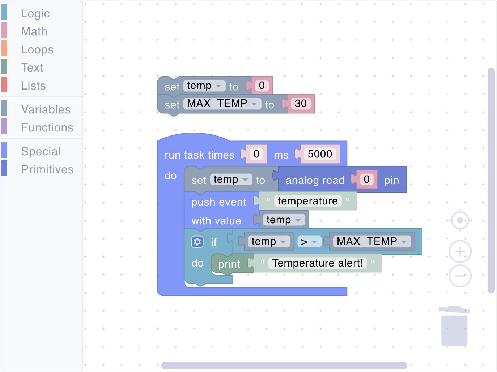

# Text

Text section provides blocks designed to handle and transform textual data, as well as integrate text-based input and output into your scripts. This section empowers you to:

- Represent fixed pieces of text for use in messages, labels, or conditional checks.
- Convert numbers into strings, making it easier to display values or store them as text.
- Evaluate text-based expressions, bridging the gap between string manipulation and numeric calculations.
- Print logs and messages to the MQTT broker, simplifying the debugging and monitoring of your device’s behavior.

## value

<figure><figcaption></figcaption></figure>

Creates a text string that can be used in your program.

**Parameters:**

- **Text Value** (string)

**Returns:**

- **String**: The provided text.

**Example:**

<figure><figcaption>Text value creation</figcaption></figure>

## quote

<figure><figcaption></figcaption></figure>

Takes an expression (or value) and converts it into a text string.

**Parameters:**

- **Expression**: A value or a mathematical expression that will be evaluated and converted into a string.

**Returns:**

- **String**: The expression, converted to a text format.

## eval

<figure><figcaption></figcaption></figure>

Evaluates an expression from text.

**Parameters:**

- **Expression**: A text string that contains an expression or a value.

**Returns:**

- **Any**: The result of the evaluated expression.

## print

<figure><figcaption></figcaption></figure>

Sends a log to the MQTT broker. Logs appear on the device details page.

**Parameters:**

- **Message**: A text string that will be sent to the MQTT broker.

**Example:**

<figure><figcaption>Logging messages</figcaption></figure>

