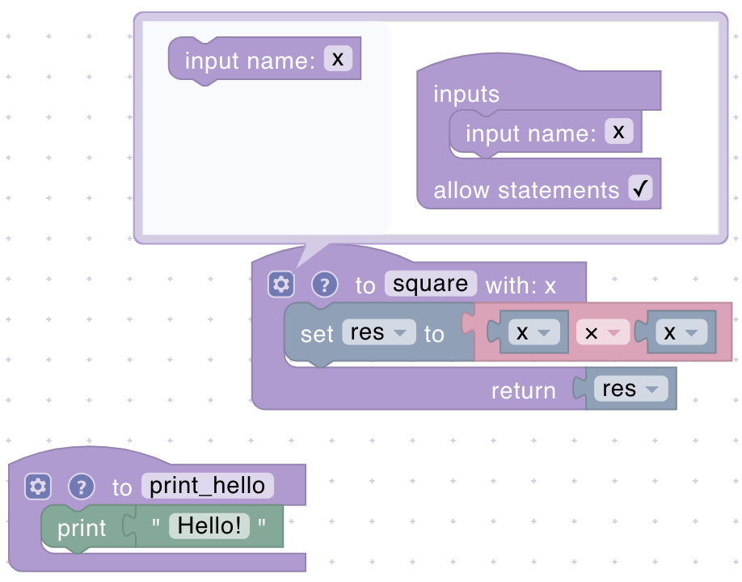
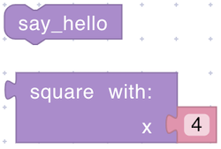

# Functions

Functions enable you to organize and streamline your code by encapsulating repetitive or complex logic into reusable components. You can create your own functions with optional parameters and a return value, making it simple to break down larger tasks into smaller, more manageable parts.

## function definition

<figure><figcaption></figcaption></figure>

Creates a new reusable function that can be called from anywhere in your program.

**Parameters:**

- **Function Name** (String): A unique name for your function
- **Parameters** (Optional): Input values your function needs
- **Return** (Optional): The type of value your function will give back

## function call

<figure><figcaption></figcaption></figure>

Executes a previously defined function with the specified parameters.

**Parameters:**

- **Function Name** (String): The name of the function to call
- **Input(s)**: Values that match the function's parameters

**Returns:**

- Depends on Function Definition:

  - If the function includes a return statement, this block will return the calculated result.
  - If the function has no return value, it performs the actions defined in the function without returning anything.
