# Logic

Logic blocks help you make decisions in your scripts based on conditions. Use logic to:

- Compare values
- Create conditional behaviors
- Combine multiple conditions
- Control program flow based on states

## value

<figure>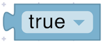<figcaption></figcaption></figure>

Represents a boolean value (`#t` for true or `()` for false).

**Parameters:**

- **Value** (Boolean): Boolean value to set.

**Returns:**

- **Boolean**: The selected Boolean value.

**Example:**

<figure>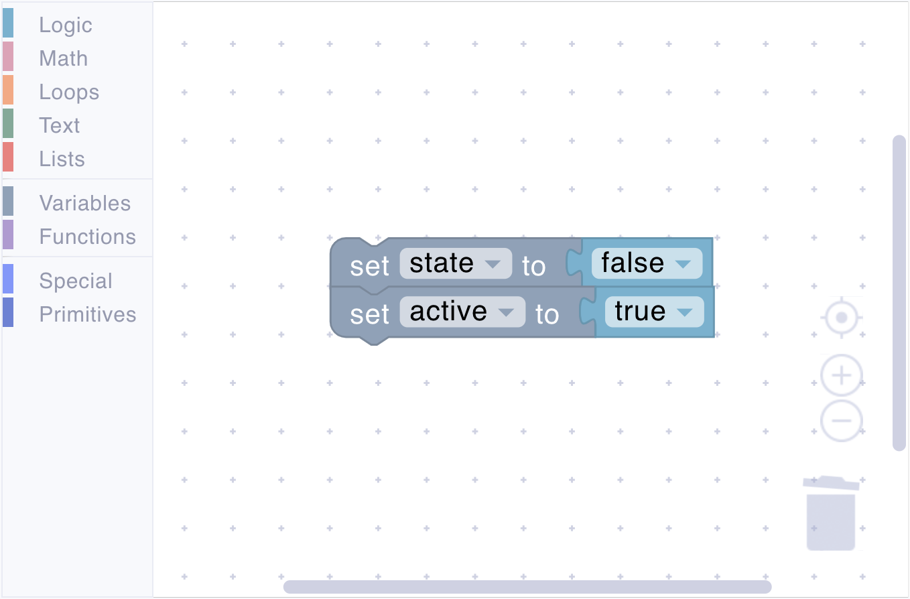<figcaption>Set initial values</figcaption></figure>

## if

<figure>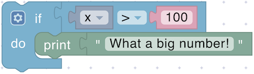<figcaption></figcaption></figure>

Executes enclosed blocks if the condition is true.

**Parameters:**

- **Condition** (Boolean): The condition to check

**Example:**

<figure>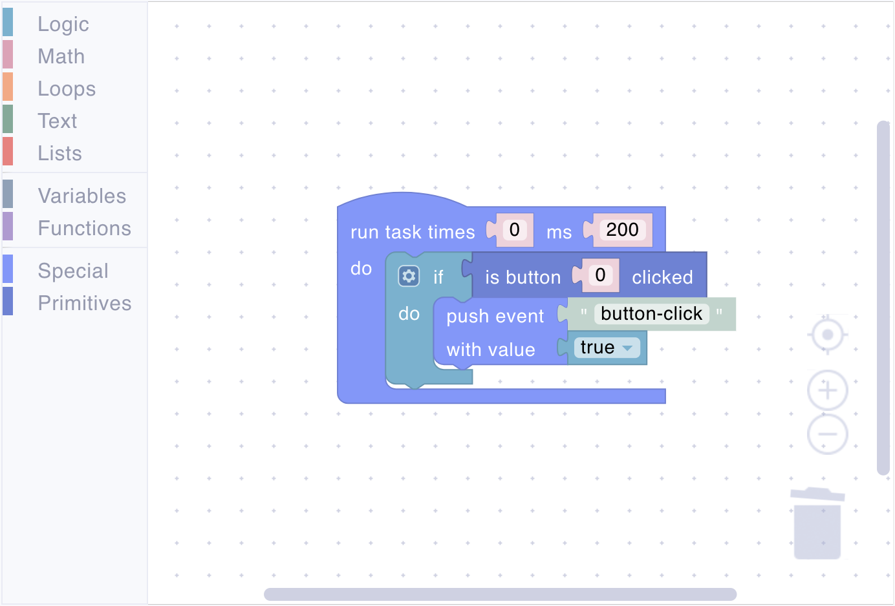<figcaption>Send event if button was clicked</figcaption></figure>

### Block Modification

Only the plain `if` block appears in the toolbox. To add `else if` and `else` clauses, click on the gear icon, which opens a new window:

<figure>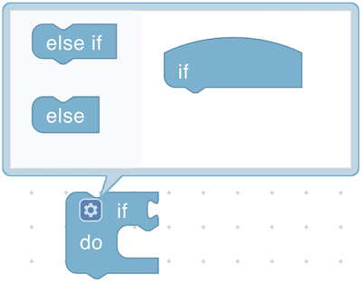<figcaption></figcaption></figure>

You can drag `else if` and `else` clauses under the `if` block, reorder them, and remove them as needed. When finished, click on the gear icon to close the window, as shown here:

<figure><figcaption></figcaption></figure>

Note that the shape of the blocks allows any number of `else if` subblocks to be added but only up to one `else` block.

## comparison

<figure>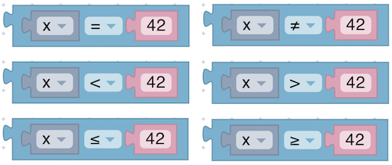<figcaption></figcaption></figure>

Compares two values using operators: `=`, `≠`, `<`, `>`, `≤`, `≥`

**Parameters:**

- **Left Value** (Number or comparable type): The first value to compare.
- **Right Value** (Number or comparable type): The second value to compare.
- **Operator** (Enum): The operator to use for the comparison.

**Returns:**

- **Boolean**: true if the comparison is satisfied, otherwise false.

**Example:**

<figure>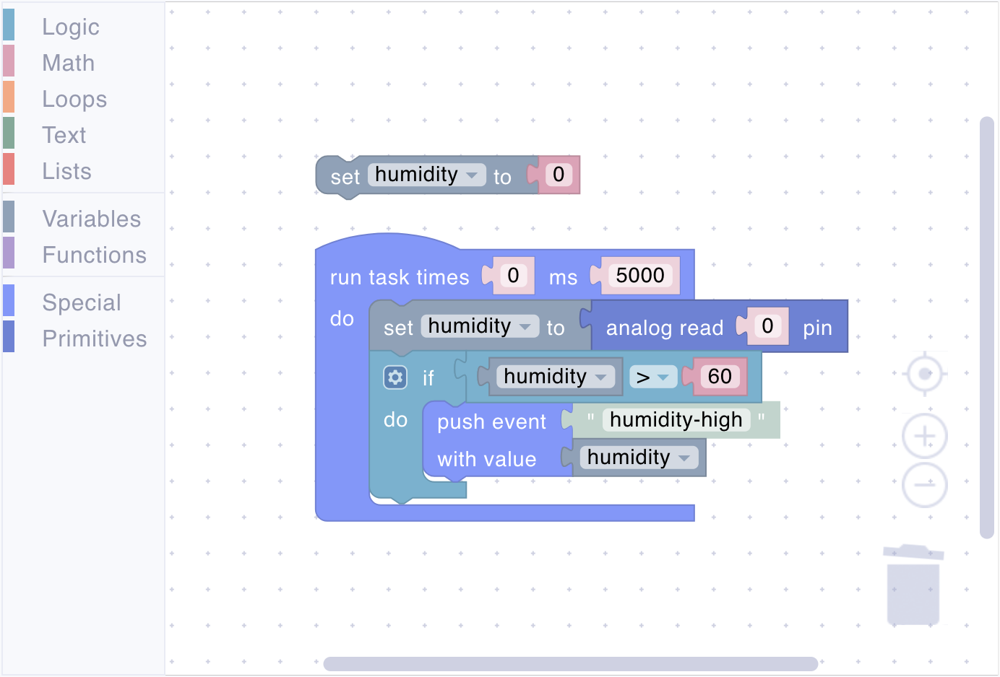<figcaption>Check humidity and send event when it is too high</figcaption></figure>

## and

<figure>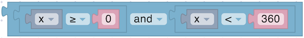<figcaption></figcaption></figure>

Returns true only if all conditions are true.

**Parameters:**

- **Input A** (Boolean): The first condition to check.
- **Input B** (Boolean): The second condition to check.

**Returns:**

- **Boolean**: true if both inputs are true, otherwise false.

**Example:**

<figure>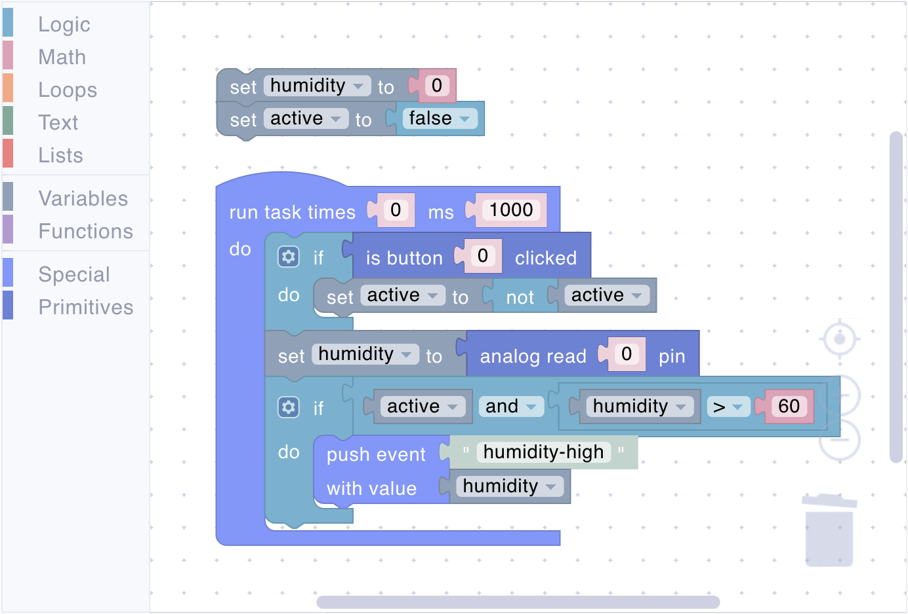<figcaption>Multiple condition check</figcaption></figure>

## or

<figure>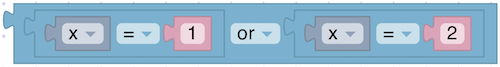<figcaption></figcaption></figure>

Returns true if any condition is true.

**Parameters:**

- **Input A** (Boolean): The first condition to check.
- **Input B** (Boolean): The second condition to check.

**Returns:**

- **Boolean**: true if at least one input is true, otherwise false.

**Example:**

<figure>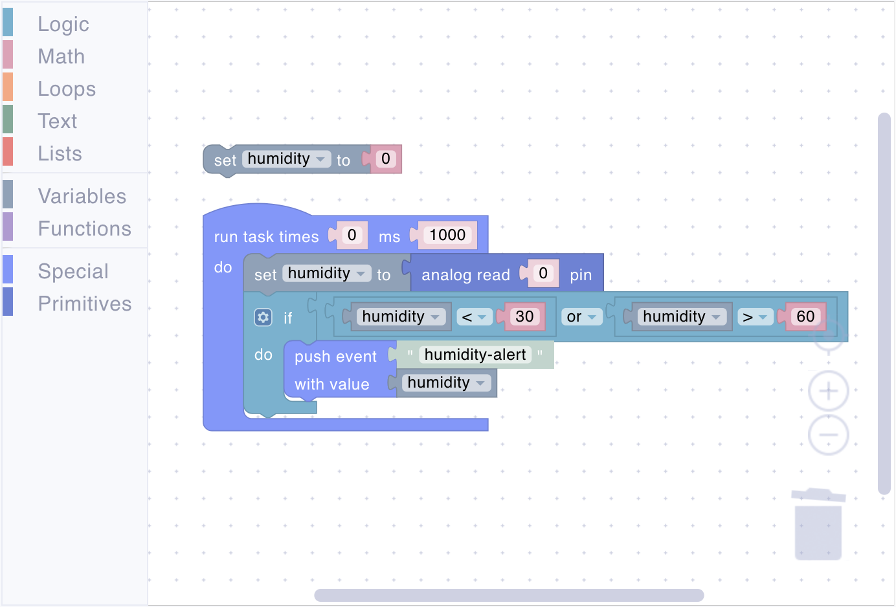<figcaption>Humidity alert</figcaption></figure>

## not

<figure><figcaption></figcaption></figure>

Inverts a boolean value. If no input is provided, a value of true is assumed. Leaving an input empty is not recommended, however.

**Parameters:**

- **Input** (Boolean): The boolean value to invert.

**Returns:**

- **Boolean**: The inverted boolean value.

**Example:**

<figure>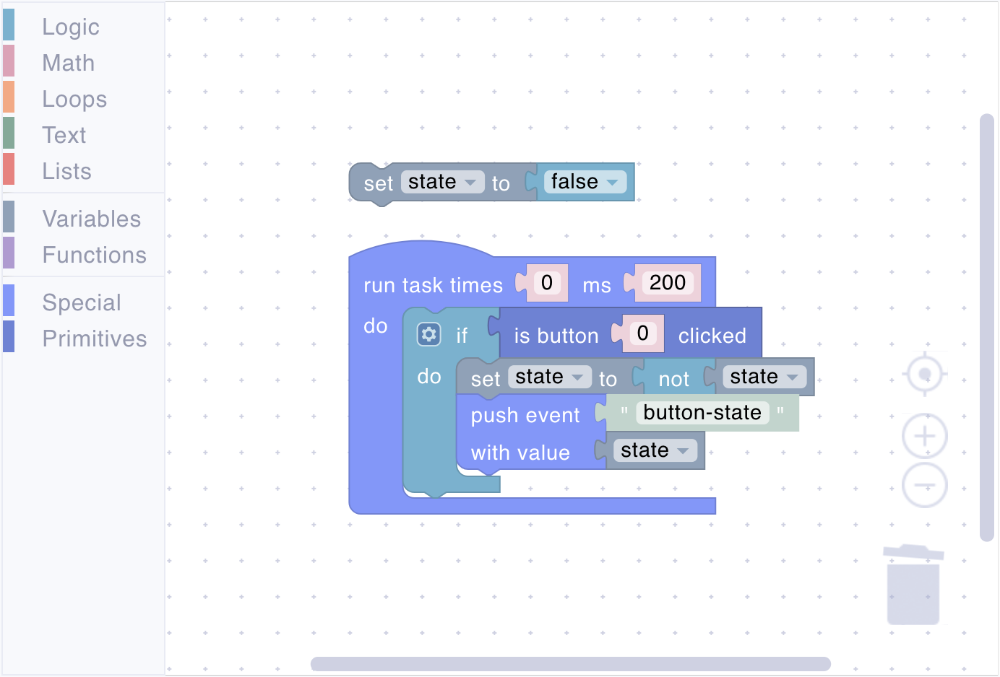<figcaption>Toggle state by button click</figcaption></figure>

