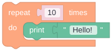
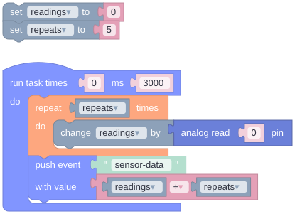
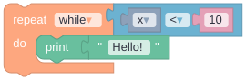
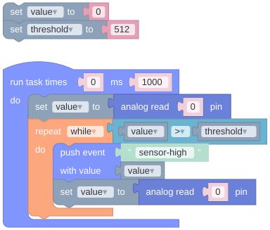
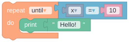
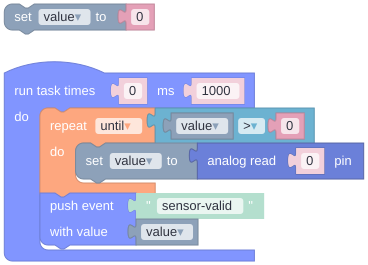
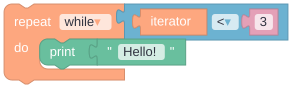
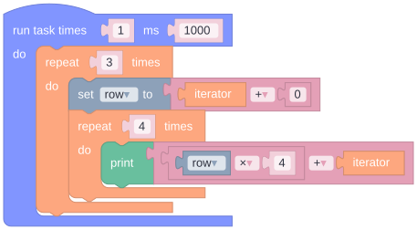
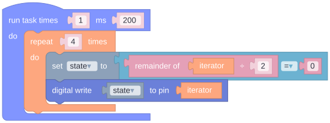
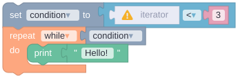

# Loops

Loop blocks repeatedly execute code, eliminating the need to duplicate instructions. Use loops to process multiple sensor readings, generate patterns, handle collections of data, or create sequences of operations.

## repeat

<div align="left"><figure><figcaption></figcaption></figure></div>

Executes the enclosed code a fixed number of times. Use this when you know exactly how many iterations you need. Inside it, the [iterator](#iterator) tells you which pass is running.

**Parameters:**

- **Count** (Number): Number of times to repeat. It is checked before every pass, so a count taken from a variable that the loop itself changes changes the number of passes too.

**Example:**

<div align="left"><figure><figcaption>Average sensor reading</figcaption></figure></div>

## repeat while

<div align="left"><figure><figcaption></figcaption></figure></div>

Repeats code as long as the condition remains true. The condition is checked before each iteration.

**Parameters:**

- **Condition** (Boolean): The condition to evaluate before each iteration

**Example:**

<div align="left"><figure><figcaption>Process values while above threshold</figcaption></figure></div>

## repeat until

<div align="left"><figure><figcaption></figcaption></figure></div>

Repeats code until the condition becomes true. Like **repeat while**, it checks the condition before each pass, so if the condition is already true, the code inside doesn't run at all.

**Parameters:**

- **Condition** (Boolean): The condition to evaluate before each iteration

**Example:**

<div align="left"><figure><figcaption>Read until valid value received</figcaption></figure></div>

## iterator

<div align="left"><figure><figcaption></figcaption></figure></div>

Returns how many passes the loop around it has completed: `0` on the first pass, `1` on the second, and so on. It works in all three loops. Use it to create indexed operations or patterns.

**Returns:**

- **Number**: The current loop iteration (0, 1, 2, ...)

**Nested loops:** the iterator belongs to the innermost loop around it. Inside an inner loop it counts that loop's passes, starting again from `0` each time the inner loop starts. When the inner loop finishes, the iterator is the outer loop's count again. To use the outer loop's count inside the inner loop, store it in a variable before the inner loop starts:

<div align="left"><figure><figcaption>Print the cells of a 3 × 4 grid, numbered 0 to 11</figcaption></figure></div>

```lisp
(define row ())

(task 1 1000 '
 (progn
  (while
   (< #itr 3)
   (setq row
    (+ #itr 0))
   (while
    (< #itr 4)
    (print
     (+
      (* row 4) #itr))))))
```


**Known issue:** a variable set to the **iterator** keeps a link to the loop's counter rather than its value, so it changes along with the counter. In the example above, `row` would follow the inner loop, and a count saved inside a loop reads `0` once the loop has finished. Until this is fixed, store a copy instead — **iterator + 0**, as the example does: the arithmetic makes a new number. The fix is coming in the next release of the UniotLisp interpreter, after which the iterator can be stored directly.


**Example:**

<div align="left"><figure><figcaption>Alternate on/off pattern for multiple LEDs</figcaption></figure></div>



This block only works inside a loop. Anywhere else, and in a **repeat** block's count, the editor disables it and marks it with a warning. A disabled block is left out of the code, and the block around it falls back to its own default. In the example below, the comparison gets an empty value, `()`, and stops the script with `< takes only numbers`; a **set** block would quietly store `0` instead.





## How long a loop may run

A loop, together with any loops inside it, may run for 20,000 passes in all. Past that, the script stops with `Loop ran for 20000 iterations without ending; possible endless loop`. Something that should go on for as long as the device runs belongs in the [task](special.md#task), which repeats on its own.
