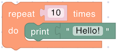
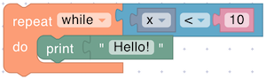
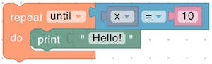
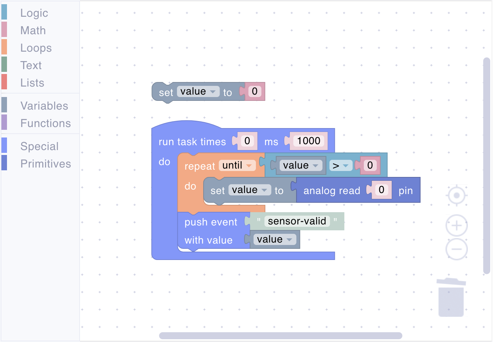

# Loops

Loop blocks repeatedly execute code, eliminating the need to duplicate instructions. Use loops to process multiple sensor readings, generate patterns, handle collections of data, or create sequences of operations.

## repeat

<figure><figcaption></figcaption></figure>

Executes the enclosed code a fixed number of times. Use this when you know exactly how many iterations you need.

**Parameters:**

- **Count** (Number): Number of times to repeat

**Example:**

<figure><figcaption>Average sensor reading</figcaption></figure>

## repeat while

<figure><figcaption></figcaption></figure>

Repeats code as long as the condition remains true. The condition is checked before each iteration.

**Parameters:**

- **Condition** (Boolean): The condition to evaluate before each iteration

**Example:**

<figure><figcaption>Process values while above threshold</figcaption></figure>

## repeat until

<figure><figcaption></figcaption></figure>

Repeats code until the condition becomes true. The condition is checked after each iteration, so the loop always executes at least once.

**Parameters:**

- **Condition** (Boolean): The condition to evaluate after each iteration

**Example:**

<figure><figcaption>Read until valid value received</figcaption></figure>

## iterator

<figure><figcaption></figcaption></figure>

Returns the current iteration counter for the loop, starting from 0. Use this to create indexed operations or patterns.

**Returns:**

- **Number**: The current loop iteration (0, 1, 2, ...)

**Example:**

<figure><figcaption>Alternate on/off pattern for multiple LEDs</figcaption></figure>



This block only works inside a loop block. Using it elsewhere will cause an error.


