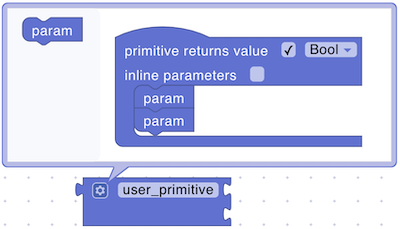

# Primitives

Primitives provide direct access to your device's hardware capabilities. These fundamental blocks enable you to:

- Read sensor values
- Control digital outputs
- Manage analog signals
- Create custom hardware interactions

When using primitives, you'll work with [register](../../../general-concepts/primitives.md#registers) indices rather than direct pin numbers. The register system organizes pins into categories (digital input/output, analog input/output) and assigns each pin an index. You can view the mapping between physical pins and register indices in your device's Registers tab on the Uniot Platform.

## analog read

<figure><figcaption></figcaption></figure>

Reads an analog value from a specified pin (range: **0-1023**).

**Parameters:**

- **Pin** (Number): The analog pin to read from

**Returns:**

- **Number**: Value between **0-1023**

**Example:**

<figure><figcaption>Check light level and push event if it's too low.</figcaption></figure>

## analog write

<figure><figcaption></figcaption></figure>

Sets an analog (PWM) value on a pin (range: **0-1023**).

**Parameters:**

- **Pin** (Number): The PWM-capable pin
- **Value** (Number): Value between **0-1023**

**Example:**

<figure><figcaption>Receives brightness value from the dashboard (or another device) and sets it to the LED.</figcaption></figure>

## digital read

<figure><figcaption></figcaption></figure>

Reads a digital value from a pin (HIGH or LOW).

**Parameters:**

- **Pin** (Number): The digital pin to read from

**Returns:**

- **Boolean**: `#t` for high, `()` for low

**Example:**

<figure><figcaption>Read switch state and push event when it is changed.</figcaption></figure>

## digital write

<figure><figcaption></figcaption></figure>

Sets a digital pin to high or low.

**Parameters:**

- **Pin** (Number): The digital pin
- **Value** (Boolean): `#t` for high, `()` for low

**Example:**

<figure><figcaption>Checks if an event was received and sets the LED accordingly.</figcaption></figure>

## button clicked

<figure><figcaption></figcaption></figure>

Checks if a button on a specified pin was clicked since the last check.

**Parameters:**

- **Pin** (Number): The digital pin

**Returns:**

- **Boolean**: `#t` if the button was clicked, `()` otherwise

**Example:**

<figure><figcaption>Checks if a button was clicked, change the state, and sets the LED accordingly.</figcaption></figure>

## user primitive (template)

<figure><figcaption></figcaption></figure>

A template for defining custom primitives with configurable parameters and return values. The user primitive returns a boolean value by default. If you need to perform only some actions and do not expect any data in response, you need to customize the block by clicking on the gear icon.

**Parameters:**

- **Parameters** (As defined by the user)

**Returns:**

- **Any type** (As defined by the user)

## user primitive (autogenerated)

<figure><figcaption></figcaption></figure>

Accesses custom primitives defined in firmware. The primitive returns a boolean value by default. If you need to perform only some actions and do not expect any data in response, you need to customize the block by clicking on the gear icon.

**Parameters:**

- **Parameters** (As defined by the user)

**Returns:**

- **Any type** (As defined by the user)

**Example:**

<figure><figcaption>Custom LED strip control</figcaption></figure>

