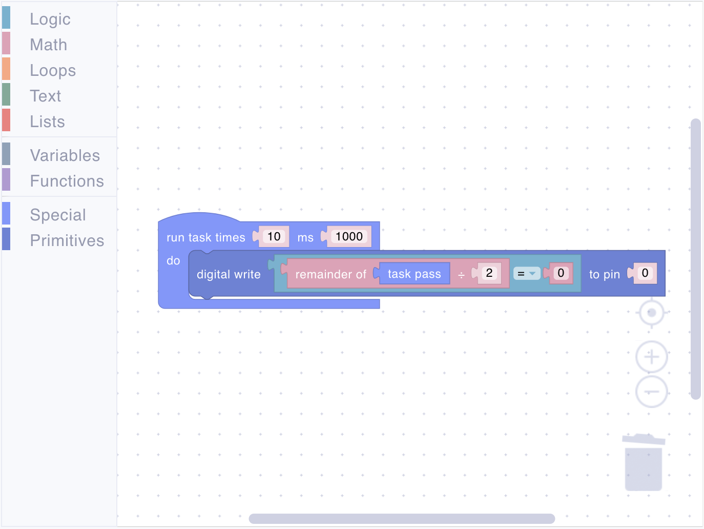
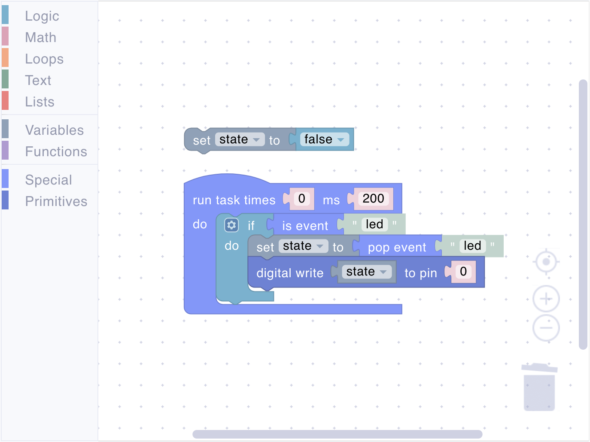
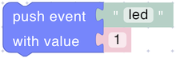
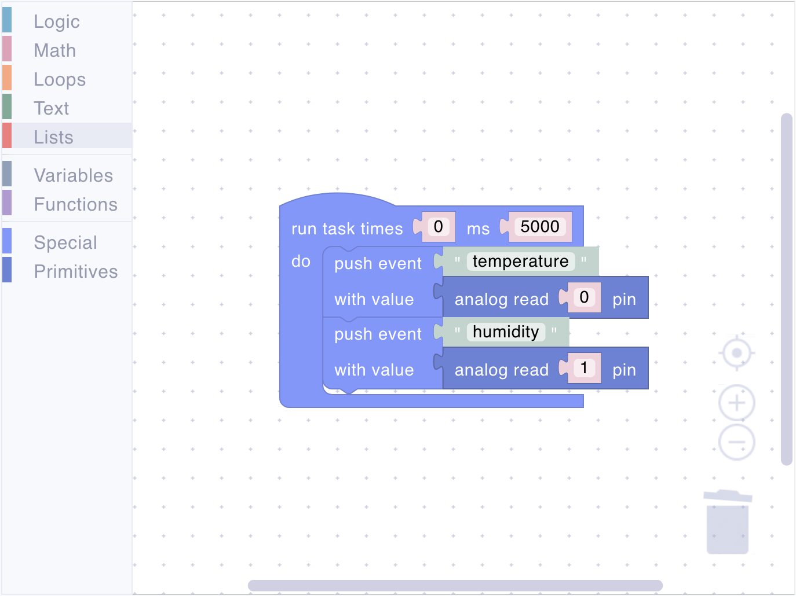

# Special

Special blocks provide essential control over program execution and event handling in your IoT system. These blocks enable you to:

- Control program timing and execution
- Handle MQTT events
- Manage program state
- Create event-driven behaviors

## task

<figure><figcaption></figcaption></figure>

Creates a recurring task that executes at specified intervals. This is the primary execution loop required in every script - only one task block is allowed per script as it serves as the main program loop.

**Parameters:**

- **Iterations** (Number): How many times to run (0 for infinite)
- **Interval** (Number): Time between executions in milliseconds

**Example:**

<figure><figcaption>Read temperature every 5 seconds and send an event with the value</figcaption></figure>

## task pass

<figure><figcaption></figcaption></figure>

Returns the current task iteration count. For infinite tasks (0 iterations), returns -1.

**Returns:**

- **Number** (Number): -1 if infinite; otherwise a **countdown from n-1 to 0**



An iterator can not be used outside the task block.

<figure><figcaption></figcaption></figure>



**Example:**

<figure><figcaption>Create LED patterns based on iteration</figcaption></figure>



A custom iterator implementation.

<figure><figcaption></figcaption></figure>



## is event

<figure><figcaption></figcaption></figure>

Checks if a specific MQTT event exists in the queue.

**Parameters:**

- **Event Name** (String): Name of the event to check

**Returns:**

- **Boolean**: `#t` if event exists, `()` if not



This block will return true until you retrieve and remove the value using the pop event block.



**Example:**

<figure><figcaption>Check and retrieve an event</figcaption></figure>

## pop event

<figure><figcaption></figcaption></figure>

Retrieves and removes the oldest event of the specified type from the queue.

**Parameters:**

- **Event Name** (String): Name of the event to retrieve

**Returns:**

- **Value**: The event value, or `()` if no event exists



The event payload is always of type Number.



**Example:**

<figure><figcaption>Check and retrieve an event</figcaption></figure>

## push event

<figure><figcaption></figcaption></figure>

Sends an event with a value to the MQTT broker.

**Parameters:**

- **Event Name** (String): Name of the event
- **Value**: Value to send (number or boolean)



The event payload is always of type Number. Boolean values are converted to 1 or 0.



**Example:**

<figure><figcaption>Send sensor readings</figcaption></figure>

