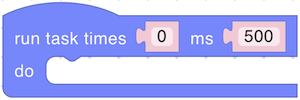
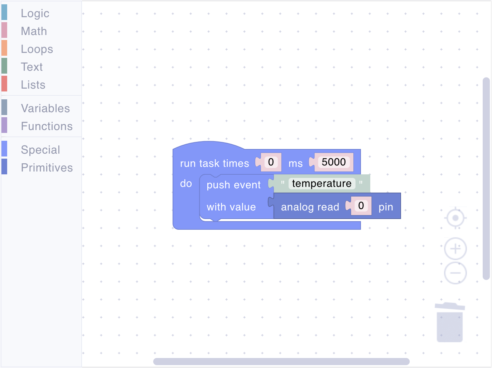
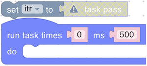
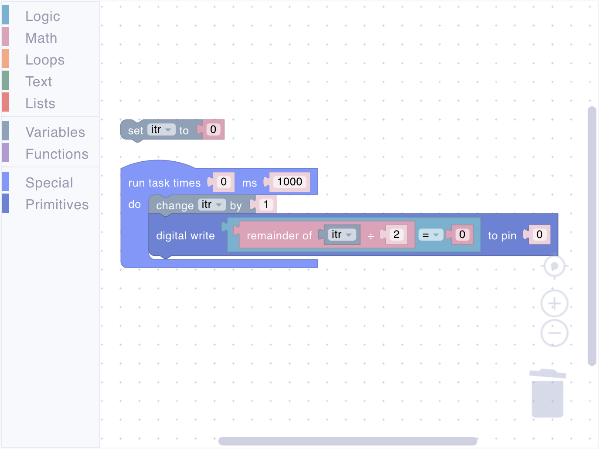

# Special

Special blocks provide essential control over program execution and event handling. These blocks let you create the main program loop, handle MQTT events, and build event-driven device behaviors.

## task

<figure><figcaption></figcaption></figure>

The main execution loop for your script. This block repeatedly executes the code inside it at a specified interval. Every script requires exactly one task block - it serves as your program's entry point and controls when your device logic runs.

**Parameters:**

- **Iterations** (Number): How many times to run. Set to `0` for infinite execution (most common)
- **Interval** (Number): Time between executions in milliseconds

**Example:**

<figure><figcaption>Read temperature every 5 seconds and send an event with the value</figcaption></figure>

## task pass

<figure><figcaption></figcaption></figure>

Returns the current iteration counter for the task. Useful for creating behaviors that change over time or execute only on specific iterations.

**Returns:**

- **Number**: `-1` for infinite tasks (iterations = 0), otherwise counts down from `n-1` to `0`



This block only works inside a task block. Using it elsewhere will cause an error.

<figure><figcaption></figcaption></figure>



**Example:**

<figure><figcaption>Create LED patterns based on iteration</figcaption></figure>



Custom iterator implementation using variables to count up instead of down.

<figure><figcaption></figcaption></figure>



## is event

<figure><figcaption></figcaption></figure>

Checks whether a specific MQTT event is waiting in the queue. Use this to conditionally process events when they arrive.

**Parameters:**

- **Event Name** (String): The name of the event to check for

**Returns:**

- **Boolean**: `#t` (true) if the event exists in the queue, `()` (false) if not



This block returns true as long as the event remains in the queue. To remove the event, use the **pop event** block.



**Example:**

<figure><figcaption>Check and retrieve an event</figcaption></figure>

## pop event

<figure><figcaption></figcaption></figure>

Retrieves and removes the oldest event of the specified type from the queue. Use this to access event data sent via MQTT.

**Parameters:**

- **Event Name** (String): The name of the event to retrieve

**Returns:**

- **Number**: The event payload value, or `()` (empty) if no event exists



Event payloads are always of type **Number**. If you need to send other data types, encode them as numbers.



**Example:**

<figure><figcaption>Check and retrieve an event</figcaption></figure>

## push event

<figure><figcaption></figcaption></figure>

Sends an event with a value to the MQTT broker. Use this to publish sensor readings, status updates, or trigger actions on other devices or dashboards.

**Parameters:**

- **Event Name** (String): The name of the event to publish
- **Value** (Number/Boolean): The value to send



Event payloads are always sent as **Number** type. Boolean values are automatically converted: `true` → `1`, `false` → `0`.



**Example:**

<figure><figcaption>Send sensor readings</figcaption></figure>

