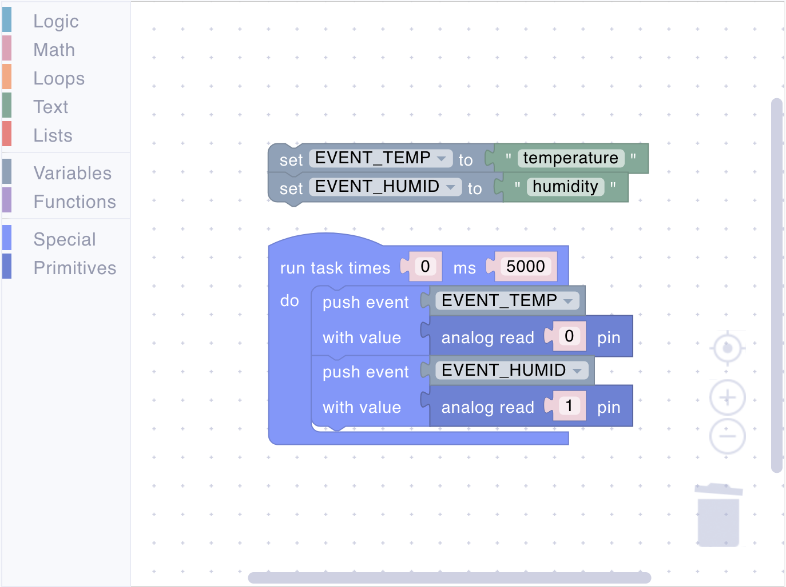

# Text

Text blocks handle string operations and text-based data. Use these blocks to create text values, convert between strings and numbers, evaluate expressions, and send log messages.

## value

<figure><figcaption></figcaption></figure>

A text string constant. Use this block to create fixed text values for labels, messages, or event names.

**Parameters:**

- **Value** (String): Enter any text

**Returns:**

- **String**: The text value

**Example:**

<figure><figcaption>Text value creation</figcaption></figure>

## quote

<figure><figcaption></figcaption></figure>

Converts an expression or value into a string representation without evaluating it. Useful for capturing code as text.

**Parameters:**

- **Expression**: The value or expression to convert

**Returns:**

- **String**: The expression as text

## eval

<figure><figcaption></figcaption></figure>

Evaluates a text string as UniotLisp code and returns the result. Use this to execute dynamic code or parse text-based expressions.

**Parameters:**

- **Expression** (String): Text containing UniotLisp code to evaluate

**Returns:**

- **Any**: The result of evaluating the expression

## print

<figure><figcaption></figcaption></figure>

Sends a log message to the MQTT broker. Messages appear on the device details page for monitoring and debugging.

**Parameters:**

- **Message** (String): The text to log

**Example:**

<figure><figcaption>Logging messages</figcaption></figure>

