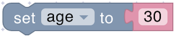
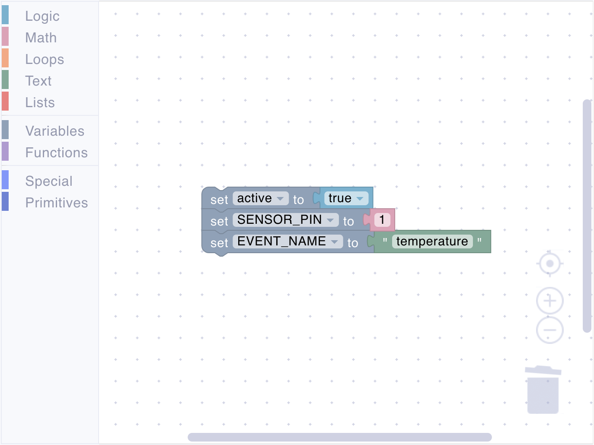
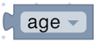
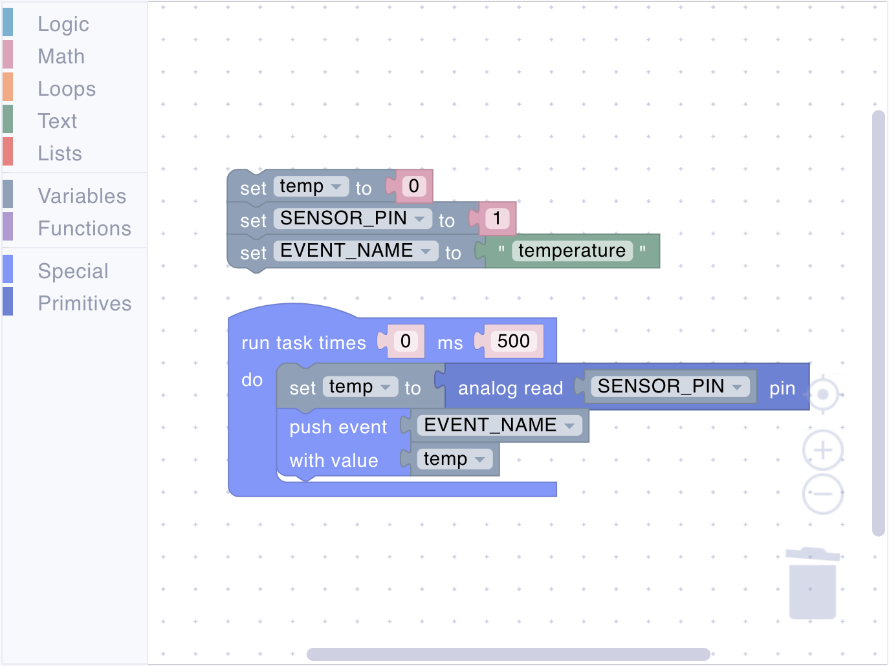
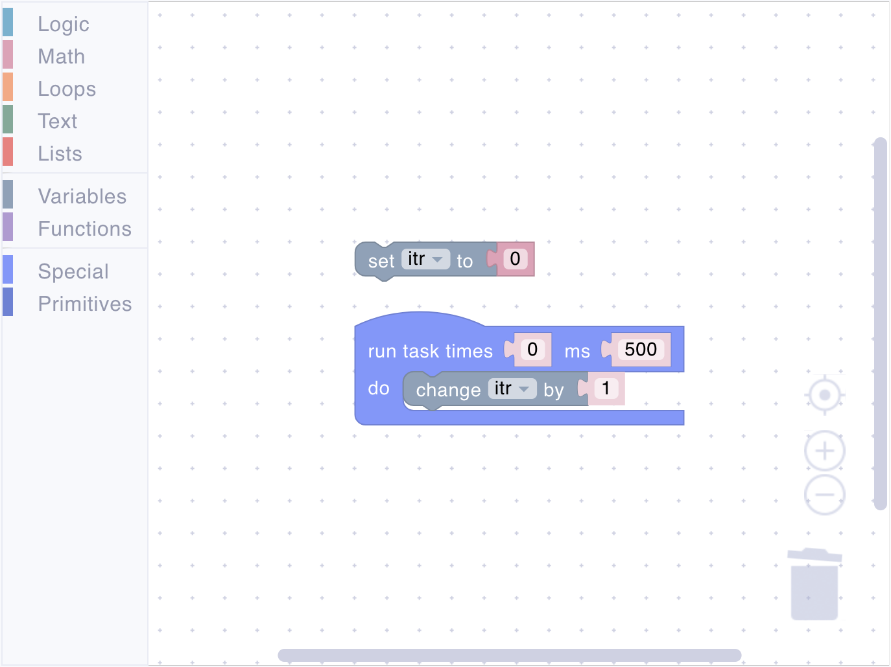
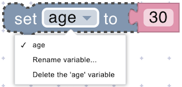

# Variables

Variables allow you to store, retrieve, and manipulate data within the script. They are essential for keeping track of changing values, such as sensor readings, user inputs, or counters.



Note: Before using a variable, you typically create it through a corresponding section in the toolbox. Once created, it can be used and modified throughout your program. Variables are case-sensitive and should have meaningful names to make your code easier to understand.



## set

<figure><figcaption></figcaption></figure>

Creates a new variable or changes an existing variable's value.

**Parameters:**

- **Variable Name** (String): The name of the variable to set.
- **Value** (Any type): The value to store in the variable.

**Example:**

<figure><figcaption>Setting variables</figcaption></figure>

## get

<figure><figcaption></figcaption></figure>

Retrieves the current value of a variable.

**Parameters:**

- **Variable Name** (String): The name of the variable whose value you want to access.

**Returns:**

- **Any type**: The current value of the specified variable.

**Example:**

<figure><figcaption>Getting variable values</figcaption></figure>

## change

<figure><figcaption></figcaption></figure>

Modifies a numeric variable by adding a value to it.

**Parameters:**

- **Variable Name** (String): The name of the variable to modify.
- **Value** (Number): The amount to add to the variable.

**Example:**

<figure><figcaption>Modifying variables</figcaption></figure>

## Dropdown Menu

<figure><figcaption></figcaption></figure>

The variable dropdown menu provides options to:

- Select existing variables
- Rename selected variable
- Delete selected variable



Renaming or deleting a variable affects all blocks that use that variable.


