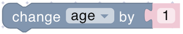

# Variables

Variables store and manage data in your scripts. Use variables to track changing values like sensor readings, counters, states, or calculated results.



Create variables through the Variables section in the toolbox before using them. Variable names are case-sensitive - choose meaningful names to make your code easier to understand.



## set

<figure><figcaption></figcaption></figure>

Assigns a value to a variable. If the variable doesn't exist, it's created automatically.

**Parameters:**

- **Variable**: Select from the dropdown or create a new variable
- **Value** (Any): The value to store

**Example:**

<figure><figcaption>Setting variables</figcaption></figure>

## get

<figure><figcaption></figcaption></figure>

Retrieves the current value stored in a variable.

**Parameters:**

- **Variable**: Select which variable to read

**Returns:**

- **Any**: The current value of the variable

**Example:**

<figure><figcaption>Getting variable values</figcaption></figure>

## change

<figure><figcaption></figcaption></figure>

Increments or decrements a numeric variable by adding a value to it. Use negative values to subtract.

**Parameters:**

- **Variable**: Select which variable to modify
- **Value** (Number): The amount to add (use negative for subtraction)

**Example:**

<figure><figcaption>Modifying variables</figcaption></figure>

## Managing Variables

<figure><figcaption></figcaption></figure>

The variable dropdown menu in each block provides options to:

- **Select** existing variables from your script
- **Rename** the selected variable (updates all references)
- **Delete** the selected variable (removes from all blocks)



Renaming or deleting a variable affects **all blocks** that use it. Be careful when modifying variables used in multiple places.


