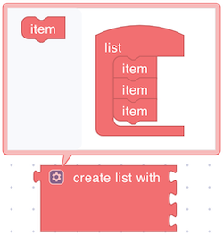

# Lists

## create empty list

<figure></figure>

Creates an empty list.

**Returns:**

* **List**: An empty list.

## create list with

<figure></figure>

Creates a list with the specified items.

**Parameters:**

* **Item(s)** (Any type)

**Returns:**

* **List**: A list containing the specified items.

## create list

<figure></figure>

\[description]

**Parameters:**

* **Item(s)** (Any type)

**Returns:**

* **List**: A newly created list.

## head (Lisp CAR)

<figure></figure>

\[description]

**Parameters:**

* **List** (List)

**Returns:**

* **Any type**: The first element of the list.

## tail (Lisp CDR)

<figure></figure>

\[description]

**Parameters:**

* **List** (List)

**Returns:**

* **List**: A list excluding the first element.
