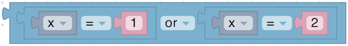

# Logic

[Boolean logic](https://en.wikipedia.org/wiki/Boolean_algebra) is a simple mathematical system that has two values:

* true
* false

Logic blocks are generally used to control [conditional blocks](logic.md#if) and repeat blocks.

Here's an example:

<figure><figcaption></figcaption></figure>

If the value of the variable `temperature` is less than or equal to 0, the condition is true, and the text "Freezing" is printed. If the value of `temperature` is greater than 0, the condition is false, and "A thaw" is printed.

Boolean values can also be stored in variables and passed to functions, the same as number, text, and list values.

## Table of contents

* [value](logic.md#value)
* [comparison](logic.md#comparison)
* [and](logic.md#and)
* [or](logic.md#or)
* [not](logic.md#not)
* [ternary operator](logic.md#ternary-operator)
* [if](logic.md#if)
* [if-else](logic.md#if-else)
* [if-else-if](logic.md#if-else-if)
* [if-else-if-else](logic.md#if-else-if-else)

## value

<figure><figcaption></figcaption></figure>

A block that returns a fixed Boolean value (either `true` or `false`).

### Parameters

* **Value** (Boolean): Choose `true` or `false`.

### Returns

* **Boolean**: The selected Boolean value.

## comparison

<figure><figcaption></figcaption></figure>

Compares two values using a chosen operator (equals, not equals, less than, greater than, less than or equal, greater than or equal).

### Parameters

* **Left Value** (Number or comparable type)
* **Right Value** (Number or comparable type)
* **Operator** (Enum): `=`, `≠`, `<`, `>`, `≤`, `≥`

### Returns

* **Boolean**: `true` if the comparison is satisfied, otherwise `false`.

## and

<figure><figcaption></figcaption></figure>

Performs a logical AND operation on two Boolean inputs.

### Parameters

* **Input A** (Boolean)
* **Input B** (Boolean)

### Returns

* **Boolean**: `true` if both inputs are `true`, otherwise `false`.

## or

<figure><figcaption></figcaption></figure>

Performs a logical OR operation on two Boolean inputs.

### Parameters

* **Input A** (Boolean)
* **Input B** (Boolean)

### Returns

* **Boolean**: `true` if at least one input is `true`, otherwise `false`.

## not

<figure><figcaption></figcaption></figure>

The not block converts its Boolean input into its opposite.\
If no input is provided, a value of `true` is assumed, so the following block produces the value `false`:

<figure><figcaption></figcaption></figure>

Leaving an input empty is not recommended, however.

### Parameters

* **Input** (Boolean)

### Returns

* **Boolean**: `true` if the input was `false`, and `false` if the input was `true`.

## ternary operator

<figure><figcaption></figcaption></figure>

A conditional expression that returns one of two values based on a Boolean condition.

### Parameters

* **Condition** (Boolean)
* **Value if True** (Any type)
* **Value if False** (Any type)

### Returns

* **Any type**: The value corresponding to the outcome of the condition.

## if

<figure><figcaption></figcaption></figure>

Executes enclosed blocks if the condition is `true`.

### Parameters

* **Condition** (Boolean)

## if-else

<figure><figcaption></figcaption></figure>

Executes one set of blocks if the condition is `true`, otherwise executes another set.

### Parameters

* **Condition** (Boolean)

## if-else-if

<figure><figcaption></figcaption></figure>

Checks multiple conditions in sequence. Executes the first matching condition’s blocks.

### Parameters

* **Condition (if)** (Boolean)
* **Condition(s) (else if)** (Boolean)

## if-else-if-else

<figure><figcaption></figcaption></figure>

Checks multiple conditions and has a final `else` to run if none are met.

### Parameters

* **Condition (if)** (Boolean)
* **Condition(s) (else if)** (Boolean)

## Block Modification

Only the plain `if` block appears in the toolbox:

<figure><figcaption></figcaption></figure>

To add `else if` and `else` clauses, the click on the gear icon, which opens a new window:

<figure><figcaption></figcaption></figure>

Drag `else if` and `else` clauses under the `if` block, as well as reordering and removing them. When finished, click on the gear icon, which closes the window, as shown here:

<figure><figcaption></figcaption></figure>

Note that the shapes of the blocks allows any number of `else if` subblocks to be added but only up to one `else` block.
