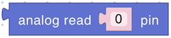

# Primitives

The Primitives section provides direct access to your device’s input/output pins, allowing you to read sensor values, control actuators, and detect user interactions at a low level. By extending core Arduino functions, these blocks make it easy to interface with your hardware without writing additional code.

* Retrieve values from sensors or determine if a button or switch is pressed.
* Control LEDs, motors, and other actuators with precise or simple on/off signals.
* Define your own functionality with parameters and return values tailored to your specific needs.

Using these primitives, you can easily incorporate hardware interaction into your scripts, bridging the gap between the digital logic of your program and the physical world your device operates in.

## analog read

<figure></figure>

Reads the value from an analog pin.

> Read more about [analogRead()](https://docs.arduino.cc/language-reference/en/functions/analog-io/analogRead/) in Arduino

**Parameters:**

* **Pin Number** (Number)

**Returns:**

* **Number**: In the range 0–1023.

## analog write

<figure></figure>

Writes a value to an analog pin.

> Read more about [analogWrite()](https://docs.arduino.cc/language-reference/en/functions/analog-io/analogWrite/) in Arduino

**Parameters:**

* **Pin Number** (Number)
* **Value** (Number, 0-1023)

## digital read

<figure></figure>

Reads the digital state of a pin.

> Read more about [digitalRead()](https://docs.arduino.cc/language-reference/en/functions/digital-io/digitalread/) in Arduino

**Parameters:**

* **Pin Number** (Number)

**Returns:**

* **Boolean**: `true` (`HIGH` signal) or `false` (`LOW` signal)

## digital write

<figure></figure>

Sets a state to a pin.

> Read more about [digitalWrite()](https://docs.arduino.cc/language-reference/en/functions/digital-io/digitalwrite/) in Arduino

**Parameters:**

* **Pin Number** (Number)
* **Boolean** `true` (`HIGH`) or `false` (`LOW`)

## button clicked

<figure></figure>

Checks if a button on a specified pin has been clicked since last check.

**Parameters:**

* **Pin Number** (Number)

**Returns:**

* **Boolean**: `true` if clicked, `false` otherwise.

## user primitive

<figure></figure>

A template for defining custom primitives with configurable parameters and return values.\
The user primitive returns a boolean value by default. If you need to perform only some actions and do not expect any data in response, you need to customize the block by clicking on the gear icon.

**Parameters:**

* **Parameters** (As defined by the user)

**Returns:**

* **Any type**: As defined by the user.
