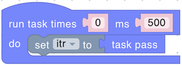

# Special

The Special section provides blocks that allow you to add structure, timing, and event-driven behavior to your scripts. With these blocks, you can:

* Define how often and how many times your main code should run.
* Keep track of each execution cycle, allowing you to respond differently as a task progresses.
* Receive and handle incoming messages from an MQTT broker, as well as send messages and data out, enabling real-time communication and interaction with other devices or services.

By using these Special blocks, you can create dynamic, event-responsive, and time-aware scripts that are well suited for a wide range of IoT scenarios.

## task

<figure></figure>

Defines the primary execution loop for your script.

**Parameters:**

* **Number of Executions** (Number): 0 for infinite.
* **Frequency** (Number, ms): Delay between executions.

## task pass

<figure></figure>

Returns iteration information about the current task execution.\\

**Returns:**

* **Number**: `-1` if infinite; otherwise a countdown from `n-1` to `0`.

> _**NOTE**_: An iterator can not be used outside the task.

## is event

<figure></figure>

Checks if an event with a specified name has been received from the MQTT broker.

**Parameters:**

* **Event Name** (String)

**Returns:**

* **Boolean**: `true` if the event is present, `false` otherwise.

## pop event

<figure></figure>

Retrieves and removes the value associated with a specified event from the MQTT broker.

**Parameters:**

* **Event Name** (String)

**Returns:**

* **Any type**: The value associated with that event.

## push event

<figure></figure>

Sends an event with a value to the MQTT broker.

**Parameters:**

* **Event Name** (String)
* **Value** (Number, Boolean)
