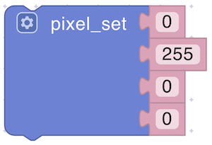
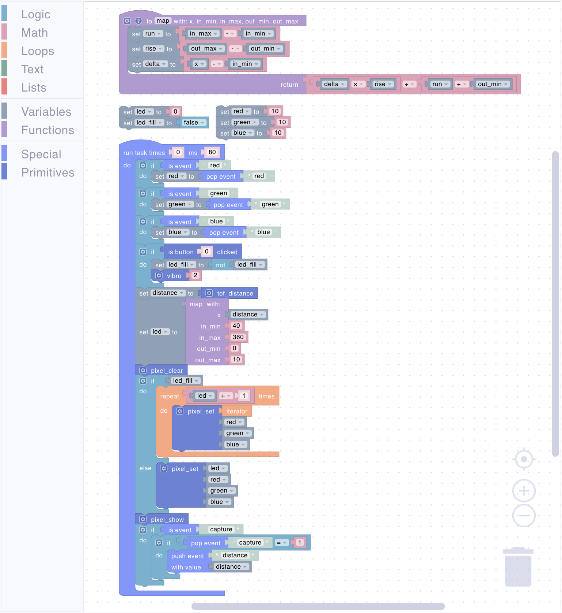

# Uniot Badge

The Uniot Badge is a mini IoT development board. Made in the size of a credit card, this badge is designed to be both a fun gadget and a showcase of what IoT can achieve. The board has several interactive components, including colorful LEDs, a button, a vibration motor, and a sensor, all packed into a sleek form factor.

<div><figure><figcaption>Uniot Badge</figcaption></figure></div>

## Hardware Overview

The Uniot Badge is equipped with the following hardware components:

- **ESP32-C3 Dev Board**: The main microcontroller board that runs the [Uniot Core](./advanced/uniot-core/README.md).
- **VL53L0X ToF Sensor**: A time-of-flight sensor for distance measurement.
- **Button**: A button for user interaction.
- **Vibration Motor**: A small motor that can vibrate to provide haptic feedback.
- **10x addressable RGB LEDs**: A circle of 10 RGB LEDs for displaying colors and patterns (NeoPixel-like).

## Getting Started

To start working with the Uniot Badge, you need to flash the board and add it to the platform. The firmware source code can be found [here](https://github.com/uniot-io/uniot-promo-badge-firmware). Instructions for flashing and adding the device to the platform are available in the [Getting Started](./getting-started/README.md) section.

## Promo

You can redeem the promo code by scanning the QR code on your badge. This promo code will extend your plan by:

- **Device: +1**
- **Dashboard: 1**
- **Script: +1**

A script and a dashboard, both named 'Uniot Promo Badge,' will also be created for demonstration purposes. You can deploy the script to the badge and try it out in interaction with the dashboard.

<div align="left"><figure><figcaption>Promo Script</figcaption></figure></div>

<div align="left"><figure><figcaption>Promo Dashboard</figcaption></figure></div>

Learn more about this script below in the [Examples](#promo-badge) section. If you wish, you can delete these dashboard and script and create your own (the plan extension will remain).

## Functionality Overview

The Uniot Badge can light up, vibrate, measure distances, and even react to your actions. With just the press of a button, you can activate various features like making lights flash in patterns or making the badge respond to movement. To interact with peripherals, the firmware has corresponding primitives. Read more about primitives [here](./general-concepts/primitives.md).

### Primitives

The badge has several primitives for controlling peripherals. You can read more about primitives [here](./general-concepts/primitives.md).

#### vibro

<div align="left"><figure><figcaption></figcaption></figure></div>

Vibrates the specified number of times (the period of one vibration is set in the [firmware](https://github.com/uniot-io/uniot-promo-badge-firmware/blob/main/lib/Vibro/Vibro.h#L9)).

**Parameters:**

- **Times** (Number): Number of vibrations

#### tof_distance

<div align="left"><figure><figcaption></figcaption></figure></div>

Reads the value of the distance sensor.

**Returns:**

- **Distance** (Number): Distance to obstacle in **millimeters**

#### pixel_clear

<div align="left"><figure><figcaption></figcaption></figure></div>

Turns all LEDs off.

#### pixel_set

<div align="left"><figure><figcaption></figcaption></figure></div>

Sets a LED's color.

**Parameters:**

- **Index** (Number): LED index (**0-9**)
- **Red** (Number): Red color brightness (**0-255**)
- **Green** (Number): Green color brightness (**0-255**)
- **Blue** (Number): Blue color brightness (**0-255**)

#### pixel_show

<div align="left"><figure><figcaption></figcaption></figure></div>

Turns on the set LEDs.

## Firmware

The Uniot Badge is powered by firmware based on [Uniot Core](./advanced/uniot-core/README.md). You can find the source code of the firmware [here](https://github.com/uniot-io/uniot-promo-badge-firmware).

## Script Examples

### Promo Badge

<div><figure><figcaption>The visual script</figcaption></figure></div>

The visual script generates the following code:



```lisp
;;; begin-user-library
;; This block describes the library of user functions.
;; So the editor knows that your device implements it.
;
; (defjs bclicked (button_id)) ;-> Bool
; (defjs vibro (_0)) ;-> Bool
; (defjs tof_distance ()) ;-> Int
; (defjs pixel_clear ()) ;-> Bool
; (defjs pixel_set (_0 _1 _2 _3)) ;-> Bool
; (defjs pixel_show ()) ;-> Bool
;
;;; end-user-library

(define led ())
(define red ())
(define run ())
(define led_fill ())
(define green ())
(define rise ())
(define blue ())
(define delta ())
(define distance ())
; Re-maps a number from one range to another.
(defun map
 (x in_min in_max out_min out_max)
 (setq run
  (- in_max in_min))
 (setq rise
  (- out_max out_min))
 (setq delta
  (- x in_min))
 (/
  (* delta rise)
  (+ run out_min)))

(setq led 0)
(setq led_fill ())

(setq red 10)
(setq green 10)
(setq blue 10)

(task 0 80 '
 (list
  (if
   (is_event 'red)
   (list
    (setq red
     (pop_event 'red))))
  (if
   (is_event 'green)
   (list
    (setq green
     (pop_event 'green))))
  (if
   (is_event 'blue)
   (list
    (setq blue
     (pop_event 'blue))))
  (if
   (bclicked 0)
   (list
    (setq led_fill
     (not led_fill))
    (vibro 2)))
  (setq distance
   (tof_distance))
  (setq led
   (map distance 40 360 0 10))
  (pixel_clear)
  (if led_fill
   (list
    (while
     (< #itr
      (+ led 1))
     (pixel_set #itr red green blue)))
   (list
    (pixel_set led red green blue)))
  (pixel_show)
  (if
   (is_event 'capture)
   (list
    (if
     (=
      (pop_event 'capture) 1)
     (list
      (push_event 'distance distance)))))))
```



To demonstrate the functionality of the badge, this script uses several blocks:

- **Variables Initialization**: The blocks initializes several variables.
  - **`led`**: The number of active (glowing) LEDs.
  - **`led_fill`**: The indicator of the pattern according to which the LEDs will turn on.
  - **`red`**: The brightness of the red color of the LEDs.
  - **`green`**: The brightness of the green color of the LEDs.
  - **`blue`**: The brightness of the blue color of the LEDs.
- **Function Block**: Function `map` accepts 5 arguments and performs a linear interpolation to calculate the number of active LEDs relative to the distance sensor value.
  - **`x`**: The distance sensor value
  - **`in_min`**: The minimum value of the distance sensor (in **millimeters**).
  - **`in_max`**: The maximum value of the distance sensor (in **millimeters**).
  - **`out_min`**: The minimum number of active LEDs.
  - **`out_max`**: The maximum number of active LEDs.
- **Run Task Block**: Configured to run every 80 milliseconds indefinitely (as the `times` parameter is set to `0`).
- **Color Events Trigger Block**: Responds to the `red`/`green`/`blue` events by updating corresponding variables to the event's value.
- **Button Check Block**: Monitors if the button (that occupies the register with index `0`, learn more about registers [here](./general-concepts/primitives.md#registers)) is clicked. When clicked, inverts the state of the `led_fill` variable and calls `vibro` primitive to provide a haptic feedback.
- **Distance Sensor Reading**: Calls the `tof_distance` primitive and set the value of the sensor to the `distance` variable.
- **Determining Active LEDs**: Calls the `map` function to calculate the number of active LEDs relative to `distance`.
- **Update LEDs Block**: Updates LEDs according to current data.
  - **Turn Off Block**: Calls the `pixel_clear` primitive to turn off all LEDs.
  - **Set Color Block**: Set the color for the active LED(s) according to the pattern (`led_fill`) using the `pixel_set` primitive.
  - **Turn On Block**: Calls the `pixel_show` primitive to turn on the set LEDs.
- **Event Trigger Block**: Responds to the `capture` event by emmiting a global event `distance` with the `distance` variable value. Checks whether the value of the `capture` event is equal to `1` to generate the `distance` event only once when the corresponding Push Button widget is pressed on the dashboard (this widget generates an event with a value of `1` when pressed and an event with a value of `0` when the button is released)
